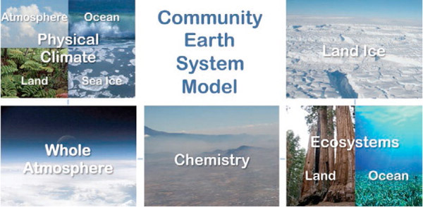

# CESM MODEL

The [Community Earth System Model](http://www.cesm.ucar.edu/) (CESM) is a fully-coupled, global climate model that provides state-of-the-art computer simulations of the Earth's past, present, and future climate states.

*   [CESM Web page](http://www.cesm.ucar.edu/)
*   [CESM User's Guide](http://www.cesm.ucar.edu/models/cesm1.2/cesm/doc/usersguide/book1.html)
*   [CESM Supported Releases](https://www.cesm.ucar.edu/models/current)
*   [CESM scientifically validated configurations](http://www.cesm.ucar.edu/models/scientifically-supported.html)
*   [CESM Bulletin Board](http://bb.cgd.ucar.edu/)
*   [CESM Support Policy](http://www.cesm.ucar.edu/about/support)

## Community Atmosphere Model

*   [Community Atmosphere Model (CAM5, CAM-CHEM, WACCM)](http://www.cesm.ucar.edu/models/cesm1.2/cam/)
*   [CAM-5.3 User's Guide](http://www.cesm.ucar.edu/models/cesm1.2/cam/docs/ug5_3/index.html)

* * *

## CAM 5.3 Source code overview

The full description of the Community Atmosphere Model CAM 5.3 can be found [here](http://www.cesm.ucar.edu/models/cesm1.2/cam/docs/description/cam5_desc.pdf).  
CESM is a fully-coupled, community, global climate model that provides state-of-the-art computer simulations of the Earth's past, present, and future climate states.  
Some facts about CESM:

*   Written in Fortran 90
*   About 900 000 lines of Fortran 90 code
*   About 12,000 lines of scripts that configure, build, and run the model
*   Parallelized with [MPI](http://www.mpi-forum.org/) (Message Passing Interface) and [OpenMP](http://openmp.org/) (Open Multi-Processing)
*   To keep track of code changes, CESM developers currently use [subversion](https://subversion.apache.org/). However, some components use [git](https://git-scm.com/).
*   Fortran Coding standard as well as style rules are enforced and anyone wishing to contribute to the Community Atmosphere Model must comply to these [rules](http://www.cesm.ucar.edu/working_groups/Software/dev_guide/dev_guide/node7.html).

To browse and explore CAM5.3 source code, you can login on abel.  
From a Linux terminal:

<pre>ssh -Y $LOGNAME@abel.uio.no
</pre>

where $LOGNAME is your UIO username (replace it by your own username!)  
Documentation on norStore facility can be found [here](https://www.sigma2.no/node/8).  

Please note that these machines are not accessible outside the UIO networks. 

The source code we will be using is stored (on abel) in /projects/NS1000K/GEO4962/cesm1_2_2/models/atm/cam:

~~~ 
module load cesm
cd $CESM_HOME/cesm1_2_2/models/atm/cam
ls 
~~~
{: .language-bash}

*   **bld**: scripts to generate makefiles and dependencies for compiling CAM5
*   **chem_proc**: MOZART [chemical preprocessor](http://www.cesm.ucar.edu/working_groups/Chemistry/chemistry.preprocessor.pdf)
*   **doc**: change log
*   **src**: source code for CAM5
*   **test**: CAM testing framework
*   **tools**: utility to generate or remap terrain dataset

The full developers guidelines can be found [here](https://www2.cesm.ucar.edu/working-groups/amwg/developers-guidelines).  
The source code for CAM 5.3 is located in the "src" and its sub-directories (the main parts are highlighted in bold):

*   **control**: contains several Fortran 90 modules to control CAM 5\. That's a good starting point to explore CAM source code. Look for instance at cam_comp.F90:  
    The main subroutines for controlling CAM 5 are:

    <pre>    .
        .
        .
       implicit none
       private
       save
       !
       ! Public access methods
       !
       public cam_init      ! First phase of CAM initialization
       public cam_run1      ! CAM run method phase 1: Runs first phase of dynamics and first phase of physics (before surface model updates).
       public cam_run2      ! CAM run method phase 2: It requires the surface model updates.  And run the second phase of dynamics 
                            !                         that at least couple between physics to dynamics.
       public cam_run3      ! CAM run method phase 3: Third phase of the dynamics. For some dycores this will be the actual dynamics run, 
                            !                         for others the dynamics happens before physics in phase 1.
       public cam_run4      ! CAM run method phase 4: Final phase of atmosphere model run method. This consists
                            !                         of all the restart output, history writes, and other file output.
       public cam_final     ! CAM Finalization      :  CAM finalization.

        .
        .
        .
        </pre>

    
*   **dynamics**: source code for the different dynamical core options.
*   **physics**: model physics (for instance check physics/cam directory)
*   **advection**
*   **chemistry**
*   Interaction with other components: one of these components will be used to interact with other models (land, etc.). We do not discuss this part as we do not run a full coupled configuration.

*   cpl_esmf
*   cpl_mct
*   cpl_share

*   utils: Fortran 90 modules containing utilities (such as sorting methods, namelist utilities, PIO io interface, etc.)
*   unit_drivers: Parallel Offline Radiation Tool (PORT); not used for our configuration.



