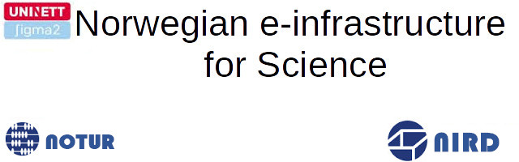
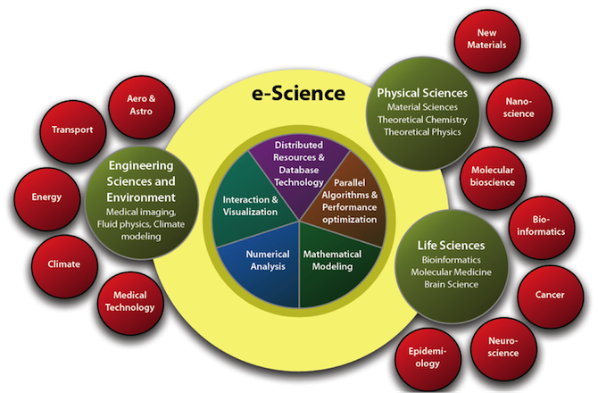
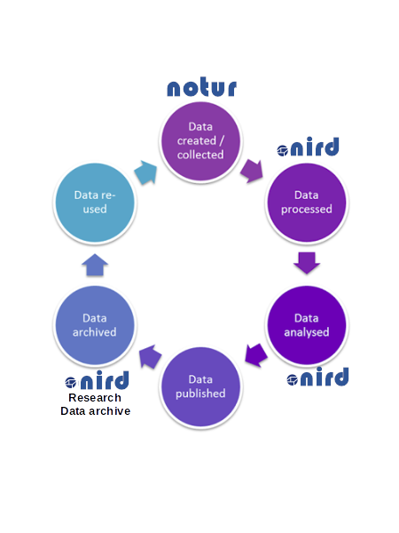
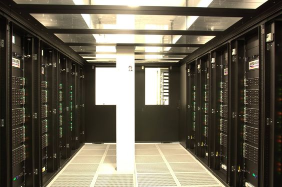

  

*   [An e-infrastructure for Science](#an-e-infrastructure-for-science)
*   [Notur](#notur)
	*   [What is Notur?](#what-is-notur)
	*   [Abel computing facility](#abel-computing-facility)
	*   [Available Filesystems on Abel](#available-filesystems-on-abel)
*   [NorStore](#norstore)
	*   [What is NorStore?](#what-is-norstore)
	
*   [IaaS](#iaas)
	*   [What is IaaS?](#what-is-iaas)
	*   [Post-processing and visualization facility](#post-processing-and-visualization-facility)

## An e-infrastructure for Science

[E-science](https://en.wikipedia.org/wiki/E-Science) is the application of computer technology to the 
undertaking of modern scientific investigation, including the preparation, experimentation, data collection, 
results dissemination, and long-term storage and accessibility of all materials generated through the scientific
 process. These may include data modeling and analysis, electronic/digitized laboratory notebooks, raw and 
 fitted data sets, manuscript production and draft versions, preprints, and print and/or electronic publications.  

  

The e-infrastructure for Science in Norway follows the same structure and provides users with both computing 
resources ([Notur](#notur)) and post-processing and visualization facilities with large storage capacity 
([NorStore](#norstore)).  

The picture below introduces the data life cycle from the generation of your model outputs on Notur computing facility (Abel) to the preservation of your model results in the [NorStore archive](https://archive.norstore.no/).  

  

## Notur

### What is Notur?

Through the Notur-project, [UNINETT Sigma2](https://www.sigma2.no/) serves the Norwegian computational science community by providing the infrastructure to individuals or groups involved in education and research at Norwegian universities and colleges, and research and engineering at research institutes and industry who contribute to the funding of Notur.  
The HPC-service provides the customer access to facilities and software with a far greater capacity than is normally available at department and faculty levels. The service is primarily set up to run simulation calculations for research and educations purposes, designed as batches.  

For running [CESM CAM-5.3](http://www.cesm.ucar.edu/), such computing facilities are necessary.  

### Abel computing facility

  
Abel is a cluster machine:

*   258.0 TFlops peak performance
*   10000+ cores
*   650+ nodes
*   650+ Supermicro X9DRT compute nodes
*   dual Intel E5-2670 (Sandy Bridge) running at 2.6 GHz
*   16 cores per node
*   64GB Samsung DDR3 memory operating at 1600 MHz per node (4GB/core)
*   FDR (56 Gbits/s eq 6.78 Gbytes/s) InfiniBand interconnect
*   OS: Linux Environment, 64 bit Centos 6

Abel is a large machine (cluster) made of more than 10000 nodes (collection of machines linked together via an efficient network). On one single node, there are 16 cores and a total of 64 GB of shared memory. This shared memory can be accessed by all the processors of one single node but a processor on another node cannot access it. The image below attempts to summarize these two concepts (shared vs. distributed memory):  
  
To manage efficiently the machine, it runs under the control of a batch system. The fact is that one single program does not usually use the full machine (1392 CPUs) but many users can fill the machine very quickly with several "small" programs.  
The opposite of a batch job is interactive processing, in which a user enters individual commands to be processed immediately. This is what you are used to when working on your laptop or any UIO servers (such as sverdrup.uio.no).  
We need to use a batch system to make sure all the resources are well utilized and this is the role of the job scheduler to decide where to run user "jobs". Its role is to optimize the resources and to try to run as many user jobs as possible. It can be seen as a tetris game (see image below) where each block represents a user job.  
  
All user jobs must be submitted to the cluster through this batch system. Abel uses [SLURM](https://en.wikipedia.org/wiki/Slurm_Workload_Manager) (Portable Batch System). The submitted jobs are then routed into a number of queues (depending on the needed resources, e.g. runtime) and sorted according to some priority scheme.  
A job will run when the required resources become available.  
More information on the Batch system on Abel can be found [here](http://www.uio.no/english/services/it/research/hpc/abel/help/user-guide/queue-system.html).  

### Available Filesystems on Abel

The following file systems exist on abel:

*   User area (home directories): /home  
    The file system for user home directories on abel. This file system is currently very small, and it should NOT be used for processing data and running batch jobs (slow access). It has quota enabled, limits can be found [here](http://www.uio.no/english/services/it/research/hpc/abel/help/user-guide/data.html) . Files are backed up daily, except for folders called "nobackup" and their sub-folders.
*   Work area (temporary data): /work/users ($USERWORK)  
    Large external storage shared by all compute nodes on abel. Files are NOT backed up. /work should be used when running jobs since it's much larger than /home and is available on the compute nodes. /work/users is a [BeeGFS](https://en.wikipedia.org/wiki/BeeGFS) parallel file system.

**Note:** the /work/users/* directories are subject to automatic deletion dependent on modification, access time and the total usage in the file system. The oldest files will be deleted first.  

## NorStore

### What is NorStore?

[NorStore](https://www.sigma2.no/node/8) is the Norwegian infrastructure for storing scientific data.  

NorStore facility is divided in two parts:

*   Active data, which are processed or being analysed, are stored in the [Project Area](https://www.sigma2.no/content/project-data-storage).
*   When the data are no longer expected to change and/or results have been published, the data should normally be made accessible to the public. Data can be transferred to the [NorStore Archive](https://www.sigma2.no/content/national-research-data-archive) from the Project area or directly uploaded.

When running the CAM-5.3 model on abel, the model outputs are generated and stored in the temporary working area (/work/users/$LOGNAME). As mentioned earlier, the working area on Abel is a temporary storage area and data must be moved to a more permanent storage area where you will be able to easily post-process and visualize your model results.  
Model outputs will have to be moved from Abel working area (/work/users/$LOGNAME) to the norStore project area. You can use scp to copy your data from Abel to NorStore but the detailed procedure will be explained later.  

### what is a Research Data Archive?

Data archiving is the practice of moving data to a separate storage device that is no longer needed for everyday business operations but
may occasionally need to be accessed. 
Archiving research data facilitates the re-use and verification of research results. 
By depositing a dataset in a data repository, it is not only protected against corruption and loss, 
but also becomes findable and citable via a Digital Object Identifier [DOI](https://www.doi.org/).

This step is very important for publishing scientific results where all data used needs to be kept for about 10 years.

## IaaS

### What is IaaS?

IaaS means Infrastructure as a Service and provides researchers from the University of Oslo or Bergen 
with cloud services.

The [UH-IaaS cloud](http://docs.uh-iaas.no/en/latest/index.html) is based on OpenStack, which is a large framework of software components used to deliver an 
Infrastructure-as-a-Service consisting of compute, networking and storage resources.

### Post-processing and visualization facility

Once your model run is finished, you can start post-processing and generating plots. 
The machine you will be using for post-processing and visualizing your data has been created on UH-IaaS. The machine
will be accessed through a web interface using [jupyterhub](https://jupyter.org/hub).
 
Each attendee will get a username and password so do not panic if you still haven't received anything.
 
The main advantage of using this machine is that your data are directly accessible from anywhere through a web 
interface and the necessary post-processing and visualization packages we need are already available. 

