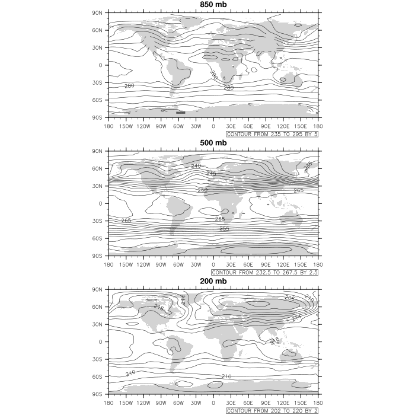

*   [Post-processing workflow: example with the control experiment](#post-processing-workflow:-example-with-the-control-experiment)
*   [SPARC Climatology](#sparc-climatology)
*   [Exercice-1](#exercice-1)

# Post-processing workflow: example with the control experiment

On NIRD (login.nird.sigma2.no):

<pre>cd /projects/NS1000K/GEO4962/outputs/runs/f2000.T31T31.control/atm/hist
</pre>

-  How many years did we run?
-  What is the output frequency?

1.  [Selection of variables of interest and visualization](#Selection-of-variables-of-interest-and-visualization)
2.  [Computation of yearly or zonal mean](#Computation-of-yearly-or-zonal-means)
3.  [Conversion from Sigma coordinates to pressure levels](#Conversion-from-Sigma-coordinates-to-pressure-levels)

### **NIRD**

#### Setup on NIRD

On NIRD:

<pre>export PATH=/projects/NS1000K/panoply/4.4.3/:$PATH
</pre>

*Notes: this is to allow you to use panoply (without installing it), also the modules cdo and ncl are already loaded by default.*

#### Selection of variables of interest and visualization

Here we are going to use [ncks](http://nco.sourceforge.net/nco.html#ncks-netCDF-Kitchen-Sink).

**ncks** stands for "NetCDF Kitchen Sink" and it will allow us to extract a subset of the data (for instance to produce a new netCDF file containing only the temperature variable T) from an input-file (in this example the file corresponds to the month of January of the 5th year simulated).

On NIRD:

<pre>mkdir -p $HOME/GEO4962/control
ncks -v T f2000.T31T31.control.cam.h0.0005-01.nc $HOME/GEO4962/control/T_f2000.T31T31.control.cam.h0.0005-01.nc
</pre>

We are now going to use **panoply** to visualize the temperature field.

On NIRD:

<pre>panoply.sh</pre>

This opens a window where you can select the file that was just created (T_f2000.T31T31.control.cam.h0.0005-01.nc) in the directory $HOME/GEO4962/control. 

Then double click on the line with "   T       Temperature       Geo2D   " and click on the **Create** button.

Explore other types of plot with panoply.

Back to **ncks**, several variables can be extracted at the same time.

On NIRD:

<pre>
ncks -v T,U,hyam,hybm,PS f2000.T31T31.control.cam.h0.0003-03.nc $HOME/GEO4962/control/TU_f2000.T31T31.control.cam.h0.0003-03.nc
ncks -v T,U,hyam,hybm,PS f2000.T31T31.control.cam.h0.0004-12.nc $HOME/GEO4962/control/TU_f2000.T31T31.control.cam.h0.0004-12.nc
ncks -v T,U,hyam,hybm,PS f2000.T31T31.control.cam.h0.0005-01.nc $HOME/GEO4962/control/TU_f2000.T31T31.control.cam.h0.0005-01.nc
</pre>

-  Use panoply to visualize your new netCDF files
-  Use a shell loop to extract T and U (and hyam, hybm and PS) from all the model outputs (control experiment) and store the resulting netCDF files in $HOME/GEO4962/control/

(Example of solution (to run from the folder containing the .nc files): for file in *.nc; do ncks -v T,U,hyam,hybm,PS $file $HOME/GEO4962/control/TU_$file; done)

##### Compute yearly or zonal means

TODO

##### Convert to Pressure levels

The vertical coordinate in CESM is what is called a *hybrid sigma-pressure system*. In this system, the upper regions of the atmosphere are discretized by pressure only. Lower vertical levels use the sigma (i.e. the pressure at a given level divided by the surface pressure ) vertical coordinate *smoothly merged in*, with the lowest levels being pure sigma.

It is therefore **wrong** to assume that these sigma levels are the same as pressure levels and one has instead to converts from the hybrid coordinates to pressure levels in order to create plots, etc. 

For this purpose several tools have been developped at NCAR to perform the [vertical interpolation](http://www.ncl.ucar.edu/Applications/vert_interp.shtml).

In this lesson we are going to use the **vert_1.ncl** script.

1.  Download [vert_1.ncl](http://www.ncl.ucar.edu/Applications/Scripts/vert_1.ncl) and transfer it to NIRD. Here we assume you have your vert_1.ncl script in **$HOME/GEO4962/control/**.

2.  Edit vert_1.ncl (use your favourite editor such as emacs or vi) and change the input file name (in this example we use the month of March from the third simulation year):

    <pre>   fn  = "TU_f2000.T31T31.control.cam.h0.0003-03.nc" ; define filename
    </pre>

3.  Then run your script with ncl.

On NIRD:

<pre>
ncl vert_1.ncl
</pre>

The desired pressure levels defined in the script are:

<pre>  pnew = (/ 850.0,700.0,500.0,300.0,200.0 /)        
</pre>

This script also produces 3 contour plots showing the temperature at 850mb, 500mb and 200mb:

#### Exercice-1

1.  How well does CAM5 (T31/L30, 5 yr control run) represent observations?

1.  Select T,U,hyam,hybm,PS (use ncks) for all the model outputs of the control experiment (/projects/NS1000K/GEO4962/outputs/runs/f2000.T31T31.control/atm/hist). Save these new output files in the directory $HOME/GEO4962/control/.
2.  Use ncra to get an average for all the January months. Repeat it for each month (February to December).
3.  Use [zonal_2.ncl](http://www.ncl.ucar.edu/Applications/Scripts/zonal_2.ncl) and [vert_1.ncl](http://www.ncl.ucar.edu/Applications/Scripts/vert_1.ncl) to get a zonal mean and interpolate to pressure levels. Make sure you choose your pressure levels (change the variable **pnew** in [vert_1.ncl](http://www.ncl.ucar.edu/Applications/Scripts/vert_1.ncl) so you can easily compare with SPARC climatology).
4.  You may use [sparc_2.ncl](https://www.ncl.ucar.edu/Applications/Scripts/sparc_2.ncl) to get plots similar to those we got with the SPARC climatology. You can also use panoply (or python).

Fulfill the first exercise until the next practical on March 3, 2019!



