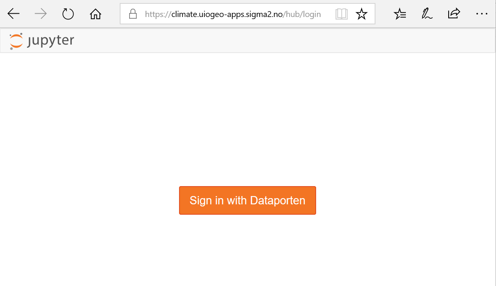

# Post-processing and Visualization

*   [Introduction to Jupyterhub and JupyterLab](#introduction-to-jupyterhub-and-jupyterlab)
	* [Login to the JupyterHub](#login-to-the-jupyterhub)
	* [Start and stop your server](#start-and-stop-your-server)
	* [JupyterLab](#jupyterlab)
*   [Copy your output files from Abel to the virtual machine](#copy-your-output-files-from-abel-to-the-virtual-machine)
*   [Map visualization with psyplot](#map-visualization-with-psyplot)
*   [Customize your maps](#customize-your-plots)
	* [Set figure size](#set-figure-size)
	* [Plot 4D-fields such as Temperature](#plot-4d-fields-such-as-temperature)
	* [Change map projection](#change-map-projection)
*   [Georeferenced Latitude-Vertical plot](#georeferenced-latitude-vertical-plot)	
	* [2D plot for one longitude point](#2d-plot-for-one-longitude-point)
	* [2D plot over averaged longitudes](#2d-plot-over-averaged-longitudes)
*   [CESM vertical coordinate system](#cesm-vertical-coordinate-system)

# Introduction to Jupyterhub and JupyterLab

You will be using jupyterhub to post-process and visualize your data. All attendees have received a username
and corresponding password; please let us know otherwise.  

## Login to the JupyterHub

Use the username and password you have received and **sign In**.
 
> ## Tips
> Before getting to the username/password login page, your browser may warn you about the security
> of the website and get a message such as "This site is not secure". In order to bypass this security message,
> you need to accept to proceed. Let us know if you still have problems to login.
>
{: .callout}
 
## Start and stop your server

When you manage to successfully login to the Jupyterhub, you should have the following panels:

To start/stop your server, clock on **Control Panel**:

When your server is not running, the button "Stop My Server" does not appear and you only see the button "My Server".

- To stop your server, click on "Stop My Server"
- To start your server, click on "My Server"

> ## Important note
>
> Make sure you stop your server once you have finished your session so it can release resources for next time. 
>
{: .callout}

## JupyterLab

By default, jupyterhub presents you the standard Jupyter user interface layout but you can also access the new 
web-based user interface for Project Jupyter that is called [JupyterLab](https://jupyterlab.readthedocs.io/en/stable/).

For this replace **tree?** in the web address you have in your browser tab by **lab**. Then you should get:

### Menu Bar

The menu bar at the top of JupyterLab has top-level menus that expose actions available in JupyterLab with 
their keyboard shortcuts. The default menus are:

- **File**: actions related to files and directories
- **Edit**: actions related to editing documents and other activities
- **View**: actions that alter the appearance of JupyterLab
- **Run**: actions for running code in different activities such as notebooks and code consoles
- **Kernel**: actions for managing kernels, which are separate processes for running code
- **Tabs**: a list of the open documents and activities in the dock panel
- **Settings**: common settings and an advanced settings editor
- **Help**: a list of JupyterLab and kernel help links

### Left Sidebar
The left sidebar contains a number of commonly-used tabs, such as a file browser, a list of running 
kernels and terminals, the command palette, and a list of tabs in the main work area:

If you move your mouse on the other icon of this left sidebar, a short information is given on its functionality.

If you click on the "running man" icon, you can see what is currently running on your server and you can click on 
"SHUTDOWN" to stop a running Python notebook or Terminal.

> ## Tips
>
> To access to **Control Panel**, you would need to go back to the standard Jupyter user interface layout which
> you can access by entering the Jupyterhub address given in the email in your browser tab (i.e. without your username and tree?).
{: .callout}

### Create a new python 3 notebook

Go back to the **File Browser** left sidebar tab and in the launcher select **Python 3** under the Notebook 
section:

By default, your new notebook is named as "**Untitled.ipynb**":

- **ipynb** is the extension for any Jupyter notebook and you should make sure all your notebook gets this extension (otherwise it is not recognized as a Jupyter notebook)
- you can rename your jupyter notebook with the tab "File --> Rename Notebook...".

### Start a new Terminal

Similarly, you can start a new Terminal by clicking on "Terminal" in the Launcher. 

> ## Tips
> If the **Launcher** tab does not exist 
> anymore in your JupyterLab, you can start a new one in "**File** --> **New Launcher**".
{: .callout}

# Copy your output files from Abel to the virtual machine

Start a new **Terminal** on your JupyterHub (this will be referred to hereafter as your "JupyterHub terminal") and type the following commands.

On the JupyterHub terminal:

<pre>rsync -avzu --progress YOUR_USER_NAME@abel.uio.no:/work/users/YOUR_USER_NAME/archive/f2000.T31T31.test/ /opt/uio/GEO4962/$USER/f2000.T31T31.test/
</pre>

# Map visualization with psyplot

Start a new **python3** notebook on your JupyterHub and type the following commands.

On jupyter:

~~~
# os provides a portable way of using operating system dependent functionality
# for instance to get path, environment variables
import os

# python package for plotting maps, 2D plot, etc.
import psyplot.project as psy

# the next line is only necessary when running within a Jupyter notebook
# and allows to inline plots in the Jupyter notebook
%matplotlib inline
~~~
{: .language-python}

These set of commands are meant to initialize the python 3 notebook with python packages (*os* and *psyplot.project*)
that we will use for plotting our netCDF model outputs.

Now we can create a map. We plot **TS** (Surface temperature) by specifying the filename and title of our plot 
and using *psy.plot.mapplot*:

~~~
# get your username from the environment variable USER
username = os.getenv('USER')
# specify the path where your test simulation is stored
path = '/opt/uio/GEO4962/' + username + '/f2000.T31T31.test/atm/hist/'
filename = path + 'f2000.T31T31.test.cam.h0.0009-01.nc'
print(filename)

p = psy.plot.mapplot(filename, name='TS', title="Surface temperature [K]\nF2000_CAM5_T31T31_test-0009-01")
~~~
{: .language-python}

# Customize your maps

##  Set figure size

~~~
import matplotlib as mpl
mpl.rcParams['figure.figsize'] = [10., 8.]
p = psy.plot.mapplot(filename, name='TS', title="Surface temperature [K]\nF2000_CAM5_T31T31_test-0009-01")
~~~ 
{: .language-python}

## Plot 4D-fields such as Temperature
		
In the same way add another cell below the plot and display the variable **T** instead of the surface temperature (TS). 

To show the colorbar label we used the *clabel* format option keyword and one of the predefined labels (*desc* for description). 

~~~
psy.plot.mapplot(filename, name='T', title="F2000_CAM5_T31T31_test-0009-01", clabel='{desc}')
~~~
{: .language-python}

Contrary to TS which depends only on two horizontal dimensions (namely latitude and longitude)
 plus time, for T there is an additional dimension (along the vertical).

> ## What did we plot?
>
> - What is the difference between T and TS?
> - Which time did you plot?
> - Which level did you plot?
> - How to display the lowest model level?
{: .challenge}

Now, add another cell below the plot and try to display the zonal wind (U) instead of the surface temperature (TS).
As for T, U has an additional dimension (along the vertical), hence we also have to specify a vertical level 
(between 0 and 29) to make our plot. 

On jupyter:

~~~
u = psy.plot.mapplot(filename, name='U', dims={'lev': 29}, title="F2000_CAM5_T31T31_test-0009-01", clabel='{desc}')
~~~
{: .language-python}

## Change map projection

~~~
psy.plot.mapplot(filename, name='T', dims={'lev': 29}, projection='moll', 
                 clabel='{desc}', title="F2000_CAM5_T31T31_test-0009-01")
~~~
{: .language-python}

The list of available projections for pysplot is available [here](https://psyplot.readthedocs.io/projects/psy-maps/en/latest/api/psy_maps.plotters.html#psy_maps.plotters.FieldPlotter.projection).

## Georeferenced Latitude-Vertical plot 

### 2D plot for one longitude point

We select *lon=0* and to use psyplot, we create a new *xarray* using latitudes and the levels:

~~~
import xarray as xr

mpl.rcParams['figure.figsize'] = [10., 8.]

ds = psy.open_dataset(filename)

# Create a new dataset over latitudes and levels
# where we select time=0 and lon=0
T_cross_section = xr.Dataset(
    {'T': ds['T'].isel(time=0, lon=0)},
    {'lat':  ds.lat, 'lev': ds.lev}, 
    attrs = ds['T'].attrs)

# Plot
psy.plot.plot2d(T_cross_section, name='T', clabel='{desc}', 
				xlabel=ds.lat.attrs['long_name'], 
				ylabel=ds.lev.attrs['long_name'])
~~~
{: .language-python}

### 2D plot over averaged longitudes

We create a new *xarray* as before but instead of selecting one longitude, we average over all the longitudes,
using *mean* function:

~~~
# Instead of selecting one longitude, 
# we can average over all the longitudes
# We select time=0 and use mean where we specify the dimension
# over which we want to average ('lon')
Tmean=xr.Dataset(
       {'T': ds['T'].isel(time=0).mean(dim='lon')},
       {'lat':  ds.lat, 'lev': ds.lev}, 
        attrs = ds['T'].attrs)

print(Tmean)

# Plot the cross section
psy.plot.plot2d(Tmean, name='T', title=Tmean.attrs['long_name'], clabel=Tmean.attrs['units'],
               xlabel=ds.lat.attrs['long_name'], ylabel=ds.lev.attrs['long_name'])
~~~
{: .language-python}

## CESM vertical coordinate system

The vertical coordinate is a **hybrid sigma-pressure system**. 

The hybrid coordinate was developed by 
[Simmons and Strüfing, 1981](https://rmets.onlinelibrary.wiley.com/doi/abs/10.1002/qj.49710945905) 
in order to provide a general framework for a vertical coordinate which is terrain following at 
the Earth’s surface, but reduces to a pressure coordinate at some point above the surface.

In this system, the upper regions 
of the atmosphere are discretized by pressure only. Lower vertical levels use 
the sigma (i.e. p/ps) vertical coordinate smoothly merged in, with the lowest levels being 
pure sigma. A schematic representation of the hybrid vertical coordinate and vertical indexing is 
presented below. 

The CESM system is defined such that closer to the earth's surface, the levels more closely resemble a pure sigma level, while the higher up you go, the more the levels are like pressure levels.

The formula to use to determine the pressure at the edge of the layer K is : 

where Ps is the surface pressure and A and B are coefficients defined at each model level and stored in the netCDF model outputs.

Let's have a look at the values of A and B:

~~~
print(ds.dyam)
~~~
{: .language-python}

~~~ 
<xarray.DataArray 'hyam' (lev: 30)>
array([0.003643, 0.007595, 0.014357, 0.024612, 0.038268, 0.054595, 0.072012,
       0.087821, 0.103317, 0.121547, 0.142994, 0.168225, 0.178231, 0.170324,
       0.161023, 0.15008 , 0.137207, 0.122062, 0.104245, 0.084979, 0.066502,
       0.050197, 0.037189, 0.028432, 0.022209, 0.016407, 0.011075, 0.006255,
       0.001989, 0.      ])
Coordinates:
  * lev      (lev) float64 3.643 7.595 14.36 24.61 ... 936.2 957.5 976.3 992.6
Attributes:
    long_name:  hybrid A coefficient at layer midpoints
~~~
{: .output}

~~~
print(ds.dybm)
~~~
{: .language-python}

~~~ 
<xarray.DataArray 'hybm' (lev: 30)>
array([0.      , 0.      , 0.      , 0.      , 0.      , 0.      , 0.      ,
       0.      , 0.      , 0.      , 0.      , 0.      , 0.019677, 0.062504,
       0.112888, 0.172162, 0.241894, 0.323931, 0.420442, 0.5248  , 0.624888,
       0.713208, 0.78367 , 0.831103, 0.864811, 0.896237, 0.925124, 0.951231,
       0.974336, 0.992556])
Coordinates:
  * lev      (lev) float64 3.643 7.595 14.36 24.61 ... 936.2 957.5 976.3 992.6
Attributes:
    long_name:  hybrid B coefficient at layer midpoints
~~~
{: .output}

If we print these coefficients A and B and the level, we can clearly understand why at the top of the atmosphere, we have 
pure pressure levels (B=0) and pure sigma levels at the bottom (A=0):

~~~ 
print("lev     A          B")
for lev, a, b in zip (range(1,ds.dims['lev']+1), ds.hyam.values, ds.hybm.values):
    print(lev, 1000*a, 1000*b)
~~~
{: .language-python}

~~~
lev     A          B
1 3.64346569404006 0.0
2 7.594819646328688 0.0
3 14.356632251292467 0.0
4 24.612220004200935 0.0
5 38.26829977333546 0.0
6 54.59547974169254 0.0
7 72.01245054602623 0.0
8 87.82123029232025 0.0
9 103.31712663173676 0.0
10 121.54724076390266 0.0
11 142.99403876066208 0.0
12 168.22507977485657 0.0
13 178.2306730747223 19.677413627505302
14 170.32432556152344 62.50429339706898
15 161.02290898561478 112.8879077732563
16 150.08028596639633 172.16161638498306
17 137.20685988664627 241.89404398202896
18 122.06193804740906 323.93063604831696
19 104.24471274018288 420.44246196746826
20 84.97915416955948 524.7995406389236
21 66.50169566273689 624.8877346515656
22 50.19678920507431 713.2076919078827
23 37.188658490777016 783.6697101593018
24 28.431948274374008 831.1028182506561
25 22.20897749066353 864.8112714290619
26 16.40738220885396 896.2371647357941
27 11.074557900428772 925.1238405704498
28 6.2549535650759935 951.230525970459
29 1.9894090946763754 974.3359982967377
30 0.0                992.556095123291
~~~
{: .output}

We multiplied A and B by *1000* so that values at the top of the atmosphere are in **mb** (3.64mb).

So if we compute the pressure at the lowest model level in Oslo:

~~~
# Find the surface pressure of the grid cell near Oslo and convert from Pascal to mb
PS_oslo = ds['PS'].isel(time=0).sel(lat=60., lon=10.75, method='nearest')/100. 
# Convert the lowest model level from sigma to pressure
p_bottom_oslo = ds.hyam[29] + ds.hybm[29]*PS_oslo
print("Oslo (mb)")
print("PS = ", PS_oslo.values, " Lowest model level = ", p_bottom_oslo.values)
~~~ 
{: .language-python}

~~~
Oslo (mb)
PS =  991.536640625  Lowest model level =  984.155736190416
~~~
{: .output}

So the pressure at the lowest model level is not that far from the surface pressure in Oslo.

> ## And what about the Mount Everest?
> Compute the pressure value at the lowest model level (close to the surface) for lat=28 and lon=86.5 (Everest top)
> 
> > ## Solution
> > 
> > ~~~
> > # First find the value of the surface pressure at Everest and convert in mb
> > PS_everest = ds['PS'].isel(time=0).sel(lat=28., lon=86.5, method='nearest')/100. 
> > # Then proceed as for Oslo
> > print(PS_everest)
> > ~~~
> > {: .language-python}
> > 
> > ~~~
> > <xarray.DataArray 'PS' ()>
> > array(750.189687)
> > Coordinates:
> >     time     object 0009-02-01 00:00:00
> >     lat      float64 27.83
> >     lon      float64 86.25
> > ~~~
> > {: .output}
> > 
> > And now we compute the pressure at the lowest model level:
> > 
> > ~~~
> > p_bottom_everest = ds.hyam[29] + ds.hybm[29]*PS_everest
> > print(p_bottom_everest)
> > ~~~
> > {: .language-python}
> > 
> > ~~~
> > <xarray.DataArray ()>
> > array(744.605347)
> > Coordinates:
> >     lev      float64 992.6
> >     time     object 0009-02-01 00:00:00
> >     lat      float64 27.83
> >     lon      float64 86.25
> > ~~~
> > {: .output}
> > This clearly shows that the lowest pressure value we have at the top of Mount Everest is 744 mb, quite different from the corresponding sigma level (992.6).
> {: .solution}
{: .challenge}

More information can be found in [Description of the NCAR Community Atmosphere Model (CAM 3.0)](http://www.cesm.ucar.edu/models/atm-cam/docs/description/description.pdf).

The values at the top of the model are then pressure values (mb) so it is clear that we need to revert the
vertical axis to get the lower values at the top and the highest values at the bottom:

~~~
# To revert vertical axis
psy.plot.plot2d(Tmean, name='T', title=Tmean.attrs['long_name'], clabel=Tmean.attrs['units'],
               xlabel=ds.lat.attrs['long_name'], ylabel=ds.lev.attrs['long_name'])

# Invert vertical axis
import matplotlib.pyplot as plt
plt.ylim(plt.ylim()[::-1])
~~~
{: .language-python}

The vertical axis is labelled as "hybrid level at midpoints". Again, not pressure levels but still we 
usually use the log to plot it as it is more intuitive to analyze. For this, go to the tab "Grid" and 
change the units of the vertical axis from "scalar" to "Log10". 

~~~
psy.plot.plot2d(Tmean, name='T', title=Tmean.attrs['long_name'], clabel=Tmean.attrs['units'],
               xlabel=ds.lat.attrs['long_name'], ylabel=ds.lev.attrs['long_name'])

# Invert vertical axis
plt.ylim(plt.ylim()[::-1])
# 'symlog' scaling, however, handles negative values nicely
plt.yscale('symlog')
~~~
{: .language-python}

We can also adjust the top of the figure:

~~~
psy.plot.plot2d(Tmean, name='T', title=Tmean.attrs['long_name'],plot='contourf', clabel=Tmean.attrs['units'],
               xlabel=ds.lat.attrs['long_name'], ylabel=ds.lev.attrs['long_name'])

# Invert vertical axis
plt.ylim(plt.ylim()[::-1])
# 'symlog' scaling, however, handles negative values nicely
plt.yscale('symlog')
plt.ylim(top=3)
~~~
{: .language-python}



