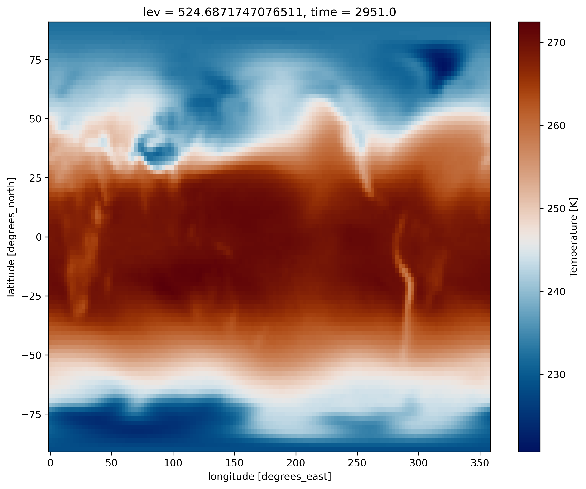

# Post-processing and Visualization

*   [Introduction to Jupyterhub and JupyterLab](#introduction-to-jupyterhub-and-jupyterlab)
	* [Login to the JupyterHub](#login-to-the-jupyterhub)
	* [Start and stop your server](#start-and-stop-your-server)
	* [JupyterLab](#jupyterlab)
*   [Copy your output files from Saga to the jupyterhub ](#copy-your-output-files-from-saga-to-the-jupyterhub)
*   [Map visualization with python](#map-visualization-with-python)
*   [Customize your maps](#customize-your-plots)
	* [Set figure size](#set-figure-size)
	* [Plot 4D-fields such as Temperature](#plot-4d-fields-such-as-temperature)
	* [Change map projection](#change-map-projection)
*   [Georeferenced Latitude-Vertical plot](#georeferenced-latitude-vertical-plot)	
	* [2D plot for one longitude point](#2d-plot-for-one-longitude-point)
	* [2D plot over averaged longitudes](#2d-plot-over-averaged-longitudes)
*   [CESM vertical coordinate system](#cesm-vertical-coordinate-system)

# Introduction to Jupyterhub and JupyterLab

You will be using jupyterhub to post-process and visualize your data. All attendees have received a username
and corresponding password; please let us know otherwise.  

## Login to the JupyterHub

- Click on **Dataporten**

- **Do not use your Feide user account, so click on **Can't find your user account?**

- In **Other login alternatives**, click on **Feide guest users**

- Use the username and password you have received and **sign In**.

> ## Tips
> Before getting to the username/password login page, your browser may warn you about the security
> of the website and get a message such as "This site is not secure". In order to bypass this security message,
> you need to accept to proceed. Let us know if you still have problems to login.
>
{: .callout}
 
## Start and stop your server

When you manage to successfully login to the Jupyterhub, you should have the following panels:

To start/stop your server, clock on **Control Panel**:

When your server is not running, the button "Stop My Server" does not appear and you only see the button "My Server".

- To stop your server, click on "Stop My Server"
- To start your server, click on "My Server"

> ## Important note
>
> Make sure you stop your server once you have finished your session so it can release resources for next time. 
>
{: .callout}

## JupyterLab

By default, you will get the web-based user interface for Project Jupyter that is called [JupyterLab](https://jupyterlab.readthedocs.io/en/stable/).

> ## Remark
> Do not worry if you do not have **pangeo** notebooks. We will see later how to change kernels within JupyterLab.
>
{: .callout}

### Menu Bar

The menu bar at the top of JupyterLab has top-level menus that expose actions available in JupyterLab with 
their keyboard shortcuts. The default menus are:

- **File**: actions related to files and directories
- **Edit**: actions related to editing documents and other activities
- **View**: actions that alter the appearance of JupyterLab
- **Run**: actions for running code in different activities such as notebooks and code consoles
- **Kernel**: actions for managing kernels, which are separate processes for running code
- **Tabs**: a list of the open documents and activities in the dock panel
- **Settings**: common settings and an advanced settings editor
- **Help**: a list of JupyterLab and kernel help links

### Left Sidebar

The left sidebar contains a number of commonly-used tabs, such as a file browser, a list of running 
kernels and terminals, the command palette, and a list of tabs in the main work area:

If you move your mouse on the other icon of this left sidebar, a short information is given on its functionality.

If you click on the "running man" icon, you can see what is currently running on your server and you can click on 
"SHUTDOWN" to stop a running Python notebook or Terminal.

### Start a new Terminal

Similarly, you can start a new Terminal by clicking on "Terminal" in the Launcher. 

> ## Tips
> If the **Launcher** tab does not exist 
> anymore in your JupyterLab, you can start a new one in "**File** --> **New Launcher**".
{: .callout}

In your terminal (from jupyterhub):

~~~
source activate pangeo
python -m ipykernel install --user --name=pangeo
~~~
{: .language-bash}

### Create a new python 3 notebook

Go back to the **File Browser** left sidebar tab and in the launcher select **Python 3** under the Notebook 
section:

By default, your new notebook is named as "**Untitled.ipynb**":

- **ipynb** is the extension for any Jupyter notebook and you should make sure all your notebook gets this extension (otherwise it is not recognized as a Jupyter notebook)
- you can rename your jupyter notebook with the tab "File --> Rename Notebook..." or 
  right click on its name.

### Changing kernel

All the python packages we need to analyzing and visualizing climate data are not available in the default **python 3** kernel.

We would need to switch to **pangeo** kernel as shown on the figure below.

- Click on **Python 3** (top right)
- Select **pangeo** to switch kernel

# Copy your output files from Saga to JupyterHub

Start a new **Terminal** on your JupyterHub (this will be referred to hereafter as your "JupyterHub terminal") and type the following commands.

On the JupyterHub terminal:

~~~
# Create a nwe folder for storing mod outputs
mkdir -p $HOME/outputs/runs
# Change directory
cd $HOME/outputs/runs
# Copy model outputs (remote synchronization)
rsync -avzu --progress YOUR_USER_NAME@saga.sigma2.no:/cluster/work/users/YOUR_USER_NAME/archive/F2000climo-f19_g17 .
# Go back to last directory
cd -
~~~
{: .language-bash}

# Map visualization with xarray

Start a new **python3** notebook on your JupyterHub and type the following commands.

On jupyter:

~~~
# Python package that makes working with labelled multi-dimensional arrays simple and efficient
import xarray as xr
~~~
{: .language-python}

This set of commands initialize the python 3 notebook with python package (*xarray*)
that we will use for plotting our netCDF model outputs.

Now we can create a map. We plot **TS** (Surface temperature) by specifying the filename, opening the dataset, and using the *xarray.DataArray.plot()* function:

~~~
%matplotlib inline

# specify the path where your test simulation is stored
path = 'shared-ns1000k/GEO4962/outputs/runs/F2000climo.f19_g17.control/atm/hist/'
filename = path + 'F2000climo.f19_g17.control.cam.h0.0009-01.nc'
print(filename)

# load netcdf file into an xarray dataset
ds = xr.open_dataset(filename, decode_times=False)

# and plot surface temperature
ds.TS.plot()
~~~
{: .language-python}

> ## Remark:
> To make a plot from a jupyter notebook, you may need to add:
> ~~~
> %matplotlib inline
> ~~~
> {: .language-python}
> 
> This line is only valid in a jupyter notebook and cannot be used otherwise.
>
{: .callout}

# Customize your maps

##  Set figure size

~~~
import matplotlib as mpl
mpl.rcParams['figure.figsize'] = [10., 8.]
ds.TS.plot()
~~~ 
{: .language-python}

## Use a scientific color map
Using unscientific color maps like the rainbow (a.k.a. jet) color map distorts and hides the underlying data, while often making the figure unreadable to color-blind readers or when printed in black and white. 
If you want to use a scientific color map (created by Fabio Crameri here at UiO), you can load the function [load_cmap.py](https://raw.githubusercontent.com/NordicESMhub/GEO4962/gh-pages/code/load_cmap.py) using the following statment in your Jupyter Notebook:
~~~
%run load_cmap.py
~~~
{: .language-bash}
More info about scientific color maps, as well as a list of included color maps [here](http://www.fabiocrameri.ch/colourmaps.php)

The function can now be used as the color map argument when you plot:
~~~
ds.TS.plot(cmap=load_cmap('vik'))
~~~ 
{: .language-python}

## Plot 4D-fields such as Temperature
		
In the same way add another cell below the plot and display the variable **T** instead of the surface temperature (TS). 
To select which vertical level to plot use the isel() function.

~~~
ds.T.isel(lev=20).plot(cmap=load_cmap('vik'))
~~~
{: .language-python}

Contrary to TS which depends only on two horizontal dimensions (namely latitude and longitude)
 plus time, for T there is an additional vertical dimension (lev).

> ## What did we plot?
>
> - What is the difference between T and TS?
> - Which time did you plot?
> - Which level did you plot?
> - How to display the lowest model level?
{: .challenge}

Now, add another cell below the plot and try to display the zonal wind (U) instead of the surface temperature (TS).
As for T, U has an additional dimension (along the vertical), hence we also have to specify a vertical level 
(between 0 and 29) to make our plot. 

On jupyter:

~~~
ds.U.isel(lev=-1).squeeze().plot(cmap=load_cmap('broc'))
~~~
{: .language-python}

## Change map projection
We can use the Python package Cartopy to produce maps and do other geospatial data analyses.
We will also use pyplot, a collection of functions that make plotting simpler.

~~~
import cartopy.crs as ccrs
import matplotlib.pyplot as plt

fig = plt.figure()
ax = plt.axes(projection=ccrs.Miller())

ds.TS.plot(ax=ax, 
           transform=ccrs.PlateCarree(),
           cmap=load_cmap('vik') 
          )

ax.coastlines()
~~~
{: .language-python}

The list of available cartopy projections is available [here](https://scitools.org.uk/cartopy/docs/latest/crs/projections.html).

> ## Plotting your model outputs
> - Use data from your own experiment `F2000climo-f19_g17` to generate maps for various
> variables such as T, U and any other variables that may be of interest for your analysis.
> **Tips**: To read your model outputs, use: 
>
> ~~~
> path = 'outputs/runs/F2000climo-f19_g17/atm/hist/' 
> filename = path + 'F2000climo-f19_g17.cam.h0.0014-01.nc' 
> ~~~
> {: .language-python}
>
{: .challenge}

## Georeferenced Latitude-Vertical plot 

### 2D plot for one longitude point

We use *xarray*'s *sel* to select the data along longitude 0.

~~~

ds.T.sel(lon=0).plot(cmap=load_cmap('vik'))

~~~
{: .language-python}

### 2D plot over averaged longitudes
Now instead of selecting one longitude, we average over all the longitudes,
using the *mean* function:

~~~
ds.T.mean(dim='lon').plot(cmap=load_cmap('vik'))
~~~
{: .language-python}

## CESM vertical coordinate system

The vertical coordinate is a **hybrid sigma-pressure system**. 

The hybrid coordinate was developed by 
[Simmons and Strüfing, 1981](https://rmets.onlinelibrary.wiley.com/doi/abs/10.1002/qj.49710945905) 
in order to provide a general framework for a vertical coordinate which is terrain following at 
the Earth’s surface, but reduces to a pressure coordinate at some point above the surface.

In this system, the upper regions 
of the atmosphere are discretized by pressure only. Lower vertical levels use 
the sigma (i.e. p/ps) vertical coordinate smoothly merged in, with the lowest levels being 
pure sigma. A schematic representation of the hybrid vertical coordinate and vertical indexing is 
presented below. 

The CESM system is defined such that closer to the earth's surface, the levels more closely resemble a pure sigma level, while the higher up you go, the more the levels are like pressure levels.

The formula to use to determine the pressure at the edge of the layer K is : 

where Ps is the surface pressure and A and B are coefficients defined at each model level and stored in the netCDF model outputs.

Let's have a look at the values of A and B:

~~~
print(ds.hyam)
~~~
{: .language-python}

~~~ 
<xarray.DataArray 'hyam' (lev: 32)>
array([0.003643, 0.007595, 0.014357, 0.024612, 0.035923, 0.043194, 0.051677,
       0.06152 , 0.073751, 0.087821, 0.103317, 0.121547, 0.142994, 0.168225,
       0.178231, 0.170324, 0.161023, 0.15008 , 0.137207, 0.122062, 0.104245,
       0.084979, 0.066502, 0.050197, 0.037189, 0.028432, 0.022209, 0.016407,
       0.011075, 0.006255, 0.001989, 0.      ])
Coordinates:
  * lev      (lev) float64 3.643 7.595 14.36 24.61 ... 936.2 957.5 976.3 992.6
Attributes:
    long_name:  hybrid A coefficient at layer midpoints

~~~
{: .output}

~~~
print(ds.hybm)
~~~
{: .language-python}

~~~ 
<xarray.DataArray 'hybm' (lev: 32)>
array([0.      , 0.      , 0.      , 0.      , 0.      , 0.      , 0.      ,
       0.      , 0.      , 0.      , 0.      , 0.      , 0.      , 0.      ,
       0.019677, 0.062504, 0.112888, 0.172162, 0.241894, 0.323931, 0.420442,
       0.5248  , 0.624888, 0.713208, 0.78367 , 0.831103, 0.864811, 0.896237,
       0.925124, 0.951231, 0.974336, 0.992556])
Coordinates:
  * lev      (lev) float64 3.643 7.595 14.36 24.61 ... 936.2 957.5 976.3 992.6
Attributes:
    long_name:  hybrid B coefficient at layer midpoints
~~~
{: .output}

If we print these coefficients A and B and the level, we can clearly understand why at the top of the atmosphere, we have 
pure pressure levels (B=0) and pure sigma levels at the bottom (A=0):

~~~ 
print("lev     A          B")
for lev, a, b in zip (range(1,ds.dims['lev']+1), ds.hyam.values, ds.hybm.values):
    print(lev, 1000*a, 1000*b)
~~~
{: .language-python}

~~~
lev     A          B
1 3.64346569404006 0.0
2 7.594819646328688 0.0
3 14.356632251292467 0.0
4 24.612220004200935 0.0
5 35.92325001955032 0.0
6 43.1937500834465 0.0
7 51.67749896645546 0.0
8 61.52049824595451 0.0
9 73.75095784664154 0.0
10 87.82123029232025 0.0
11 103.31712663173676 0.0
12 121.54724076390266 0.0
13 142.99403876066208 0.0
14 168.22507977485657 0.0
15 178.2306730747223 19.677413627505302
16 170.32432556152344 62.50429339706898
17 161.02290898561478 112.8879077732563
18 150.08028596639633 172.16161638498306
19 137.20685988664627 241.89404398202896
20 122.06193804740906 323.93063604831696
21 104.24471274018288 420.44246196746826
22 84.97915416955948 524.7995406389236
23 66.50169566273689 624.8877346515656
24 50.19678920507431 713.2076919078827
25 37.188658490777016 783.6697101593018
26 28.431948274374008 831.1028182506561
27 22.20897749066353 864.8112714290619
28 16.40738220885396 896.2371647357941
29 11.074557900428772 925.1238405704498
30 6.2549535650759935 951.230525970459
31 1.9894090946763754 974.3359982967377
32 0.0 992.556095123291

~~~
{: .output}

We multiplied A and B by *1000* so that values are in **hPa**.

So if we compute the pressure at the lowest model level in Oslo:

~~~
# Find the surface pressure of the grid cell near Oslo and convert from Pascal to hPa
PS_oslo = ds['PS'].isel(time=0).sel(lat=60., lon=10.75, method='nearest')/100. 

# Convert the lowest model level from sigma to pressure
p_bottom_oslo = ds.hyam[-1] + ds.hybm[-1]*PS_oslo
print("Oslo (hPa)")
print("PS = ", PS_oslo.values, " Lowest model level = ", p_bottom_oslo.values)

~~~ 
{: .language-python}

~~~
Oslo (hPa)
PS =  948.606640625  Lowest model level =  941.545303026773
~~~
{: .output}

So the pressure at the lowest model level is not that far from the surface pressure in Oslo.

> ## And what about the Mount Everest?
> Compute the pressure value at the lowest model level (close to the surface) for lat=28 and lon=86.5 (Everest top)
> 
> > ## Solution
> > 
> > ~~~
> > # First find the value of the surface pressure at Everest and convert to hPa
> > PS_everest = ds['PS'].isel(time=0).sel(lat=28., lon=86.5, method='nearest')/100. 
> > # Then proceed as for Oslo
> > print(PS_everest)
> > ~~~
> > {: .language-python}
> > 
> > ~~~
> > <xarray.DataArray 'PS' ()>
> > array(756.7215625)
> > Coordinates:
> >     lat      float64 27.47
> >     lon      float64 87.5
> >     time     float64 2.951e+03
> > ~~~
> > {: .output}
> > 
> > And now we compute the pressure at the lowest model level:
> > 
> > ~~~
> > p_bottom_everest = ds.hyam[-1] + ds.hybm[-1]*PS_everest
> > print(p_bottom_everest)
> > ~~~
> > {: .language-python}
> > 
> > ~~~
> > <xarray.DataArray ()>
> > array(751.08859917)
> > Coordinates:
> >     lev      float64 992.6
> >     lat      float64 27.47
> >     lon      float64 87.5
> >     time     float64 2.951e+03
> > ~~~
> > {: .output}
> > This clearly shows that the lowest level pressure value we have at the top of Mount Everest is 751 hPa, quite different from the corresponding sigma level (992.6).
> {: .solution}
{: .challenge}

More information can be found in [Description of the NCAR Community Atmosphere Model (CAM 3.0)](http://www.cesm.ucar.edu/models/atm-cam/docs/description/description.pdf).

Having pressure values (hPa) as the vertical coordinate, it is clear that we need to revert the
vertical axis to get the lower values at the top and the highest values at the bottom:

~~~
ds.T.mean(dim='lon').plot(cmap=load_cmap('vik'))
plt.ylim(plt.ylim()[::-1])
~~~
{: .language-python}

The vertical axis is labelled as "hybrid level at midpoints". Again, not pressure levels but still we 
usually use the log to plot it as it is more intuitive to analyze. For this, go to the tab "Grid" and 
change the units of the vertical axis from "scalar" to "Log10". 

~~~
ds.T.mean(dim='lon').plot(cmap=load_cmap('vik'))
plt.ylim(plt.ylim()[::-1])
plt.yscale('log')
~~~
{: .language-python}

We can also adjust the top of the figure:

~~~
ds.T.mean(dim='lon').plot(cmap=load_cmap('vik'))
plt.ylim(plt.ylim()[::-1])
plt.yscale('log')
plt.ylim(top=10)
~~~
{: .language-python}

> ## Georeferenced Latitude-Vertical plot with your model outputs
> - Use data from your own experiment `F2000climo-f19_g17` to generate 
> georeferenced Latitude-Vertical plot for U and T. 
>
> **Tips**: To read your model outputs, use: 
>
> ~~~
> path = 'outputs/runs/F2000climo-f19_g17/atm/hist/' 
> filename = path + 'F2000climo-f19_g17.cam.h0.0014-01.nc' 
> ~~~
> {: .language-python}
>
{: .challenge}



