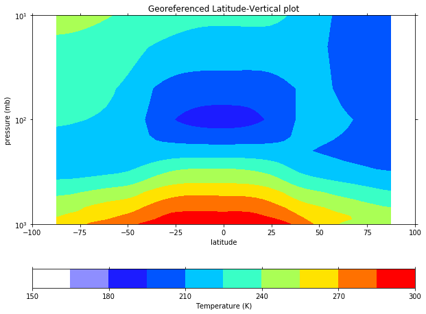
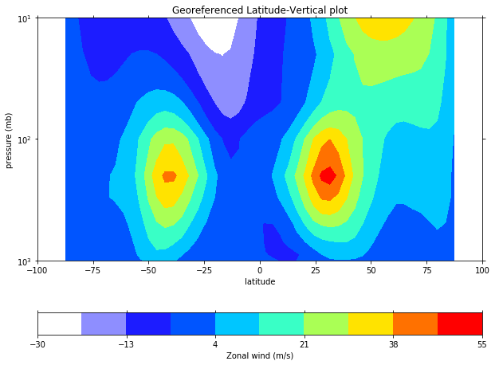

# Interpolate from model levels to pressure levels

### Interpolate to one pressure level

PyNGL (Python NCL Graphics Library) is a python interface to the same core graphics as NCL (NCAR Command Language) for visualization and data processing.

PyNIO (Python Interface for Geoscientific Data Input/Output) is a python package that allows read and/or write access to a variety of data formats using an interface modeled on netCDF.

Note: These PyNGL & PyNIO libraries are still under developpement and therefore not yet fully operational (i.e., not all the functionalities were implemented).

In this section we are going to use [Ngl.vinth2p](https://www.pyngl.ucar.edu/Functions/Ngl.vinth2p.shtml). 

- This PyNGL function interpolates CESM hybrid coordinates (i.e., model levels) to pressure coordinates.

- The type of interpolation is currently a variant of transformed pressure coordinates with the interpolation type specified by intyp. 

- All hybrid coordinate values are transformed to pressure values. 

  - If the input data (i.e., to be interpolated) is on midlevels, then hyam/hybm coefficients should be supplied; 
  - If the input data is on interfaces, then hyai/hybi coefficients should be supplied.

Warning: the unit for psrf *(the surface pressure at each grid point)* is **Pascals (Pa)** whereas the unit for pnew *(lists of output pressure levels)* and p0 *(scalar value equal to surface reference pressure)* is **millibars (mb)**. 

~~~
import Ngl
import Nio
import os
import xarray as xr
import numpy as np
import matplotlib as mpl

# python package for plotting maps, 2D plot, etc.
import psyplot.project as psy

# the next line is only necessary when running within a Jupyter notebook
# and allows to inline plots in the Jupyter notebook
%matplotlib inline

# Set figure size for all our plots
mpl.rcParams['figure.figsize'] = [10., 8.]
# get your username from the environment variable USER
username = os.getenv('USER')
# specify the path where your test simulation is stored
path = '/opt/uio/GEO4962/' + username + '/f2000.T31T31.test/atm/hist/'
filename = path + 'f2000.T31T31.test.cam.h0.0009-01.nc'
print(filename)

#  Open the netCDF file containing the input data.
cfile = Nio.open_file(filename,"r")

#  Define the output pressure levels.
pnew = [850.]

#  Extract the desired variables.
hyam = cfile.variables["hyam"][:]
hybm = cfile.variables["hybm"][:]
T    = (cfile.variables["T"][:,:,:,:])
psrf = (cfile.variables["PS"][:,:,:])
P0mb =  0.01*cfile.variables["P0"].get_value()

lats = cfile.variables["lat"][:]
lons = cfile.variables["lon"][:]

#  Do the interpolation.
intyp = 1                              # 1=linear, 2=log, 3=log-log
kxtrp = False                          # True=extrapolate (when the output pressure level is outside of the range of psrf)
  
Tnew = Ngl.vinth2p(T,hyam,hybm,pnew,psrf,intyp,P0mb,1,kxtrp)

Tnew[Tnew==1e30] = np.NaN

T850=xr.Dataset({'T850': (('lats','lons'), Tnew[0,0,:,:])},
                {'lons':  lons, 'lats':  lats})

# plot using psyplot

psy.plot.mapplot(T850, name='T850', title='Temperature (K) at 850 mb')
~~~
{: .language-python}

> ## Create a map plot for the zonal wind (U) at **850 mb**
> 
> Make a similar plot with **U**, using the same structure and code as for **T**.
>
> > ## Solution
> > ~~~
> > import xarray as xr
> > import numpy as np
> >  
> > pnew = [850.]
> > 
> > U    = (cfile.variables["U"][:,:,:,:])
> > UonP = Ngl.vinth2p(U,hyam,hybm,pnew,psrf,intyp,P0mb,1,kxtrp)
> >  
> > ntime, output_levels, nlat, nlon = UonP.shape
> > 
> > UonP[UonP==1e30] = np.NaN
> > U850=xr.Dataset({'U850': (('lat','lon'), UonP[0,0,:,:])},
> >                 {'lat':  lats, 'lon':  lons})
> > 
> > # plot using psyplot
> > psy.plot.mapplot(U850, name='U850', title='Zonal wind (m/s) at 850 mb')
> > ~~~
> > {: .language-python}
> >
> >  
> >
> {: .solution}
{: .challenge}

### Georeferenced Latitude-Vertical plot on pressure levels

Let's go back to Georeferenced Latitude-Vertical plots but now we wish the vertical axis to
represent pressure levels and not hybrid sigma pressure levels.

We will first plot the zonal wind (U):

~~~
import xarray as xr
import numpy as np
import matplotlib.pyplot as plt

pnew = [1000., 900., 850., 700., 600, 500., 400., 300., 100., 30., 10.]

intyp = 1                             # 1=linear, 2=log, 3=log-log
kxtrp = True                          # True=extrapolate

UonP = Ngl.vinth2p(U,hyam,hybm,pnew,psrf,intyp,P0mb,1,kxtrp)

ntime, output_levels, nlat, nlon = UonP.shape

~~~
{: .language-python}

You will notice that here we used **kxtrp = True** in order to **extrapolate** when the pressure level is outside of the range of psrf (the array of surface pressures).

In this example *pnew* is an array containing pressure levels and we interpolate U on these levels to 
generate a new array called *UonP*.
 
Then we average *UonP* along all the longitudes and generate a new array called *Umean*:

~~~
UonP[UonP==1e30] = np.NaN
print(UonP.mean(axis=3).shape,lats.shape)
Umean=xr.Dataset({'U': (('lev','lat'), UonP.mean(axis=3)[0,:,:])},
                 {'lev':  np.asarray(pnew), 'lat':  lats})
~~~
{: .language-python}
		
We can now plot *Umean*:

~~~
psy.plot.plot2d(Umean, name='U', plot='contourf', 
                title="Georeferenced Latitude-Vertical plot", 
                clabel="Zonal wind (m/s)",
                xlabel='latitude',
                ylabel='pressure (mb)')
                
plt.ylim(plt.ylim()[::-1])
plt.yscale('symlog')
plt.ylim(bottom=1000)
plt.ylim(top=10)
~~~
{: .language-python}

> ## Create a Georeferenced Latitude-Vertical **temperature** plot on the following pressure levels:
> pnew = [850., 700., 600, 500., 400., 300., 100., 30., 10.]
> 
> - What do you observe? 
> - Is there anything wrong?
>
> > ## Solution
> >
> > Note: In the plot below we do not use a log scale for the vertical axis in order to highlight the issue with missing values.
> >
> > ~~~
> > import xarray as xr
> > import numpy as np
> > import matplotlib.pyplot as plt
> > 
> > pnew = [850., 700., 600, 500., 400., 300., 100., 30., 10.]
> > 
> > intyp = 1                             # 1=linear, 2=log, 3=log-log
> > kxtrp = True                          # True=extrapolate
> >
> > Tnew = Ngl.vinth2p(T,hyam,hybm,pnew,psrf,intyp,P0mb,1,kxtrp)
> > 
> > ntime, output_levels, nlat, nlon = Tnew.shape
> > 
> > Tnew[Tnew==1e30] = np.NaN
> >
> > Tmean=xr.Dataset({'T': (('lev','lat'), Tnew.mean(axis=3)[0,:,:])},
> >                  {'lev':  np.asarray(pnew), 'lat':  lats})
> > 
> > psy.plot.plot2d(Tmean, name='T', plot='contourf')
> > # Invert vertical axis
> > plt.ylim(plt.ylim()[::-1])
> > plt.ylim(top=10.)
> > plt.ylim(bottom=900.)
> > plt.xlim(left=-90)
> > plt.xlim(right=90)
> > ~~~
> > {: .language-python}
> >
> >  
> >
> {: .solution}
{: .challenge}

Here, we show you how to use [ncl](https://www.ncl.ucar.edu/Document/Tools/) to interpolate T and U fields to 
a list of pressure levels and store the resulting field in a new netCDF file.

The main advantage of using *ncl* as opposed to the current (non-operational) PyNGL and PyNIO is that you have access to an improved interpolation routine called *vinth2p_ecmwf* which interpolates CESM hybrid coordinates to pressure coordinates but uses an ECMWF formulation to **extrapolate** values below ground.

> ## First we need to get the ncl script [vertical_interpolation.ncl](https://raw.githubusercontent.com/NordicESMhub/GEO4962/gh-pages/code/vertical_interpolation.ncl) 
> For instance using the wget command (on the Jupyterhub Terminal):
> ~~~
> (Be careful: do not forget to change directory first by using cd /opt/uio/GEO4962/$USER/analysis)
>
> wget https://raw.githubusercontent.com/NordicESMhub/GEO4962/gh-pages/code/vertical_interpolation.ncl
> ~~~
> {: .language-bash}
>
{: .callout}

~~~
press = "'lev_p=(/1000.0,900.,850.,700.,500.,300.,200.,100.,50.,20.,10./)'"
cmd = "ncl " + press + " 'input_filename=" + '"' + filename + '"' 
cmd = cmd + "' 'output_filename=" + '"f2000.T31T31.test.cam.h0.0009-01_pl.nc"' 
cmd = cmd + "' vertical_interpolation.ncl"

# run ncl command
import os
returned_value = os.system(cmd)
print(returned_value)
~~~
{: .language-python}

A *returned value* different from **0** means that there has been an error somewhere (which will have to be fixed), otherwise we can plot the temperature values read from the newly created file:

~~~
import xarray as xr

ds = psy.open_dataset('f2000.T31T31.test.cam.h0.0009-01_pl.nc')

# Create a new dataset over latitudes and levels
# where we select time=0 and lon=0
T_cross_section = xr.Dataset({'T': ds['T'].isel(time=0).mean(dim='lon')},
                             {'lat':  ds.lat, 'lev': ds.lev_p}, 
                             attrs = ds['T'].attrs)

# Plot
psy.plot.plot2d(T_cross_section, name='T', plot='contourf', 
                title="Georeferenced Latitude-Vertical plot", 
                clabel="Temperature (K)",
                xlabel='latitude',
                ylabel='pressure (mb)')

plt.ylim(plt.ylim()[::-1])
plt.yscale('symlog')
plt.ylim(bottom=1000)
plt.ylim(top=10)
~~~
{: .language-python}

 

And U:

~~~
U_cross_section = xr.Dataset({'U': ds['U'].isel(time=0).mean(dim='lon')},
                             {'lat':  ds.lat, 'lev': ds.lev_p}, 
                             attrs = ds['U'].attrs)

psy.plot.plot2d(U_cross_section, name='U', plot='contourf', 
                title="Georeferenced Latitude-Vertical plot", 
                clabel="Zonal wind (m/s)",
                xlabel='latitude',
                ylabel='pressure (mb)')
                
plt.ylim(plt.ylim()[::-1])
plt.yscale('symlog')
plt.ylim(bottom=1000)
plt.ylim(top=10)
~~~
{: .language-python}

 



