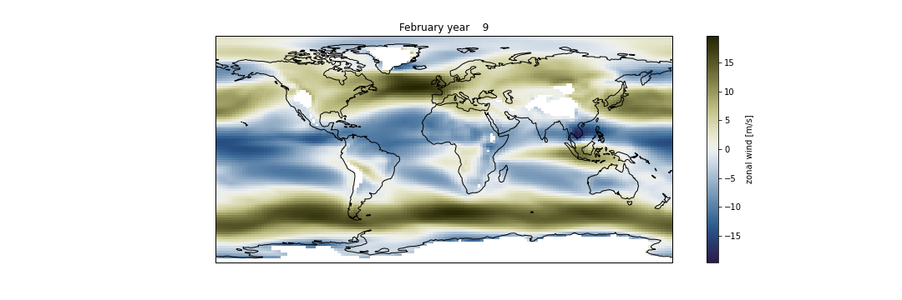

# Interpolate from model levels to pressure levels

### Interpolate to one pressure level

PyNGL (Python NCL Graphics Library) is a python interface with the same core graphics as NCL (NCAR Command Language) for visualization and data processing.

In this section we are going to use [Ngl.vinth2p](https://www.pyngl.ucar.edu/Functions/Ngl.vinth2p.shtml). 

- This PyNGL function interpolates CESM hybrid coordinates (i.e., model levels) to pressure coordinates.

- The type of interpolation is currently a variant of transformed pressure coordinates with the interpolation type specified by intyp. 

- All hybrid coordinate values are transformed to pressure values. 

  - If the input data (i.e., to be interpolated) is on midlevels, then hyam/hybm coefficients should be supplied; 
  - If the input data is on interfaces, then hyai/hybi coefficients should be supplied.

> ## Warning
> The unit for psrf *(the surface pressure at each grid point)* is **Pascals (Pa)** whereas the unit for pnew *(lists of output pressure levels)* and p0 *(scalar value equal to surface reference pressure)* is **millibars (mb)**. 
>
{: .callout}

~~~
# Python package that makes working with labelled multi-dimensional arrays simple and efficient
import Ngl
import os
import xarray as xr
import numpy as np
import cartopy.crs as ccrs
import matplotlib.pyplot as plt
%matplotlib inline

path = 'shared-ns1000k/GEO4962/outputs/runs/F2000climo.f19_g17.control/atm/hist/'
filename = path + 'F2000climo.f19_g17.control.cam.h0.0009-01.nc'
print(filename)

# load netcdf file into an xarray dataset
ds = xr.open_dataset(filename, decode_times=True)

#  Extract the desired variables (need numpy arrays for vertical interpolation)
hyam = ds["hyam"]
hybm = ds["hybm"]
T    = ds["T"]
psrf = ds["PS"]
P0mb =  0.01*ds["P0"]

lats = ds["lat"]
lons = ds["lon"]

#  Define the output pressure levels.
pnew = [850.]
#  Do the interpolation.
intyp = 1                              # 1=linear, 2=log, 3=log-log
kxtrp = False                          # True=extrapolate (when the output pressure level is outside of the range of psrf)
  
# Vertical interpolation

Tnew = Ngl.vinth2p(T,hyam,hybm,pnew,psrf,intyp,P0mb,1,kxtrp)

Tnew[Tnew==1e30] = np.NaN

# Create new xarray Dataset

dset_p = xr.Dataset({'T850': (('lat','lon'), Tnew[0,0,:,:])},
                  {'lon':  lons, 'lat':  lats})
dset_p.T850.attrs['units'] = 'K'
dset_p.T850.attrs['long_name'] = "Temperature"
dset_p.T850.attrs['standard_name'] = 'T'

# Plotting
fig = plt.figure(figsize=(15, 5))
ax = plt.axes(projection=ccrs.PlateCarree())

dset_p.T850.plot(ax=ax, transform=ccrs.PlateCarree(), cmap=load_cmap('vik'))

ax.coastlines()
plt.title(ds.time.values[0].strftime("%B year %Y"))
~~~
{: .language-python}

> ## Loading colormaps
> In your jupyter notebook, you can load additional/customized colormap using the following statment:
> ~~~
> %run shared-ns1000k/GEO4962/scripts/load_cmap.ipynb
> ~~~
> {: .language-bash}
>
> with [load_cmap.py](https://raw.githubusercontent.com/NordicESMhub/GEO4962/gh-pages/code/load_cmap.py).
>
{: .callout}

> ## Create a map plot for the zonal wind (U) at **850 mb**
> 
> Make a similar plot with **U**, using the same structure and code as for **T**.
>
> > ## Solution
> > ~~~
> > pnew = [850.]
> >
> > #  Do the interpolation.
> > intyp = 1                              # 1=linear, 2=log, 3=log-log
> > kxtrp = False                          # True=extrapolate (when the output pressure level is outside of the range of psrf)
> >   
> > U    = ds["U"]
> > 
> > UonP = Ngl.vinth2p(U,hyam,hybm,pnew,psrf,intyp,P0mb,1,kxtrp)
> >    
> > ntime, output_levels, nlat, nlon = UonP.shape
> > 
> > UonP[UonP==1e30] = np.NaN
> > 
> > dset_p=xr.Dataset({'U850': (('lat','lon'), UonP[0,0,:,:])},
> >                   {'lat':  lats, 'lon':  lons})
> > dset_p.U850.attrs['units'] = 'm/s'
> > dset_p.U850.attrs['long_name'] = "zonal wind"
> > dset_p.U850.attrs['standard_name'] = 'U'
> > fig = plt.figure(figsize=(15, 5))
> > ax = plt.axes(projection=ccrs.PlateCarree())
> > 
> > dset_p.U850.plot(ax=ax, 
> >            transform=ccrs.PlateCarree(),
> >            cmap=load_cmap('broc') 
> >            )
> > 
> > ax.coastlines()
> > plt.title(ds.time.values[0].strftime("%B year %Y"))
> > 
> > ~~~
> > {: .language-python}
> >
> >  
> >
> {: .solution}
{: .challenge}

### Georeferenced Latitude-Vertical plot on pressure levels

Let's go back to Georeferenced Latitude-Vertical plots but now we wish the vertical axis to
represent pressure levels and not hybrid sigma pressure levels.

We will first plot the zonal wind (U):

~~~
import xarray as xr
import numpy as np
import matplotlib.pyplot as plt

pnew = [850., 700., 600, 500., 400., 300., 100., 30., 10.]

intyp = 1                             # 1=linear, 2=log, 3=log-log
kxtrp = True                          # True=extrapolate

UonP = Ngl.vinth2p(U,hyam,hybm,pnew,psrf,intyp,P0mb,1,kxtrp)

ntime, output_levels, nlat, nlon = UonP.shape
~~~
{: .language-python}

You will notice that here we used **kxtrp = True** in order to **extrapolate** when the pressure level is outside of the range of psrf (the array of surface pressures).

In this example *pnew* is an array containing pressure levels and we interpolate U on these levels to 
generate a new array called *UonP*.
 
Then we average *UonP* along all the longitudes and generate a new array called *Umean*:

~~~
UonP[UonP==1e30] = np.NaN
print(UonP.mean(axis=3).shape,lats.shape)
Umean=xr.Dataset({'U': (('lev','lat'), UonP.mean(axis=3)[0,:,:])},
                 {'lev':  np.asarray(pnew), 'lat':  lats})
Umean.U.attrs['units'] = 'm/s'
Umean.U.attrs['long_name'] = "zonal wind"
Umean.U.attrs['standard_name'] = 'U'
~~~
{: .language-python}
		
We can now plot *Umean*:

~~~
fig = plt.figure(figsize=(8, 6))
Umean.U.plot.contourf(cmap=load_cmap('vik'))
plt.ylim(plt.ylim()[::-1])
plt.yscale('log')
plt.ylim(top=10.)
plt.ylim(bottom=850.)
plt.title("Zonal wind on pressure levels")
~~~
{: .language-python}

> ## Create a Georeferenced Latitude-Vertical **temperature** plot on the following pressure levels:
> pnew = [850., 700., 600, 500., 400., 300., 100., 30., 10.]
> 
> - Try setting `kxtrp = False` and make another plot with `kxtrp = True`
> - What do you observe? 
> - Is there anything wrong?
>
> > ## Solution
> >
> > Note: In the plot below we do not use a log scale for the vertical axis in order to highlight the issue with missing values.
> >
> > ~~~
> > import xarray as xr
> > import numpy as np
> > import matplotlib.pyplot as plt
> > 
> > pnew = [850., 700., 600, 500., 400., 300., 100., 30., 10.]
> > 
> > intyp = 1                             # 1=linear, 2=log, 3=log-log
> > kxtrp = True                          # True=extrapolate
> > 
> > Tnew = Ngl.vinth2p(T,hyam,hybm,pnew,psrf,intyp,P0mb,1,kxtrp)
> > 
> > ntime, output_levels, nlat, nlon = Tnew.shape
> > 
> > Tnew[Tnew==1e30] = np.NaN
> > 
> > Tmean=xr.Dataset({'T': (('lev','lat'), Tnew.mean(axis=3)[0,:,:])},
> >                  {'lev':  np.asarray(pnew), 'lat':  lats})
> > Tmean.T.attrs['units'] = 'K'
> > Tmean.T.attrs['long_name'] = "Temperature"
> > Tmean.T.attrs['standard_name'] = 'T'
> > 
> > fig = plt.figure(figsize=(8, 6))
> > Tmean.T.plot.contourf(cmap=load_cmap('vik'))
> > # Invert vertical axis
> > plt.ylim(plt.ylim()[::-1])
> > plt.ylim(top=10.)
> > plt.ylim(bottom=850.)
> > plt.xlim(left=-90)
> > plt.xlim(right=90)
> > plt.title("Georeferenced Latitude-Vertical plot \n Temperature on pressure levels")
> > ~~~
> > {: .language-python}
> >
> >  
> >
> {: .solution}
{: .challenge}



