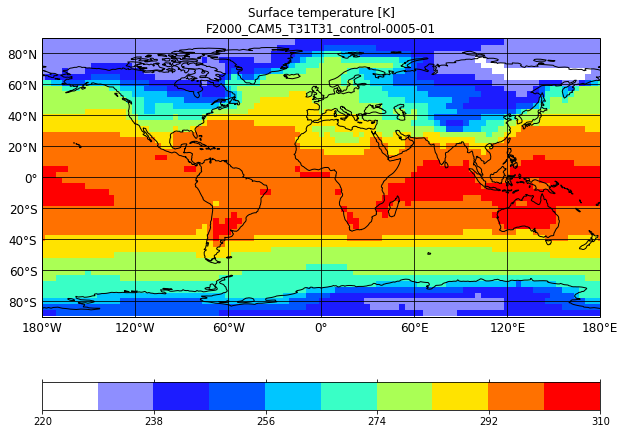
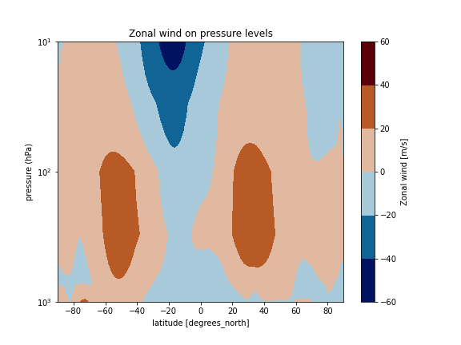
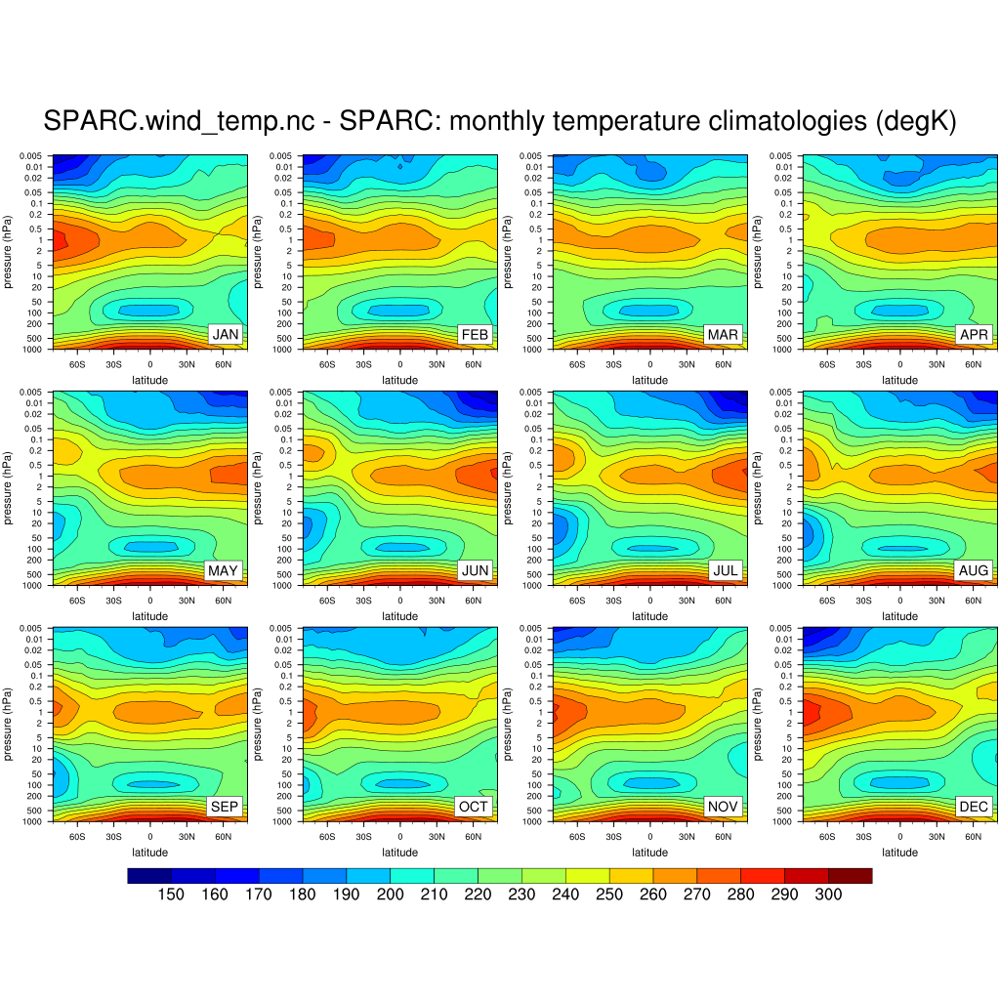
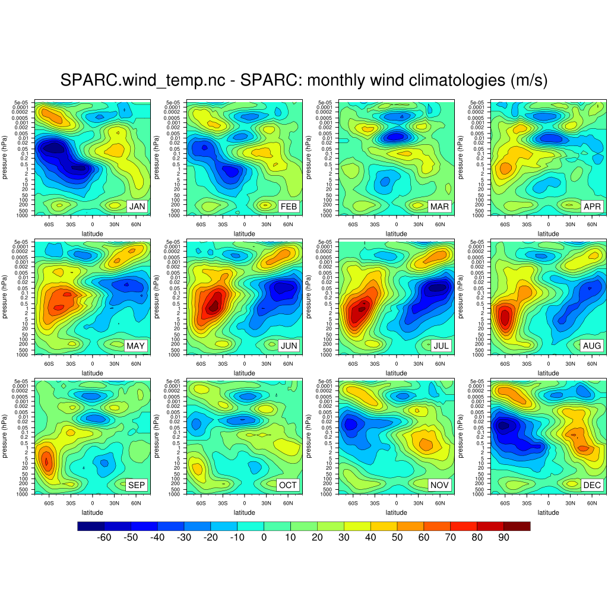
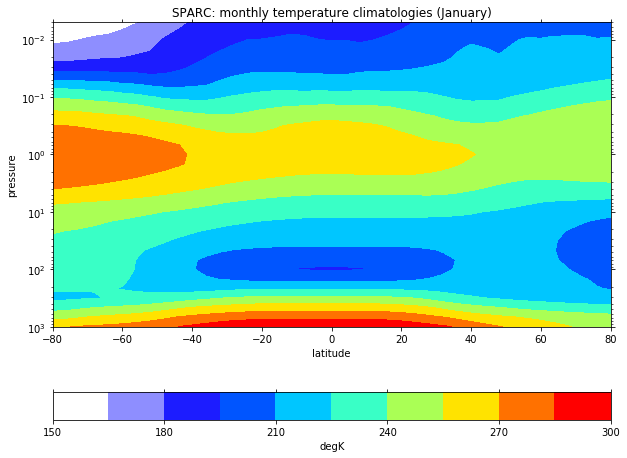
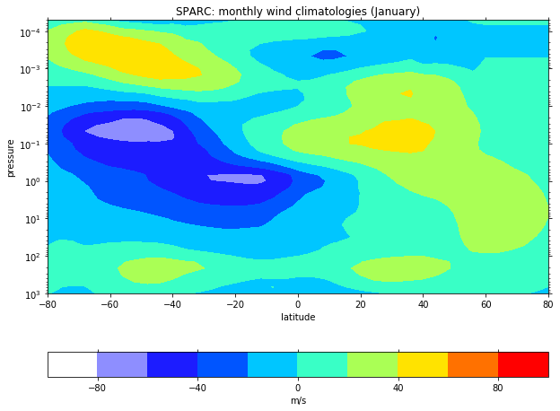
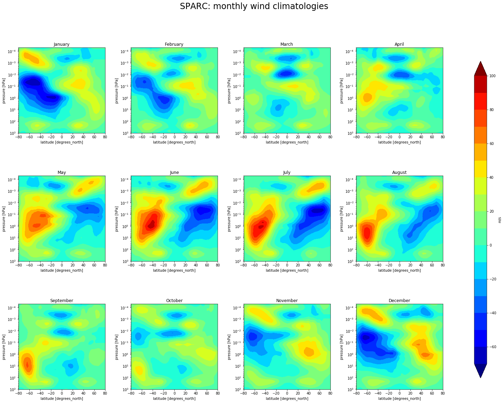
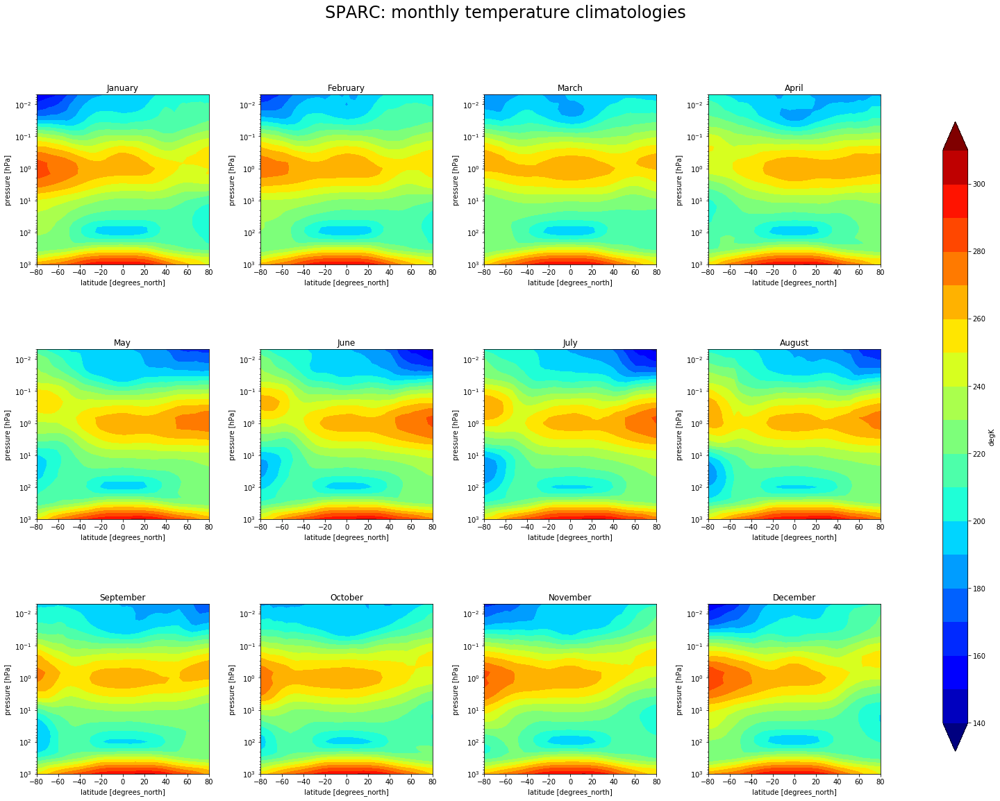

*   [What is a control run?](#what-is-a-control-run)
	* [What does our control run contain?](#what-does-our-control-run-contain)
	* [Analyze and Visualize](#analyze-and-visualize)
*   [What is a climatology?](#what-is-a-climatology)
	*   [SPARC Climatology](#sparc-climatology)
*   [Compare the control run to the SPARC climatology](#compare-the-control-run-to-the-sparc-climatology)
	*   [Methodology](#methodology)
	*   [Exercice](#exercice) ([check the deadline!](#deadline))

# What is a control run?

A control run is a simulation undertaken with a model with known conditions for the ocean, atmosphere, etc.

In our case, the control run will be used as a reference to evaluate the impacts of different scenarii 
(changes made to the atmospheric composition such CO2 concentration increase, etc.).

The control run is representative of the conditions in years 2000 i.e. similar to today's climate. The idea was 
to generate the restart files (snapshot of the model state at a given point in time) from where you will be able to 
start your future experiments at year 9 and further compare your simulation outputs with the control run for the following years.

## What does our control run contain?

The control run model outputs are accessible from the Jupyterhub; for instance, from a Terminal:

~~~
ls $HOME/GEO4962/outputs/runs/f2000.T31T31.control/atm/hist
~~~
{: .language-bash}

~~~

f2000.T31T31.control.cam.h0.0001-01.nc  f2000.T31T31.control.cam.h0.0005-09.nc  f2000.T31T31.control.cam.h0.0010-05.nc
f2000.T31T31.control.cam.h0.0001-02.nc  f2000.T31T31.control.cam.h0.0005-10.nc  f2000.T31T31.control.cam.h0.0010-06.nc
f2000.T31T31.control.cam.h0.0001-03.nc  f2000.T31T31.control.cam.h0.0005-11.nc  f2000.T31T31.control.cam.h0.0010-07.nc
f2000.T31T31.control.cam.h0.0001-04.nc  f2000.T31T31.control.cam.h0.0005-12.nc  f2000.T31T31.control.cam.h0.0010-08.nc
f2000.T31T31.control.cam.h0.0001-05.nc  f2000.T31T31.control.cam.h0.0006-01.nc  f2000.T31T31.control.cam.h0.0010-09.nc
f2000.T31T31.control.cam.h0.0001-06.nc  f2000.T31T31.control.cam.h0.0006-02.nc  f2000.T31T31.control.cam.h0.0010-10.nc
f2000.T31T31.control.cam.h0.0001-07.nc  f2000.T31T31.control.cam.h0.0006-03.nc  f2000.T31T31.control.cam.h0.0010-11.nc
f2000.T31T31.control.cam.h0.0001-08.nc  f2000.T31T31.control.cam.h0.0006-04.nc  f2000.T31T31.control.cam.h0.0010-12.nc
f2000.T31T31.control.cam.h0.0001-09.nc  f2000.T31T31.control.cam.h0.0006-05.nc  f2000.T31T31.control.cam.h0.0011-01.nc
f2000.T31T31.control.cam.h0.0001-10.nc  f2000.T31T31.control.cam.h0.0006-06.nc  f2000.T31T31.control.cam.h0.0011-02.nc
f2000.T31T31.control.cam.h0.0001-11.nc  f2000.T31T31.control.cam.h0.0006-07.nc  f2000.T31T31.control.cam.h0.0011-03.nc
f2000.T31T31.control.cam.h0.0001-12.nc  f2000.T31T31.control.cam.h0.0006-08.nc  f2000.T31T31.control.cam.h0.0011-04.nc
f2000.T31T31.control.cam.h0.0002-01.nc  f2000.T31T31.control.cam.h0.0006-09.nc  f2000.T31T31.control.cam.h0.0011-05.nc
f2000.T31T31.control.cam.h0.0002-02.nc  f2000.T31T31.control.cam.h0.0006-10.nc  f2000.T31T31.control.cam.h0.0011-06.nc
f2000.T31T31.control.cam.h0.0002-03.nc  f2000.T31T31.control.cam.h0.0006-11.nc  f2000.T31T31.control.cam.h0.0011-07.nc
f2000.T31T31.control.cam.h0.0002-04.nc  f2000.T31T31.control.cam.h0.0006-12.nc  f2000.T31T31.control.cam.h0.0011-08.nc
f2000.T31T31.control.cam.h0.0002-05.nc  f2000.T31T31.control.cam.h0.0007-01.nc  f2000.T31T31.control.cam.h0.0011-09.nc
f2000.T31T31.control.cam.h0.0002-06.nc  f2000.T31T31.control.cam.h0.0007-02.nc  f2000.T31T31.control.cam.h0.0011-10.nc
f2000.T31T31.control.cam.h0.0002-07.nc  f2000.T31T31.control.cam.h0.0007-03.nc  f2000.T31T31.control.cam.h0.0011-11.nc
f2000.T31T31.control.cam.h0.0002-08.nc  f2000.T31T31.control.cam.h0.0007-04.nc  f2000.T31T31.control.cam.h0.0011-12.nc
f2000.T31T31.control.cam.h0.0002-09.nc  f2000.T31T31.control.cam.h0.0007-05.nc  f2000.T31T31.control.cam.h0.0012-01.nc
f2000.T31T31.control.cam.h0.0002-10.nc  f2000.T31T31.control.cam.h0.0007-06.nc  f2000.T31T31.control.cam.h0.0012-02.nc
f2000.T31T31.control.cam.h0.0002-11.nc  f2000.T31T31.control.cam.h0.0007-07.nc  f2000.T31T31.control.cam.h0.0012-03.nc
f2000.T31T31.control.cam.h0.0002-12.nc  f2000.T31T31.control.cam.h0.0007-08.nc  f2000.T31T31.control.cam.h0.0012-04.nc
f2000.T31T31.control.cam.h0.0003-01.nc  f2000.T31T31.control.cam.h0.0007-09.nc  f2000.T31T31.control.cam.h0.0012-05.nc
f2000.T31T31.control.cam.h0.0003-02.nc  f2000.T31T31.control.cam.h0.0007-10.nc  f2000.T31T31.control.cam.h0.0012-06.nc
f2000.T31T31.control.cam.h0.0003-03.nc  f2000.T31T31.control.cam.h0.0007-11.nc  f2000.T31T31.control.cam.h0.0012-07.nc
f2000.T31T31.control.cam.h0.0003-04.nc  f2000.T31T31.control.cam.h0.0007-12.nc  f2000.T31T31.control.cam.h0.0012-08.nc
f2000.T31T31.control.cam.h0.0003-05.nc  f2000.T31T31.control.cam.h0.0008-01.nc  f2000.T31T31.control.cam.h0.0012-09.nc
f2000.T31T31.control.cam.h0.0003-06.nc  f2000.T31T31.control.cam.h0.0008-02.nc  f2000.T31T31.control.cam.h0.0012-10.nc
f2000.T31T31.control.cam.h0.0003-07.nc  f2000.T31T31.control.cam.h0.0008-03.nc  f2000.T31T31.control.cam.h0.0012-11.nc
f2000.T31T31.control.cam.h0.0003-08.nc  f2000.T31T31.control.cam.h0.0008-04.nc  f2000.T31T31.control.cam.h0.0012-12.nc
f2000.T31T31.control.cam.h0.0003-09.nc  f2000.T31T31.control.cam.h0.0008-05.nc  f2000.T31T31.control.cam.h0.0013-01.nc
f2000.T31T31.control.cam.h0.0003-10.nc  f2000.T31T31.control.cam.h0.0008-06.nc  f2000.T31T31.control.cam.h0.0013-02.nc
f2000.T31T31.control.cam.h0.0003-11.nc  f2000.T31T31.control.cam.h0.0008-07.nc  f2000.T31T31.control.cam.h0.0013-03.nc
f2000.T31T31.control.cam.h0.0003-12.nc  f2000.T31T31.control.cam.h0.0008-08.nc  f2000.T31T31.control.cam.h0.0013-04.nc
f2000.T31T31.control.cam.h0.0004-01.nc  f2000.T31T31.control.cam.h0.0008-09.nc  f2000.T31T31.control.cam.h0.0013-05.nc
f2000.T31T31.control.cam.h0.0004-02.nc  f2000.T31T31.control.cam.h0.0008-10.nc  f2000.T31T31.control.cam.h0.0013-06.nc
f2000.T31T31.control.cam.h0.0004-03.nc  f2000.T31T31.control.cam.h0.0008-11.nc  f2000.T31T31.control.cam.h0.0013-07.nc
f2000.T31T31.control.cam.h0.0004-04.nc  f2000.T31T31.control.cam.h0.0008-12.nc  f2000.T31T31.control.cam.h0.0013-08.nc
f2000.T31T31.control.cam.h0.0004-05.nc  f2000.T31T31.control.cam.h0.0009-01.nc  f2000.T31T31.control.cam.h0.0013-09.nc
f2000.T31T31.control.cam.h0.0004-06.nc  f2000.T31T31.control.cam.h0.0009-02.nc  f2000.T31T31.control.cam.h0.0013-10.nc
f2000.T31T31.control.cam.h0.0004-07.nc  f2000.T31T31.control.cam.h0.0009-03.nc  f2000.T31T31.control.cam.h0.0013-11.nc
f2000.T31T31.control.cam.h0.0004-08.nc  f2000.T31T31.control.cam.h0.0009-04.nc  f2000.T31T31.control.cam.h0.0013-12.nc
f2000.T31T31.control.cam.h0.0004-09.nc  f2000.T31T31.control.cam.h0.0009-05.nc  f2000.T31T31.control.cam.h0.0014-01.nc
f2000.T31T31.control.cam.h0.0004-10.nc  f2000.T31T31.control.cam.h0.0009-06.nc  f2000.T31T31.control.cam.h0.0014-02.nc
f2000.T31T31.control.cam.h0.0004-11.nc  f2000.T31T31.control.cam.h0.0009-07.nc  f2000.T31T31.control.cam.h0.0014-03.nc
f2000.T31T31.control.cam.h0.0004-12.nc  f2000.T31T31.control.cam.h0.0009-08.nc  f2000.T31T31.control.cam.h0.0014-04.nc
f2000.T31T31.control.cam.h0.0005-01.nc  f2000.T31T31.control.cam.h0.0009-09.nc  f2000.T31T31.control.cam.h0.0014-05.nc
f2000.T31T31.control.cam.h0.0005-02.nc  f2000.T31T31.control.cam.h0.0009-10.nc  f2000.T31T31.control.cam.h0.0014-06.nc
f2000.T31T31.control.cam.h0.0005-03.nc  f2000.T31T31.control.cam.h0.0009-11.nc  f2000.T31T31.control.cam.h0.0014-07.nc
f2000.T31T31.control.cam.h0.0005-04.nc  f2000.T31T31.control.cam.h0.0009-12.nc  f2000.T31T31.control.cam.h0.0014-08.nc
f2000.T31T31.control.cam.h0.0005-05.nc  f2000.T31T31.control.cam.h0.0010-01.nc  f2000.T31T31.control.cam.h0.0014-09.nc
f2000.T31T31.control.cam.h0.0005-06.nc  f2000.T31T31.control.cam.h0.0010-02.nc  f2000.T31T31.control.cam.h0.0014-10.nc
f2000.T31T31.control.cam.h0.0005-07.nc  f2000.T31T31.control.cam.h0.0010-03.nc  f2000.T31T31.control.cam.h0.0014-11.nc
f2000.T31T31.control.cam.h0.0005-08.nc  f2000.T31T31.control.cam.h0.0010-04.nc  f2000.T31T31.control.cam.h0.0014-12.nc
~~~
{: .output}

## Analyze and Visualize

The *ending* of the filename gives you some information on its content:
- **f2000.T31T31.control.cam** is the control experiment name
- **h0**: *h* stands for *history* and all *h0* files contain the same variables, processed in a similar manner but for different times.
- The 7 digits allow to represent the simulated year and month i.e. **0005-08** means year 5 (from the start of the simulation) and month 8 (August).
- **.nc** means we have netCDF files only.

So in the control directory (*atm/hist* as we are only interested by CAM model outputs), we have 14 years of simulation and
a file per month. Now let's have a look at a single file.

On jupyterhub in a Python 3 jupyter notebook:

~~~
# python package for plotting maps, 2D plot, etc.
import psyplot.project as psy
import matplotlib as mpl

# the next line is only necessary when running within a Jupyter notebook
# and allows to inline plots in the Jupyter notebook
%matplotlib inline

# Set figure size for all our plots
mpl.rcParams['figure.figsize'] = [10., 8.]

path = '/opt/uio/GEO4962/outputs/runs/f2000.T31T31.control/atm/hist/'
filename = path + 'f2000.T31T31.control.cam.h0.0005-01.nc'
print(filename)

ds = psy.open_dataset(filename)
ds
~~~
{: .language-python}

~~~
<xarray.Dataset>
Dimensions:        (ilev: 31, lat: 48, lev: 30, lon: 96, nbnd: 2, time: 1)
Coordinates:
  * lev            (lev) float64 3.643 7.595 14.36 24.61 ... 957.5 976.3 992.6
  * ilev           (ilev) float64 2.255 5.032 10.16 18.56 ... 967.5 985.1 1e+03
  * time           (time) object 0005-02-01 00:00:00
  * lat            (lat) float64 -87.16 -83.48 -79.78 ... 79.78 83.48 87.16
  * lon            (lon) float64 0.0 3.75 7.5 11.25 ... 345.0 348.8 352.5 356.2
    time_bnds      (time, nbnd) float64 ...
Dimensions without coordinates: nbnd
Data variables:
    hyam           (lev) float64 ...
    hybm           (lev) float64 ...
    hyai           (ilev) float64 ...
    hybi           (ilev) float64 ...
    P0             float64 ...
    date           (time) int32 ...
    datesec        (time) int32 ...
    date_written   (time) |S8 ...
    time_written   (time) |S8 ...
    ntrm           int32 ...
    ntrn           int32 ...
    ntrk           int32 ...
    ndbase         int32 ...
    nsbase         int32 ...
    nbdate         int32 ...
    nbsec          int32 ...
    mdt            int32 ...
    nlon           (lat) int32 ...
    wnummax        (lat) int32 ...
    gw             (lat) float64 ...
    ndcur          (time) int32 ...
    nscur          (time) int32 ...
    co2vmr         (time) float64 ...
    ch4vmr         (time) float64 ...
    n2ovmr         (time) float64 ...
    f11vmr         (time) float64 ...
    f12vmr         (time) float64 ...
    sol_tsi        (time) float64 ...
    nsteph         (time) int32 ...
    AEROD_v        (time, lat, lon) float32 ...
    ANRAIN         (time, lev, lat, lon) float32 ...
    ANSNOW         (time, lev, lat, lon) float32 ...
    AODDUST1       (time, lat, lon) float32 ...
    AODDUST3       (time, lat, lon) float32 ...
    AODVIS         (time, lat, lon) float32 ...
    AQRAIN         (time, lev, lat, lon) float32 ...
    AQSNOW         (time, lev, lat, lon) float32 ...
    AREI           (time, lev, lat, lon) float32 ...
    AREL           (time, lev, lat, lon) float32 ...
    AWNC           (time, lev, lat, lon) float32 ...
    AWNI           (time, lev, lat, lon) float32 ...
    BURDEN1        (time, lat, lon) float32 ...
    BURDEN2        (time, lat, lon) float32 ...
    BURDEN3        (time, lat, lon) float32 ...
    BURDENBC       (time, lat, lon) float32 ...
    BURDENDUST     (time, lat, lon) float32 ...
    BURDENPOM      (time, lat, lon) float32 ...
    BURDENSEASALT  (time, lat, lon) float32 ...
    BURDENSO4      (time, lat, lon) float32 ...
    BURDENSOA      (time, lat, lon) float32 ...
    CCN3           (time, lev, lat, lon) float32 ...
    CDNUMC         (time, lat, lon) float32 ...
    CLDHGH         (time, lat, lon) float32 ...
    CLDICE         (time, lev, lat, lon) float32 ...
    CLDLIQ         (time, lev, lat, lon) float32 ...
    CLDLOW         (time, lat, lon) float32 ...
    CLDMED         (time, lat, lon) float32 ...
    CLDTOT         (time, lat, lon) float32 ...
    CLOUD          (time, lev, lat, lon) float32 ...
    DCQ            (time, lev, lat, lon) float32 ...
    DMS_SRF        (time, lat, lon) float32 ...
    DTCOND         (time, lev, lat, lon) float32 ...
    DTH            (time, lev, lat, lon) float32 ...
    DTV            (time, lev, lat, lon) float32 ...
    EMISCLD        (time, lev, lat, lon) float32 ...
    FICE           (time, lev, lat, lon) float32 ...
    FLDS           (time, lat, lon) float32 ...
    FLNS           (time, lat, lon) float32 ...
    FLNSC          (time, lat, lon) float32 ...
    FLNT           (time, lat, lon) float32 ...
    FLNTC          (time, lat, lon) float32 ...
    FLUT           (time, lat, lon) float32 ...
    FLUTC          (time, lat, lon) float32 ...
    FREQI          (time, lev, lat, lon) float32 ...
    FREQL          (time, lev, lat, lon) float32 ...
    FREQR          (time, lev, lat, lon) float32 ...
    FREQS          (time, lev, lat, lon) float32 ...
    FSDS           (time, lat, lon) float32 ...
    FSDSC          (time, lat, lon) float32 ...
    FSNS           (time, lat, lon) float32 ...
    FSNSC          (time, lat, lon) float32 ...
    FSNT           (time, lat, lon) float32 ...
    FSNTC          (time, lat, lon) float32 ...
    FSNTOA         (time, lat, lon) float32 ...
    FSNTOAC        (time, lat, lon) float32 ...
    FSUTOA         (time, lat, lon) float32 ...
    H2O2_SRF       (time, lat, lon) float32 ...
    H2SO4_SRF      (time, lat, lon) float32 ...
    ICEFRAC        (time, lat, lon) float32 ...
    ICIMR          (time, lev, lat, lon) float32 ...
    ICWMR          (time, lev, lat, lon) float32 ...
    IWC            (time, lev, lat, lon) float32 ...
    LANDFRAC       (time, lat, lon) float32 ...
    LHFLX          (time, lat, lon) float32 ...
    LWCF           (time, lat, lon) float32 ...
    NUMICE         (time, lev, lat, lon) float32 ...
    NUMLIQ         (time, lev, lat, lon) float32 ...
    OCNFRAC        (time, lat, lon) float32 ...
    OMEGA          (time, lev, lat, lon) float32 ...
    OMEGAT         (time, lev, lat, lon) float32 ...
    ORO            (time, lat, lon) float32 ...
    PBLH           (time, lat, lon) float32 ...
    PHIS           (time, lat, lon) float32 ...
    PRECC          (time, lat, lon) float32 ...
    PRECL          (time, lat, lon) float32 ...
    PRECSC         (time, lat, lon) float32 ...
    PRECSL         (time, lat, lon) float32 ...
    PS             (time, lat, lon) float32 ...
    PSL            (time, lat, lon) float32 ...
    Q              (time, lev, lat, lon) float32 ...
    QFLX           (time, lat, lon) float32 ...
    QREFHT         (time, lat, lon) float32 ...
    QRL            (time, lev, lat, lon) float32 ...
    QRS            (time, lev, lat, lon) float32 ...
    RELHUM         (time, lev, lat, lon) float32 ...
    SHFLX          (time, lat, lon) float32 ...
    SNOWHICE       (time, lat, lon) float32 ...
    SNOWHLND       (time, lat, lon) float32 ...
    SO2_SRF        (time, lat, lon) float32 ...
    SOAG_SRF       (time, lat, lon) float32 ...
    SOLIN          (time, lat, lon) float32 ...
    SWCF           (time, lat, lon) float32 ...
    T              (time, lev, lat, lon) float32 ...
    TAUX           (time, lat, lon) float32 ...
    TAUY           (time, lat, lon) float32 ...
    TGCLDCWP       (time, lat, lon) float32 ...
    TGCLDIWP       (time, lat, lon) float32 ...
    TGCLDLWP       (time, lat, lon) float32 ...
    TMQ            (time, lat, lon) float32 ...
    TREFHT         (time, lat, lon) float32 ...
    TS             (time, lat, lon) float32 ...
    TSMN           (time, lat, lon) float32 ...
    TSMX           (time, lat, lon) float32 ...
    U              (time, lev, lat, lon) float32 ...
    U10            (time, lat, lon) float32 ...
    UU             (time, lev, lat, lon) float32 ...
    V              (time, lev, lat, lon) float32 ...
    VD01           (time, lev, lat, lon) float32 ...
    VQ             (time, lev, lat, lon) float32 ...
    VT             (time, lev, lat, lon) float32 ...
    VU             (time, lev, lat, lon) float32 ...
    VV             (time, lev, lat, lon) float32 ...
    WGUSTD         (time, lat, lon) float32 ...
    WSUB           (time, lev, lat, lon) float32 ...
    Z3             (time, lev, lat, lon) float32 ...
    bc_a1_SRF      (time, lat, lon) float32 ...
    dst_a1SF       (time, lat, lon) float32 ...
    dst_a1_SRF     (time, lat, lon) float32 ...
    dst_a3SF       (time, lat, lon) float32 ...
    dst_a3_SRF     (time, lat, lon) float32 ...
    ncl_a1_SRF     (time, lat, lon) float32 ...
    ncl_a2_SRF     (time, lat, lon) float32 ...
    ncl_a3_SRF     (time, lat, lon) float32 ...
    num_a1_SRF     (time, lat, lon) float32 ...
    num_a2_SRF     (time, lat, lon) float32 ...
    num_a3_SRF     (time, lat, lon) float32 ...
    pom_a1_SRF     (time, lat, lon) float32 ...
    so4_a1_SRF     (time, lat, lon) float32 ...
    so4_a2_SRF     (time, lat, lon) float32 ...
    so4_a3_SRF     (time, lat, lon) float32 ...
    soa_a1_SRF     (time, lat, lon) float32 ...
    soa_a2_SRF     (time, lat, lon) float32 ...
Attributes:
    Conventions:      CF-1.0
    source:           CAM
    case:             f2000.T31T31.control
    title:            UNSET
    logname:          jeani
    host:             compute-15-1.loc
    Version:          $Name$
    revision_Id:      $Id$
    initial_file:     /work/users/jeani/inputdata/atm/cam/inic/gaus/cami_0000...
    topography_file:  /work/users/jeani/inputdata/atm/cam/topo/USGS-gtopo30_4...
~~~
{: .output}

This file is very similar to the one from our test run, except we have a lot more years and months. 

This is a good news as it means we know how to make maps, Georeferenced Latitude-Vertical plots and we also
know how to interpolate on pressure levels.

~~~
psy.plot.mapplot(filename, name='TS', title="Surface temperature [K]\nF2000_CAM5_T31T31_control-0005-01")
~~~
{: .language-python}

 

~~~
import numpy as np
import xarray as xr
import Ngl
import Nio
import matplotlib.pyplot as plt
#  Open the netCDF file containing the input data.
cfile = Nio.open_file(filename,"r")

#  Define the output pressure levels.
pnew = [1000., 900., 850., 700., 600, 500., 400., 300., 100., 30., 10.]

#  Extract the desired variables.
hyam = cfile.variables["hyam"][:]
hybm = cfile.variables["hybm"][:]
U    = (cfile.variables["U"][:,:,:,:])
psrf = (cfile.variables["PS"][:,:,:])
P0mb =  0.01*cfile.variables["P0"].get_value()

lats = cfile.variables["lat"][:]
lons = cfile.variables["lon"][:]

#  Do the interpolation.
intyp = 2                              # 1=linear, 2=log, 3=log-log
kxtrp = True                          # True=extrapolate
  

UonP = Ngl.vinth2p(U,hyam,hybm,pnew,psrf,1,P0mb,1,kxtrp)

UonP[UonP==1e30] = np.NaN

U_cross_section=xr.Dataset(
       {'U': (('lev','lat'), UonP.mean(axis=3)[0,:,:])},
       {'lev':  np.asarray(pnew),
        'lat':  lats})

psy.plot.plot2d(U_cross_section, name='U', plot='contourf', 
                title="Georeferenced Latitude-Vertical plot", 
                clabel="Zonal wind (m/s)",
                xlabel='latitude',
                ylabel='pressure (mb)'
               )
plt.ylim(plt.ylim()[::-1])
plt.yscale('symlog')
plt.ylim(bottom=1000)
plt.ylim(top=10)
plt.xlim(left=-90)
plt.xlim(right=90)
~~~
{: .language-python}

 

# What is a climatology?

A Climatology is a climate data series.

In this lesson, we will use climatological data issued from the [Stratosphere-troposphere Processes And their Role in Climate](https://www.sparc-climate.org/) project (SPARC) 
and in particular the [Temperature and Zonal Wind Climatology](https://www.sparc-climate.org/data-centre/data-access/reference-climatology/randals-climatologies/temperature-wind-climatology/).

## SPARC Climatology

These data sets provide an updated climatology of zonal mean temperatures and winds covering altitudes 0-85 km. They are based on combining data from a variety of sources, and represent the time period 1992-1997 (SPARC Report No. 3, Randel et al 2002).
https://www.sparc-climate.org/wp-content/uploads/sites/5/2017/12/SPARC_Report_No3_Dec2002_Climatologies.pdf

The zonal mean temperature climatology is derived using UK Met Office (METO) analyses over 1000-1.5 hPa, combined with Halogen Occultation Experiment (HALOE) temperature climatology over pressures 1.5-0.0046 hPa (~85 km).

The monthly zonal wind climatology is derived from the UARS Reference Atmosphere Project (URAP), combining results from METO analyses with winds the UARS High Resolution Doppler Imager (HRDI). Details from the URAP winds are described in Swinbank and Ortland (2003).

[NCAR's Climate Data Guide](https://climatedataguide.ucar.edu/) (CDG) provides more information (search SPARC) including strengths and weaknesses of assorted data sets.

## Plotting SPARC climatology

### Plotting SPARC climatology using *ncl*

The SPARC climatology **T** and **U** is stored in a file called **SPARC.wind_temp.nc** and can be found 
on the Jupyterhub.

In the Jupyterhub Terminal:

~~~
cd $HOME/GEO4962/SPARC
ls
~~~
{: .language-bash}

~~~
-rw-r--r-- 1 jupyter-annefou jupyter-annefou   4173 Feb 13 12:40 sparc_2.ncl
-rw-r--r-- 1 jupyter-annefou jupyter-annefou 131512 Feb 13 12:43 sparc_temp.ascii
-rw-r--r-- 1 jupyter-annefou jupyter-annefou   4764 Feb 13 12:46 sparc_1.ncl
-rw-r--r-- 1 jupyter-annefou jupyter-annefou 229149 Feb 13 12:47 sparc_wind.ascii
-rw-r--r-- 1 jupyter-annefou jupyter-annefou 157840 Feb 13 12:47 SPARC.wind_temp.nc
-rw-r--r-- 1 jupyter-annefou jupyter-annefou 337206 Feb 13 12:47 sparc.000001.png
-rw-r--r-- 1 jupyter-annefou jupyter-annefou 480321 Feb 13 12:47 sparc.000002.png
~~~
{: .output}

where:

- [sparc_temp.ascii](ftp://sparc-ftp1.ceda.ac.uk/sparc/ref_clim/randel/temp_wind/temp.ascii) and [sparc_wind.ascii](ftp://sparc-ftp1.ceda.ac.uk/sparc/ref_clim/randel/temp_wind/wind.ascii) are two text files containing then temperature and zonal wind, respectively.
- [sparc_1.ncl](https://www.ncl.ucar.edu/Applications/Scripts/sparc_1.ncl) is an ncl script that reads sparc_temp.ascii and sparc_wind.ascii and write the temperature and zonal wind (U) in a netCDF file called SPARC.wind_temp.nc
- A ncl script is available in the same directory ([sparc_2.ncl](https://www.ncl.ucar.edu/Applications/Scripts/sparc_2.ncl)) and can be used to generate two plots (png files):
	- sparc.000001.png contains the Monthly temperature climatology (K)	
		
		
	- sparc.000002.png contains the Monthly zonal wind climatology (m/s)
		
	

To be able to run these ncl scripts, open a Terminal on the Jupyterhub:

- First copy the entire SPARC directory in your HOME area:

~~~
cp -R $HOME/GEO4962/SPARC $HOME/.
~~~
{: .language.bash}

Then go to the new SPARC directory you have copied:

~~~
cd $HOME/SPARC
~~~
{: .language.bash}

and run ncl:

~~~
ncl sparc_2.ncl
~~~
{: .language.bash}

This will generate the two images (png files) that you can open in your jupyterLab to visualize them.

## Plotting SPARC climatology using *python*

### Open SPARC climatology netCDF file

~~~
import xarray as xr
import matplotlib as mpl
import psyplot.project as psy
import matplotlib.pyplot as plt
import numpy as np
import calendar

%matplotlib inline

mpl.rcParams['figure.figsize'] = [10., 8.]

filename = "/opt/uio/GEO4962/SPARC/SPARC.wind_temp.nc"
ds = psy.open_dataset(filename)
ds
~~~
{: .language-python}

~~~
<xarray.Dataset>
Dimensions:   (lat: 41, lev_temp: 33, lev_wind: 46, month: 12)
Coordinates:
  * lev_wind  (lev_wind) float32 1000.0 681.29193 ... 3.1622778e-05
  * lat       (lat) float32 -80.0 -76.0 -72.0 -68.0 ... 68.0 72.0 76.0 80.0
  * month     (month) int32 1 2 3 4 5 6 7 8 9 10 11 12
  * lev_temp  (lev_temp) float32 1000.0 681.29193 ... 0.006812923 0.004641587
Data variables:
    WIND      (lev_wind, lat, month) float32 ...
    TEMP      (lev_temp, lat, month) float32 ...
Attributes:
    creation_date:  Wed Feb 13 12:47:23 UTC 2019
    creator:        D. Shea, NCAR
    Conventions:    None
    referencese:    \nRandel, W.J. et al., (2004)                            ...
    WWW_data:       http://www.sparc-climate.org/data-center/data-access/refe...
    WWW:            http://www.sparc-climate.org/
    README:         ftp://sparc-ftp1.ceda.ac.uk/sparc/ref_clim/randel/temp_wi...
    title:          SPARC Intercomparison of Middle Atmosphere Climatologies
~~~
{: .output}

### SPARC climatology: Plot Temperature 

~~~
# plot for January (month=0)
Tmean=xr.Dataset(
       {'TEMP': ds['TEMP'].isel(month=0)},
       {'lat':  ds.lat, 'lev_temp': ds.lev_temp}, 
        attrs = ds['TEMP'].attrs)

#Convert month number (0+1) to name i.e. January
psy.plot.plot2d(Tmean, name='TEMP', title=Tmean.attrs['long_name'] + ' (' + calendar.month_name[1]+ ')' ,plot='contourf', clabel=Tmean.attrs['units'],
               xlabel=Tmean.lat.attrs['long_name'], ylabel=Tmean.lev_temp.attrs['long_name'])

# Invert vertical axis
plt.ylim(plt.ylim()[::-1])
# 'symlog' scaling, however, handles negative values nicely
plt.yscale('log')
plt.ylim(top=0.005)
plt.ylim(bottom=1000.)
plt.xlim(left=Tmean.lat.min())
plt.xlim(right=Tmean.lat.max())
~~~
{: .language-python}

### SPARC climatology: Plot zonal wind

~~~
Umean=xr.Dataset(
       {'WIND': ds['WIND'].isel(month=0)},
       {'lat':  ds.lat, 'lev_wind': ds.lev_wind}, 
        attrs = ds['WIND'].attrs)

psy.plot.plot2d(Umean, name='WIND', title=Umean.attrs['long_name'] + ' (' + calendar.month_name[1]+ ')',plot='contourf', clabel=Umean.attrs['units'],
               xlabel=Umean.lat.attrs['long_name'], ylabel=Umean.lev_wind.attrs['long_name'])

# Invert vertical axis
plt.ylim(plt.ylim()[::-1])
# 'symlog' scaling, however, handles negative values nicely
plt.yscale('log')
plt.ylim(top=5.0e-5)
plt.ylim(bottom=1000.)
plt.xlim(left=Tmean.lat.min())
plt.xlim(right=Tmean.lat.max())
~~~
{: .language-python}

### Multiple plots 

Here we give an example to generate 12 subplots (one per month) for the zonal wind:

~~~
import xarray as xr
import matplotlib as mpl
import psyplot.project as psy
import matplotlib.pyplot as plt
import numpy as np
import calendar

%matplotlib inline

mpl.rcParams['figure.figsize'] = [10., 8.]

filename = "/opt/uio/GEO4962/SPARC/SPARC.wind_temp.nc"
ds = psy.open_dataset(filename)

fig = plt.figure(figsize=[25, 18])
for month in range(1,13):
    ax = fig.add_subplot(3, 4, month)  # specify (nrows, ncols, axnum)

    levels=np.arange(-70,110,10)

    cs=ds.WIND.isel(month=month-1).plot.contourf(ax=ax,extend='both',
                      cmap='jet', vmin=-70, vmax = 100, add_colorbar=False, levels= levels)

    # Invert vertical axis
    plt.ylim(plt.ylim()[::-1])
    # 'symlog' scaling, however, handles negative values nicely
    plt.yscale('log')
    ax.set_title(label = calendar.month_name[month])
    ax.set_ylim(top=5.0e-5)
    ax.set_ylim(bottom=1000.)
    ax.set_xlim(left=ds.WIND.lat.min())
    ax.set_xlim(right=ds.WIND.lat.max())
    
fig.suptitle(ds.WIND.attrs['long_name'], fontsize=24)
    
# adjust subplots so we keep a bit of space on the right for the colorbar    
fig.subplots_adjust(right=0.8, wspace=0.3, hspace=0.5)
# Specify where to place the colorbar
cbar_ax = fig.add_axes([0.85, 0.15, 0.02, 0.7])
# Add a unique colorbar to the figure
fig.colorbar(cs, cax=cbar_ax, label=ds.WIND.attrs['units'])
~~~
{: .language-python}

> ## Make a multiple plot for the SPARC temperature
>
> Make the same kind of multiple plot but for the temperature instead. 
>
> > ## Solution
> > 
> > ~~~
> > import xarray as xr
> > import matplotlib as mpl
> > import psyplot.project as psy
> > import matplotlib.pyplot as plt
> > import numpy as np
> > import calendar
> > 
> > %matplotlib inline
> > 
> > mpl.rcParams['figure.figsize'] = [10., 8.]
> > 
> > filename = "/opt/uio/GEO4962/SPARC/SPARC.wind_temp.nc"
> > ds = psy.open_dataset(filename)
> > 
> > fig = plt.figure(figsize=[25, 18])
> > for month in range(1,13):
> >     ax = fig.add_subplot(3, 4, month)  # specify (nrows, ncols, axnum)
> > 
> >     levels=np.arange(140,320,10)
> > 
> >     cs=ds.TEMP.isel(month=month-1).plot.contourf(ax=ax,extend='both',
> >                       cmap='jet', vmin=140, vmax = 310, add_colorbar=False, levels= levels)
> > 
> >     # Invert vertical axis
> >     plt.ylim(plt.ylim()[::-1])
> >     # 'symlog' scaling, however, handles negative values nicely
> >     plt.yscale('log')
> >     ax.set_title(label = calendar.month_name[month])
> >     ax.set_ylim(top=0.005)
> >     ax.set_ylim(bottom=1000.)
> >     ax.set_xlim(left=ds.TEMP.lat.min())
> >     ax.set_xlim(right=ds.TEMP.lat.max())
> >     
> > fig.suptitle(ds.TEMP.attrs['long_name'], fontsize=24)
> >     
> > # adjust subplots so we keep a bit of space on the right for the colorbar    
> > fig.subplots_adjust(right=0.8, wspace=0.3, hspace=0.5)
> > # Specify where to place the colorbar
> > cbar_ax = fig.add_axes([0.85, 0.15, 0.02, 0.7])
> > # Add a unique colorbar to the figure
> > fig.colorbar(cs, cax=cbar_ax, label=ds.TEMP.attrs['units'])
> > ~~~
> > {: .language-python}
> >
> > 
> > 
> {: .solution}
>
{: .challenge}

# Compare the control run to the SPARC climatology

Now that we are familiar with the SPARC climatology, we are ready to analyze the CAM control run and 
make comparison with it. This is the goal of the first exercise you will have to fulfill. 

To help you:
- we summarize the [methodology](#methodology) you can follow (please note that there is not one
unique way to analyze and plot, and you should feel free to divert from the methodology given)
- we give you some [instructions](#exercise) with a list of questions you need to answer

## Methodology

### Which variables to analyze and why?

You can analyze many variables from the control run to check its validity but at least **T** and **U** (zonal wind) as
these two variables are the one contained in the SPARC climatology. 

### How to compute yearly means from the control run?

The first years of the control run may not be scientifically representative (we call it the spin up time) 
and we will disregard the first 4 years of the control run for our analysis.

The spin up time is the time the model takes for the model output values of an annual to reach a steady state.

So for your analysis, make sure you only use from year 5 and onwards.

In python, the [xarray](http://xarray.pydata.org/en/stable/) package is very handy as it can also open several
files and compute yearly average. Here is an example, where we first create a list (called *files*) with all
the filenames we wish to analyze:

~~~
import xarray as xr
import pandas as pd
import glob
import os
%matplotlib inline

files =  glob.glob(os.path.join("/opt/uio/GEO4962/outputs/runs/f2000.T31T31.control/atm/hist/", 'f2000.T31T31.control.cam.h0.*'))
# sort files so they appear by year/month
files.sort()
# Select files from year 5 and beyond
files[48:]
~~~
{: .language-python}

~~~
['GEO4962/outputs/runs/f2000.T31T31.control/atm/hist/f2000.T31T31.control.cam.h0.0005-01.nc',
 'GEO4962/outputs/runs/f2000.T31T31.control/atm/hist/f2000.T31T31.control.cam.h0.0005-02.nc',
 'GEO4962/outputs/runs/f2000.T31T31.control/atm/hist/f2000.T31T31.control.cam.h0.0005-03.nc',
 'GEO4962/outputs/runs/f2000.T31T31.control/atm/hist/f2000.T31T31.control.cam.h0.0005-04.nc',
 'GEO4962/outputs/runs/f2000.T31T31.control/atm/hist/f2000.T31T31.control.cam.h0.0005-05.nc',
 'GEO4962/outputs/runs/f2000.T31T31.control/atm/hist/f2000.T31T31.control.cam.h0.0005-06.nc',
 'GEO4962/outputs/runs/f2000.T31T31.control/atm/hist/f2000.T31T31.control.cam.h0.0005-07.nc',
 'GEO4962/outputs/runs/f2000.T31T31.control/atm/hist/f2000.T31T31.control.cam.h0.0005-08.nc',
 'GEO4962/outputs/runs/f2000.T31T31.control/atm/hist/f2000.T31T31.control.cam.h0.0005-09.nc',
 'GEO4962/outputs/runs/f2000.T31T31.control/atm/hist/f2000.T31T31.control.cam.h0.0005-10.nc',
 'GEO4962/outputs/runs/f2000.T31T31.control/atm/hist/f2000.T31T31.control.cam.h0.0005-11.nc',
 'GEO4962/outputs/runs/f2000.T31T31.control/atm/hist/f2000.T31T31.control.cam.h0.0005-12.nc',
 'GEO4962/outputs/runs/f2000.T31T31.control/atm/hist/f2000.T31T31.control.cam.h0.0006-01.nc',
 'GEO4962/outputs/runs/f2000.T31T31.control/atm/hist/f2000.T31T31.control.cam.h0.0006-02.nc',
 'GEO4962/outputs/runs/f2000.T31T31.control/atm/hist/f2000.T31T31.control.cam.h0.0006-03.nc',
 'GEO4962/outputs/runs/f2000.T31T31.control/atm/hist/f2000.T31T31.control.cam.h0.0006-04.nc',
 'GEO4962/outputs/runs/f2000.T31T31.control/atm/hist/f2000.T31T31.control.cam.h0.0006-05.nc',
 'GEO4962/outputs/runs/f2000.T31T31.control/atm/hist/f2000.T31T31.control.cam.h0.0006-06.nc',
 'GEO4962/outputs/runs/f2000.T31T31.control/atm/hist/f2000.T31T31.control.cam.h0.0006-07.nc',
 'GEO4962/outputs/runs/f2000.T31T31.control/atm/hist/f2000.T31T31.control.cam.h0.0006-08.nc',
 'GEO4962/outputs/runs/f2000.T31T31.control/atm/hist/f2000.T31T31.control.cam.h0.0006-09.nc',
 'GEO4962/outputs/runs/f2000.T31T31.control/atm/hist/f2000.T31T31.control.cam.h0.0006-10.nc',
 'GEO4962/outputs/runs/f2000.T31T31.control/atm/hist/f2000.T31T31.control.cam.h0.0006-11.nc',
 'GEO4962/outputs/runs/f2000.T31T31.control/atm/hist/f2000.T31T31.control.cam.h0.0006-12.nc',
 'GEO4962/outputs/runs/f2000.T31T31.control/atm/hist/f2000.T31T31.control.cam.h0.0007-01.nc',
 'GEO4962/outputs/runs/f2000.T31T31.control/atm/hist/f2000.T31T31.control.cam.h0.0007-02.nc',
 'GEO4962/outputs/runs/f2000.T31T31.control/atm/hist/f2000.T31T31.control.cam.h0.0007-03.nc',
 'GEO4962/outputs/runs/f2000.T31T31.control/atm/hist/f2000.T31T31.control.cam.h0.0007-04.nc',
 'GEO4962/outputs/runs/f2000.T31T31.control/atm/hist/f2000.T31T31.control.cam.h0.0007-05.nc',
 'GEO4962/outputs/runs/f2000.T31T31.control/atm/hist/f2000.T31T31.control.cam.h0.0007-06.nc',
 'GEO4962/outputs/runs/f2000.T31T31.control/atm/hist/f2000.T31T31.control.cam.h0.0007-07.nc',
 'GEO4962/outputs/runs/f2000.T31T31.control/atm/hist/f2000.T31T31.control.cam.h0.0007-08.nc',
 'GEO4962/outputs/runs/f2000.T31T31.control/atm/hist/f2000.T31T31.control.cam.h0.0007-09.nc',
 'GEO4962/outputs/runs/f2000.T31T31.control/atm/hist/f2000.T31T31.control.cam.h0.0007-10.nc',
 'GEO4962/outputs/runs/f2000.T31T31.control/atm/hist/f2000.T31T31.control.cam.h0.0007-11.nc',
 'GEO4962/outputs/runs/f2000.T31T31.control/atm/hist/f2000.T31T31.control.cam.h0.0007-12.nc',
 'GEO4962/outputs/runs/f2000.T31T31.control/atm/hist/f2000.T31T31.control.cam.h0.0008-01.nc',
 'GEO4962/outputs/runs/f2000.T31T31.control/atm/hist/f2000.T31T31.control.cam.h0.0008-02.nc',
 'GEO4962/outputs/runs/f2000.T31T31.control/atm/hist/f2000.T31T31.control.cam.h0.0008-03.nc',
 'GEO4962/outputs/runs/f2000.T31T31.control/atm/hist/f2000.T31T31.control.cam.h0.0008-04.nc',
 'GEO4962/outputs/runs/f2000.T31T31.control/atm/hist/f2000.T31T31.control.cam.h0.0008-05.nc',
 'GEO4962/outputs/runs/f2000.T31T31.control/atm/hist/f2000.T31T31.control.cam.h0.0008-06.nc',
 'GEO4962/outputs/runs/f2000.T31T31.control/atm/hist/f2000.T31T31.control.cam.h0.0008-07.nc',
 'GEO4962/outputs/runs/f2000.T31T31.control/atm/hist/f2000.T31T31.control.cam.h0.0008-08.nc',
 'GEO4962/outputs/runs/f2000.T31T31.control/atm/hist/f2000.T31T31.control.cam.h0.0008-09.nc',
 'GEO4962/outputs/runs/f2000.T31T31.control/atm/hist/f2000.T31T31.control.cam.h0.0008-10.nc',
 'GEO4962/outputs/runs/f2000.T31T31.control/atm/hist/f2000.T31T31.control.cam.h0.0008-11.nc',
 'GEO4962/outputs/runs/f2000.T31T31.control/atm/hist/f2000.T31T31.control.cam.h0.0008-12.nc',
 'GEO4962/outputs/runs/f2000.T31T31.control/atm/hist/f2000.T31T31.control.cam.h0.0009-01.nc',
 'GEO4962/outputs/runs/f2000.T31T31.control/atm/hist/f2000.T31T31.control.cam.h0.0009-02.nc',
 'GEO4962/outputs/runs/f2000.T31T31.control/atm/hist/f2000.T31T31.control.cam.h0.0009-03.nc',
 'GEO4962/outputs/runs/f2000.T31T31.control/atm/hist/f2000.T31T31.control.cam.h0.0009-04.nc',
 'GEO4962/outputs/runs/f2000.T31T31.control/atm/hist/f2000.T31T31.control.cam.h0.0009-05.nc',
 'GEO4962/outputs/runs/f2000.T31T31.control/atm/hist/f2000.T31T31.control.cam.h0.0009-06.nc',
 'GEO4962/outputs/runs/f2000.T31T31.control/atm/hist/f2000.T31T31.control.cam.h0.0009-07.nc',
 'GEO4962/outputs/runs/f2000.T31T31.control/atm/hist/f2000.T31T31.control.cam.h0.0009-08.nc',
 'GEO4962/outputs/runs/f2000.T31T31.control/atm/hist/f2000.T31T31.control.cam.h0.0009-09.nc',
 'GEO4962/outputs/runs/f2000.T31T31.control/atm/hist/f2000.T31T31.control.cam.h0.0009-10.nc',
 'GEO4962/outputs/runs/f2000.T31T31.control/atm/hist/f2000.T31T31.control.cam.h0.0009-11.nc',
 'GEO4962/outputs/runs/f2000.T31T31.control/atm/hist/f2000.T31T31.control.cam.h0.0009-12.nc',
 'GEO4962/outputs/runs/f2000.T31T31.control/atm/hist/f2000.T31T31.control.cam.h0.0010-01.nc',
 'GEO4962/outputs/runs/f2000.T31T31.control/atm/hist/f2000.T31T31.control.cam.h0.0010-02.nc',
 'GEO4962/outputs/runs/f2000.T31T31.control/atm/hist/f2000.T31T31.control.cam.h0.0010-03.nc',
 'GEO4962/outputs/runs/f2000.T31T31.control/atm/hist/f2000.T31T31.control.cam.h0.0010-04.nc',
 'GEO4962/outputs/runs/f2000.T31T31.control/atm/hist/f2000.T31T31.control.cam.h0.0010-05.nc',
 'GEO4962/outputs/runs/f2000.T31T31.control/atm/hist/f2000.T31T31.control.cam.h0.0010-06.nc',
 'GEO4962/outputs/runs/f2000.T31T31.control/atm/hist/f2000.T31T31.control.cam.h0.0010-07.nc',
 'GEO4962/outputs/runs/f2000.T31T31.control/atm/hist/f2000.T31T31.control.cam.h0.0010-08.nc',
 'GEO4962/outputs/runs/f2000.T31T31.control/atm/hist/f2000.T31T31.control.cam.h0.0010-09.nc',
 'GEO4962/outputs/runs/f2000.T31T31.control/atm/hist/f2000.T31T31.control.cam.h0.0010-10.nc',
 'GEO4962/outputs/runs/f2000.T31T31.control/atm/hist/f2000.T31T31.control.cam.h0.0010-11.nc',
 'GEO4962/outputs/runs/f2000.T31T31.control/atm/hist/f2000.T31T31.control.cam.h0.0010-12.nc',
 'GEO4962/outputs/runs/f2000.T31T31.control/atm/hist/f2000.T31T31.control.cam.h0.0011-01.nc',
 'GEO4962/outputs/runs/f2000.T31T31.control/atm/hist/f2000.T31T31.control.cam.h0.0011-02.nc',
 'GEO4962/outputs/runs/f2000.T31T31.control/atm/hist/f2000.T31T31.control.cam.h0.0011-03.nc',
 'GEO4962/outputs/runs/f2000.T31T31.control/atm/hist/f2000.T31T31.control.cam.h0.0011-04.nc',
 'GEO4962/outputs/runs/f2000.T31T31.control/atm/hist/f2000.T31T31.control.cam.h0.0011-05.nc',
 'GEO4962/outputs/runs/f2000.T31T31.control/atm/hist/f2000.T31T31.control.cam.h0.0011-06.nc',
 'GEO4962/outputs/runs/f2000.T31T31.control/atm/hist/f2000.T31T31.control.cam.h0.0011-07.nc',
 'GEO4962/outputs/runs/f2000.T31T31.control/atm/hist/f2000.T31T31.control.cam.h0.0011-08.nc',
 'GEO4962/outputs/runs/f2000.T31T31.control/atm/hist/f2000.T31T31.control.cam.h0.0011-09.nc',
 'GEO4962/outputs/runs/f2000.T31T31.control/atm/hist/f2000.T31T31.control.cam.h0.0011-10.nc',
 'GEO4962/outputs/runs/f2000.T31T31.control/atm/hist/f2000.T31T31.control.cam.h0.0011-11.nc',
 'GEO4962/outputs/runs/f2000.T31T31.control/atm/hist/f2000.T31T31.control.cam.h0.0011-12.nc',
 'GEO4962/outputs/runs/f2000.T31T31.control/atm/hist/f2000.T31T31.control.cam.h0.0012-01.nc',
 'GEO4962/outputs/runs/f2000.T31T31.control/atm/hist/f2000.T31T31.control.cam.h0.0012-02.nc',
 'GEO4962/outputs/runs/f2000.T31T31.control/atm/hist/f2000.T31T31.control.cam.h0.0012-03.nc',
 'GEO4962/outputs/runs/f2000.T31T31.control/atm/hist/f2000.T31T31.control.cam.h0.0012-04.nc',
 'GEO4962/outputs/runs/f2000.T31T31.control/atm/hist/f2000.T31T31.control.cam.h0.0012-05.nc',
 'GEO4962/outputs/runs/f2000.T31T31.control/atm/hist/f2000.T31T31.control.cam.h0.0012-06.nc',
 'GEO4962/outputs/runs/f2000.T31T31.control/atm/hist/f2000.T31T31.control.cam.h0.0012-07.nc',
 'GEO4962/outputs/runs/f2000.T31T31.control/atm/hist/f2000.T31T31.control.cam.h0.0012-08.nc',
 'GEO4962/outputs/runs/f2000.T31T31.control/atm/hist/f2000.T31T31.control.cam.h0.0012-09.nc',
 'GEO4962/outputs/runs/f2000.T31T31.control/atm/hist/f2000.T31T31.control.cam.h0.0012-10.nc',
 'GEO4962/outputs/runs/f2000.T31T31.control/atm/hist/f2000.T31T31.control.cam.h0.0012-11.nc',
 'GEO4962/outputs/runs/f2000.T31T31.control/atm/hist/f2000.T31T31.control.cam.h0.0012-12.nc',
 'GEO4962/outputs/runs/f2000.T31T31.control/atm/hist/f2000.T31T31.control.cam.h0.0013-01.nc',
 'GEO4962/outputs/runs/f2000.T31T31.control/atm/hist/f2000.T31T31.control.cam.h0.0013-02.nc',
 'GEO4962/outputs/runs/f2000.T31T31.control/atm/hist/f2000.T31T31.control.cam.h0.0013-03.nc',
 'GEO4962/outputs/runs/f2000.T31T31.control/atm/hist/f2000.T31T31.control.cam.h0.0013-04.nc',
 'GEO4962/outputs/runs/f2000.T31T31.control/atm/hist/f2000.T31T31.control.cam.h0.0013-05.nc',
 'GEO4962/outputs/runs/f2000.T31T31.control/atm/hist/f2000.T31T31.control.cam.h0.0013-06.nc',
 'GEO4962/outputs/runs/f2000.T31T31.control/atm/hist/f2000.T31T31.control.cam.h0.0013-07.nc',
 'GEO4962/outputs/runs/f2000.T31T31.control/atm/hist/f2000.T31T31.control.cam.h0.0013-08.nc',
 'GEO4962/outputs/runs/f2000.T31T31.control/atm/hist/f2000.T31T31.control.cam.h0.0013-09.nc',
 'GEO4962/outputs/runs/f2000.T31T31.control/atm/hist/f2000.T31T31.control.cam.h0.0013-10.nc',
 'GEO4962/outputs/runs/f2000.T31T31.control/atm/hist/f2000.T31T31.control.cam.h0.0013-11.nc',
 'GEO4962/outputs/runs/f2000.T31T31.control/atm/hist/f2000.T31T31.control.cam.h0.0013-12.nc',
 'GEO4962/outputs/runs/f2000.T31T31.control/atm/hist/f2000.T31T31.control.cam.h0.0014-01.nc',
 'GEO4962/outputs/runs/f2000.T31T31.control/atm/hist/f2000.T31T31.control.cam.h0.0014-02.nc',
 'GEO4962/outputs/runs/f2000.T31T31.control/atm/hist/f2000.T31T31.control.cam.h0.0014-03.nc',
 'GEO4962/outputs/runs/f2000.T31T31.control/atm/hist/f2000.T31T31.control.cam.h0.0014-04.nc',
 'GEO4962/outputs/runs/f2000.T31T31.control/atm/hist/f2000.T31T31.control.cam.h0.0014-05.nc',
 'GEO4962/outputs/runs/f2000.T31T31.control/atm/hist/f2000.T31T31.control.cam.h0.0014-06.nc',
 'GEO4962/outputs/runs/f2000.T31T31.control/atm/hist/f2000.T31T31.control.cam.h0.0014-07.nc',
 'GEO4962/outputs/runs/f2000.T31T31.control/atm/hist/f2000.T31T31.control.cam.h0.0014-08.nc',
 'GEO4962/outputs/runs/f2000.T31T31.control/atm/hist/f2000.T31T31.control.cam.h0.0014-09.nc',
 'GEO4962/outputs/runs/f2000.T31T31.control/atm/hist/f2000.T31T31.control.cam.h0.0014-10.nc',
 'GEO4962/outputs/runs/f2000.T31T31.control/atm/hist/f2000.T31T31.control.cam.h0.0014-11.nc',
 'GEO4962/outputs/runs/f2000.T31T31.control/atm/hist/f2000.T31T31.control.cam.h0.0014-12.nc']
~~~
{: .output}

Then we can open all these files:

~~~
ds = xr.open_mfdataset(files[48:], decode_cf = False)
ds
~~~
{: .language-python}
The command above takes a bit of time (between 10-20 seconds) as it reads all the metadata of all the files but 
still does not load any data in memory yet.

~~~
<xarray.Dataset>
Dimensions:        (chars: 8, ilev: 31, lat: 48, lev: 30, lon: 96, nbnd: 2, time: 120)
Coordinates:
  * lev            (lev) float64 3.643 7.595 14.36 24.61 ... 957.5 976.3 992.6
  * ilev           (ilev) float64 2.255 5.032 10.16 18.56 ... 967.5 985.1 1e+03
  * lat            (lat) float64 -87.16 -83.48 -79.78 ... 79.78 83.48 87.16
  * lon            (lon) float64 0.0 3.75 7.5 11.25 ... 345.0 348.8 352.5 356.2
  * time           (time) float64 1.491e+03 1.519e+03 ... 5.079e+03 5.11e+03
Dimensions without coordinates: chars, nbnd
Data variables:
    hyam           (time, lev) float64 dask.array<shape=(120, 30), chunksize=(1, 30)>
    hybm           (time, lev) float64 dask.array<shape=(120, 30), chunksize=(1, 30)>
    hyai           (time, ilev) float64 dask.array<shape=(120, 31), chunksize=(1, 31)>
    hybi           (time, ilev) float64 dask.array<shape=(120, 31), chunksize=(1, 31)>
    P0             (time) float64 1e+05 1e+05 1e+05 1e+05 ... 1e+05 1e+05 1e+05
    date           (time) int32 dask.array<shape=(120,), chunksize=(1,)>
    datesec        (time) int32 dask.array<shape=(120,), chunksize=(1,)>
    time_bnds      (time, nbnd) float64 dask.array<shape=(120, 2), chunksize=(1, 2)>
    date_written   (time, chars) |S1 dask.array<shape=(120, 8), chunksize=(1, 8)>
    time_written   (time, chars) |S1 dask.array<shape=(120, 8), chunksize=(1, 8)>
    ntrm           (time) int32 31 31 31 31 31 31 31 31 ... 31 31 31 31 31 31 31
    ntrn           (time) int32 31 31 31 31 31 31 31 31 ... 31 31 31 31 31 31 31
    ntrk           (time) int32 31 31 31 31 31 31 31 31 ... 31 31 31 31 31 31 31
    ndbase         (time) int32 0 0 0 0 0 0 0 0 0 0 0 ... 0 0 0 0 0 0 0 0 0 0 0
    nsbase         (time) int32 0 0 0 0 0 0 0 0 0 0 0 ... 0 0 0 0 0 0 0 0 0 0 0
    nbdate         (time) int32 10101 10101 10101 10101 ... 10101 10101 10101
    nbsec          (time) int32 0 0 0 0 0 0 0 0 0 0 0 ... 0 0 0 0 0 0 0 0 0 0 0
    mdt            (time) int32 1800 1800 1800 1800 1800 ... 1800 1800 1800 1800
    nlon           (time, lat) int32 dask.array<shape=(120, 48), chunksize=(1, 48)>
    wnummax        (time, lat) int32 dask.array<shape=(120, 48), chunksize=(1, 48)>
    gw             (time, lat) float64 dask.array<shape=(120, 48), chunksize=(1, 48)>
    ndcur          (time) int32 dask.array<shape=(120,), chunksize=(1,)>
    nscur          (time) int32 dask.array<shape=(120,), chunksize=(1,)>
    co2vmr         (time) float64 dask.array<shape=(120,), chunksize=(1,)>
    ch4vmr         (time) float64 dask.array<shape=(120,), chunksize=(1,)>
    n2ovmr         (time) float64 dask.array<shape=(120,), chunksize=(1,)>
    f11vmr         (time) float64 dask.array<shape=(120,), chunksize=(1,)>
    f12vmr         (time) float64 dask.array<shape=(120,), chunksize=(1,)>
    sol_tsi        (time) float64 dask.array<shape=(120,), chunksize=(1,)>
    nsteph         (time) int32 dask.array<shape=(120,), chunksize=(1,)>
    AEROD_v        (time, lat, lon) float32 dask.array<shape=(120, 48, 96), chunksize=(1, 48, 96)>
    ANRAIN         (time, lev, lat, lon) float32 dask.array<shape=(120, 30, 48, 96), chunksize=(1, 30, 48, 96)>
    ANSNOW         (time, lev, lat, lon) float32 dask.array<shape=(120, 30, 48, 96), chunksize=(1, 30, 48, 96)>
    AODDUST1       (time, lat, lon) float32 dask.array<shape=(120, 48, 96), chunksize=(1, 48, 96)>
    AODDUST3       (time, lat, lon) float32 dask.array<shape=(120, 48, 96), chunksize=(1, 48, 96)>
    AODVIS         (time, lat, lon) float32 dask.array<shape=(120, 48, 96), chunksize=(1, 48, 96)>
    AQRAIN         (time, lev, lat, lon) float32 dask.array<shape=(120, 30, 48, 96), chunksize=(1, 30, 48, 96)>
    AQSNOW         (time, lev, lat, lon) float32 dask.array<shape=(120, 30, 48, 96), chunksize=(1, 30, 48, 96)>
    AREI           (time, lev, lat, lon) float32 dask.array<shape=(120, 30, 48, 96), chunksize=(1, 30, 48, 96)>
    AREL           (time, lev, lat, lon) float32 dask.array<shape=(120, 30, 48, 96), chunksize=(1, 30, 48, 96)>
    AWNC           (time, lev, lat, lon) float32 dask.array<shape=(120, 30, 48, 96), chunksize=(1, 30, 48, 96)>
    AWNI           (time, lev, lat, lon) float32 dask.array<shape=(120, 30, 48, 96), chunksize=(1, 30, 48, 96)>
    BURDEN1        (time, lat, lon) float32 dask.array<shape=(120, 48, 96), chunksize=(1, 48, 96)>
    BURDEN2        (time, lat, lon) float32 dask.array<shape=(120, 48, 96), chunksize=(1, 48, 96)>
    BURDEN3        (time, lat, lon) float32 dask.array<shape=(120, 48, 96), chunksize=(1, 48, 96)>
    BURDENBC       (time, lat, lon) float32 dask.array<shape=(120, 48, 96), chunksize=(1, 48, 96)>
    BURDENDUST     (time, lat, lon) float32 dask.array<shape=(120, 48, 96), chunksize=(1, 48, 96)>
    BURDENPOM      (time, lat, lon) float32 dask.array<shape=(120, 48, 96), chunksize=(1, 48, 96)>
    BURDENSEASALT  (time, lat, lon) float32 dask.array<shape=(120, 48, 96), chunksize=(1, 48, 96)>
    BURDENSO4      (time, lat, lon) float32 dask.array<shape=(120, 48, 96), chunksize=(1, 48, 96)>
    BURDENSOA      (time, lat, lon) float32 dask.array<shape=(120, 48, 96), chunksize=(1, 48, 96)>
    CCN3           (time, lev, lat, lon) float32 dask.array<shape=(120, 30, 48, 96), chunksize=(1, 30, 48, 96)>
    CDNUMC         (time, lat, lon) float32 dask.array<shape=(120, 48, 96), chunksize=(1, 48, 96)>
    CLDHGH         (time, lat, lon) float32 dask.array<shape=(120, 48, 96), chunksize=(1, 48, 96)>
    CLDICE         (time, lev, lat, lon) float32 dask.array<shape=(120, 30, 48, 96), chunksize=(1, 30, 48, 96)>
    CLDLIQ         (time, lev, lat, lon) float32 dask.array<shape=(120, 30, 48, 96), chunksize=(1, 30, 48, 96)>
    CLDLOW         (time, lat, lon) float32 dask.array<shape=(120, 48, 96), chunksize=(1, 48, 96)>
    CLDMED         (time, lat, lon) float32 dask.array<shape=(120, 48, 96), chunksize=(1, 48, 96)>
    CLDTOT         (time, lat, lon) float32 dask.array<shape=(120, 48, 96), chunksize=(1, 48, 96)>
    CLOUD          (time, lev, lat, lon) float32 dask.array<shape=(120, 30, 48, 96), chunksize=(1, 30, 48, 96)>
    DCQ            (time, lev, lat, lon) float32 dask.array<shape=(120, 30, 48, 96), chunksize=(1, 30, 48, 96)>
    DMS_SRF        (time, lat, lon) float32 dask.array<shape=(120, 48, 96), chunksize=(1, 48, 96)>
    DTCOND         (time, lev, lat, lon) float32 dask.array<shape=(120, 30, 48, 96), chunksize=(1, 30, 48, 96)>
    DTH            (time, lev, lat, lon) float32 dask.array<shape=(120, 30, 48, 96), chunksize=(1, 30, 48, 96)>
    DTV            (time, lev, lat, lon) float32 dask.array<shape=(120, 30, 48, 96), chunksize=(1, 30, 48, 96)>
    EMISCLD        (time, lev, lat, lon) float32 dask.array<shape=(120, 30, 48, 96), chunksize=(1, 30, 48, 96)>
    FICE           (time, lev, lat, lon) float32 dask.array<shape=(120, 30, 48, 96), chunksize=(1, 30, 48, 96)>
    FLDS           (time, lat, lon) float32 dask.array<shape=(120, 48, 96), chunksize=(1, 48, 96)>
    FLNS           (time, lat, lon) float32 dask.array<shape=(120, 48, 96), chunksize=(1, 48, 96)>
    FLNSC          (time, lat, lon) float32 dask.array<shape=(120, 48, 96), chunksize=(1, 48, 96)>
    FLNT           (time, lat, lon) float32 dask.array<shape=(120, 48, 96), chunksize=(1, 48, 96)>
    FLNTC          (time, lat, lon) float32 dask.array<shape=(120, 48, 96), chunksize=(1, 48, 96)>
    FLUT           (time, lat, lon) float32 dask.array<shape=(120, 48, 96), chunksize=(1, 48, 96)>
    FLUTC          (time, lat, lon) float32 dask.array<shape=(120, 48, 96), chunksize=(1, 48, 96)>
    FREQI          (time, lev, lat, lon) float32 dask.array<shape=(120, 30, 48, 96), chunksize=(1, 30, 48, 96)>
    FREQL          (time, lev, lat, lon) float32 dask.array<shape=(120, 30, 48, 96), chunksize=(1, 30, 48, 96)>
    FREQR          (time, lev, lat, lon) float32 dask.array<shape=(120, 30, 48, 96), chunksize=(1, 30, 48, 96)>
    FREQS          (time, lev, lat, lon) float32 dask.array<shape=(120, 30, 48, 96), chunksize=(1, 30, 48, 96)>
    FSDS           (time, lat, lon) float32 dask.array<shape=(120, 48, 96), chunksize=(1, 48, 96)>
    FSDSC          (time, lat, lon) float32 dask.array<shape=(120, 48, 96), chunksize=(1, 48, 96)>
    FSNS           (time, lat, lon) float32 dask.array<shape=(120, 48, 96), chunksize=(1, 48, 96)>
    FSNSC          (time, lat, lon) float32 dask.array<shape=(120, 48, 96), chunksize=(1, 48, 96)>
    FSNT           (time, lat, lon) float32 dask.array<shape=(120, 48, 96), chunksize=(1, 48, 96)>
    FSNTC          (time, lat, lon) float32 dask.array<shape=(120, 48, 96), chunksize=(1, 48, 96)>
    FSNTOA         (time, lat, lon) float32 dask.array<shape=(120, 48, 96), chunksize=(1, 48, 96)>
    FSNTOAC        (time, lat, lon) float32 dask.array<shape=(120, 48, 96), chunksize=(1, 48, 96)>
    FSUTOA         (time, lat, lon) float32 dask.array<shape=(120, 48, 96), chunksize=(1, 48, 96)>
    H2O2_SRF       (time, lat, lon) float32 dask.array<shape=(120, 48, 96), chunksize=(1, 48, 96)>
    H2SO4_SRF      (time, lat, lon) float32 dask.array<shape=(120, 48, 96), chunksize=(1, 48, 96)>
    ICEFRAC        (time, lat, lon) float32 dask.array<shape=(120, 48, 96), chunksize=(1, 48, 96)>
    ICIMR          (time, lev, lat, lon) float32 dask.array<shape=(120, 30, 48, 96), chunksize=(1, 30, 48, 96)>
    ICWMR          (time, lev, lat, lon) float32 dask.array<shape=(120, 30, 48, 96), chunksize=(1, 30, 48, 96)>
    IWC            (time, lev, lat, lon) float32 dask.array<shape=(120, 30, 48, 96), chunksize=(1, 30, 48, 96)>
    LANDFRAC       (time, lat, lon) float32 dask.array<shape=(120, 48, 96), chunksize=(1, 48, 96)>
    LHFLX          (time, lat, lon) float32 dask.array<shape=(120, 48, 96), chunksize=(1, 48, 96)>
    LWCF           (time, lat, lon) float32 dask.array<shape=(120, 48, 96), chunksize=(1, 48, 96)>
    NUMICE         (time, lev, lat, lon) float32 dask.array<shape=(120, 30, 48, 96), chunksize=(1, 30, 48, 96)>
    NUMLIQ         (time, lev, lat, lon) float32 dask.array<shape=(120, 30, 48, 96), chunksize=(1, 30, 48, 96)>
    OCNFRAC        (time, lat, lon) float32 dask.array<shape=(120, 48, 96), chunksize=(1, 48, 96)>
    OMEGA          (time, lev, lat, lon) float32 dask.array<shape=(120, 30, 48, 96), chunksize=(1, 30, 48, 96)>
    OMEGAT         (time, lev, lat, lon) float32 dask.array<shape=(120, 30, 48, 96), chunksize=(1, 30, 48, 96)>
    ORO            (time, lat, lon) float32 dask.array<shape=(120, 48, 96), chunksize=(1, 48, 96)>
    PBLH           (time, lat, lon) float32 dask.array<shape=(120, 48, 96), chunksize=(1, 48, 96)>
    PHIS           (time, lat, lon) float32 dask.array<shape=(120, 48, 96), chunksize=(1, 48, 96)>
    PRECC          (time, lat, lon) float32 dask.array<shape=(120, 48, 96), chunksize=(1, 48, 96)>
    PRECL          (time, lat, lon) float32 dask.array<shape=(120, 48, 96), chunksize=(1, 48, 96)>
    PRECSC         (time, lat, lon) float32 dask.array<shape=(120, 48, 96), chunksize=(1, 48, 96)>
    PRECSL         (time, lat, lon) float32 dask.array<shape=(120, 48, 96), chunksize=(1, 48, 96)>
    PS             (time, lat, lon) float32 dask.array<shape=(120, 48, 96), chunksize=(1, 48, 96)>
    PSL            (time, lat, lon) float32 dask.array<shape=(120, 48, 96), chunksize=(1, 48, 96)>
    Q              (time, lev, lat, lon) float32 dask.array<shape=(120, 30, 48, 96), chunksize=(1, 30, 48, 96)>
    QFLX           (time, lat, lon) float32 dask.array<shape=(120, 48, 96), chunksize=(1, 48, 96)>
    QREFHT         (time, lat, lon) float32 dask.array<shape=(120, 48, 96), chunksize=(1, 48, 96)>
    QRL            (time, lev, lat, lon) float32 dask.array<shape=(120, 30, 48, 96), chunksize=(1, 30, 48, 96)>
    QRS            (time, lev, lat, lon) float32 dask.array<shape=(120, 30, 48, 96), chunksize=(1, 30, 48, 96)>
    RELHUM         (time, lev, lat, lon) float32 dask.array<shape=(120, 30, 48, 96), chunksize=(1, 30, 48, 96)>
    SHFLX          (time, lat, lon) float32 dask.array<shape=(120, 48, 96), chunksize=(1, 48, 96)>
    SNOWHICE       (time, lat, lon) float32 dask.array<shape=(120, 48, 96), chunksize=(1, 48, 96)>
    SNOWHLND       (time, lat, lon) float32 dask.array<shape=(120, 48, 96), chunksize=(1, 48, 96)>
    SO2_SRF        (time, lat, lon) float32 dask.array<shape=(120, 48, 96), chunksize=(1, 48, 96)>
    SOAG_SRF       (time, lat, lon) float32 dask.array<shape=(120, 48, 96), chunksize=(1, 48, 96)>
    SOLIN          (time, lat, lon) float32 dask.array<shape=(120, 48, 96), chunksize=(1, 48, 96)>
    SWCF           (time, lat, lon) float32 dask.array<shape=(120, 48, 96), chunksize=(1, 48, 96)>
    T              (time, lev, lat, lon) float32 dask.array<shape=(120, 30, 48, 96), chunksize=(1, 30, 48, 96)>
    TAUX           (time, lat, lon) float32 dask.array<shape=(120, 48, 96), chunksize=(1, 48, 96)>
    TAUY           (time, lat, lon) float32 dask.array<shape=(120, 48, 96), chunksize=(1, 48, 96)>
    TGCLDCWP       (time, lat, lon) float32 dask.array<shape=(120, 48, 96), chunksize=(1, 48, 96)>
    TGCLDIWP       (time, lat, lon) float32 dask.array<shape=(120, 48, 96), chunksize=(1, 48, 96)>
    TGCLDLWP       (time, lat, lon) float32 dask.array<shape=(120, 48, 96), chunksize=(1, 48, 96)>
    TMQ            (time, lat, lon) float32 dask.array<shape=(120, 48, 96), chunksize=(1, 48, 96)>
    TREFHT         (time, lat, lon) float32 dask.array<shape=(120, 48, 96), chunksize=(1, 48, 96)>
    TS             (time, lat, lon) float32 dask.array<shape=(120, 48, 96), chunksize=(1, 48, 96)>
    TSMN           (time, lat, lon) float32 dask.array<shape=(120, 48, 96), chunksize=(1, 48, 96)>
    TSMX           (time, lat, lon) float32 dask.array<shape=(120, 48, 96), chunksize=(1, 48, 96)>
    U              (time, lev, lat, lon) float32 dask.array<shape=(120, 30, 48, 96), chunksize=(1, 30, 48, 96)>
    U10            (time, lat, lon) float32 dask.array<shape=(120, 48, 96), chunksize=(1, 48, 96)>
    UU             (time, lev, lat, lon) float32 dask.array<shape=(120, 30, 48, 96), chunksize=(1, 30, 48, 96)>
    V              (time, lev, lat, lon) float32 dask.array<shape=(120, 30, 48, 96), chunksize=(1, 30, 48, 96)>
    VD01           (time, lev, lat, lon) float32 dask.array<shape=(120, 30, 48, 96), chunksize=(1, 30, 48, 96)>
    VQ             (time, lev, lat, lon) float32 dask.array<shape=(120, 30, 48, 96), chunksize=(1, 30, 48, 96)>
    VT             (time, lev, lat, lon) float32 dask.array<shape=(120, 30, 48, 96), chunksize=(1, 30, 48, 96)>
    VU             (time, lev, lat, lon) float32 dask.array<shape=(120, 30, 48, 96), chunksize=(1, 30, 48, 96)>
    VV             (time, lev, lat, lon) float32 dask.array<shape=(120, 30, 48, 96), chunksize=(1, 30, 48, 96)>
    WGUSTD         (time, lat, lon) float32 dask.array<shape=(120, 48, 96), chunksize=(1, 48, 96)>
    WSUB           (time, lev, lat, lon) float32 dask.array<shape=(120, 30, 48, 96), chunksize=(1, 30, 48, 96)>
    Z3             (time, lev, lat, lon) float32 dask.array<shape=(120, 30, 48, 96), chunksize=(1, 30, 48, 96)>
    bc_a1_SRF      (time, lat, lon) float32 dask.array<shape=(120, 48, 96), chunksize=(1, 48, 96)>
    dst_a1SF       (time, lat, lon) float32 dask.array<shape=(120, 48, 96), chunksize=(1, 48, 96)>
    dst_a1_SRF     (time, lat, lon) float32 dask.array<shape=(120, 48, 96), chunksize=(1, 48, 96)>
    dst_a3SF       (time, lat, lon) float32 dask.array<shape=(120, 48, 96), chunksize=(1, 48, 96)>
    dst_a3_SRF     (time, lat, lon) float32 dask.array<shape=(120, 48, 96), chunksize=(1, 48, 96)>
    ncl_a1_SRF     (time, lat, lon) float32 dask.array<shape=(120, 48, 96), chunksize=(1, 48, 96)>
    ncl_a2_SRF     (time, lat, lon) float32 dask.array<shape=(120, 48, 96), chunksize=(1, 48, 96)>
    ncl_a3_SRF     (time, lat, lon) float32 dask.array<shape=(120, 48, 96), chunksize=(1, 48, 96)>
    num_a1_SRF     (time, lat, lon) float32 dask.array<shape=(120, 48, 96), chunksize=(1, 48, 96)>
    num_a2_SRF     (time, lat, lon) float32 dask.array<shape=(120, 48, 96), chunksize=(1, 48, 96)>
    num_a3_SRF     (time, lat, lon) float32 dask.array<shape=(120, 48, 96), chunksize=(1, 48, 96)>
    pom_a1_SRF     (time, lat, lon) float32 dask.array<shape=(120, 48, 96), chunksize=(1, 48, 96)>
    so4_a1_SRF     (time, lat, lon) float32 dask.array<shape=(120, 48, 96), chunksize=(1, 48, 96)>
    so4_a2_SRF     (time, lat, lon) float32 dask.array<shape=(120, 48, 96), chunksize=(1, 48, 96)>
    so4_a3_SRF     (time, lat, lon) float32 dask.array<shape=(120, 48, 96), chunksize=(1, 48, 96)>
    soa_a1_SRF     (time, lat, lon) float32 dask.array<shape=(120, 48, 96), chunksize=(1, 48, 96)>
    soa_a2_SRF     (time, lat, lon) float32 dask.array<shape=(120, 48, 96), chunksize=(1, 48, 96)>
Attributes:
    Conventions:      CF-1.0
    source:           CAM
    case:             f2000.T31T31.control
    title:            UNSET
    logname:          jeani
    host:             compute-15-1.loc
    Version:          $Name$
    revision_Id:      $Id$
    initial_file:     /work/users/jeani/inputdata/atm/cam/inic/gaus/cami_0000...
    topography_file:  /work/users/jeani/inputdata/atm/cam/topo/USGS-gtopo30_4...
~~~
{: .output}

You can notice that your arrays are [dask](http://docs.dask.org/en/latest/array.html) arrays and they will
be chunked (split) when loading in memory. This allows to manipulate large amounts of data in parallel and/or where
the memory of your computer is not very large. As part of this course, we will not give you more details about it but feel free to ask us
if you are interested.

By default, **time** has not been decoded properly:

~~~
* time           (time) float64 1.491e+03 1.519e+03 ... 5.079e+03 5.11e+03
~~~
{: .output}

It appears as a *float64* and is not recognized as a time but it is easy to correct it. Here is one 
way to do it afterwards:

~~~
timedata=pd.date_range(start=pd.to_datetime('2005-01-31'), end=pd.to_datetime('2014-12-31'), freq='M')
print(timedata)
~~~
{: .language-python}

~~~
DatetimeIndex(['2005-01-31', '2005-02-28', '2005-03-31', '2005-04-30',
               '2005-05-31', '2005-06-30', '2005-07-31', '2005-08-31',
               '2005-09-30', '2005-10-31',
               ...
               '2014-03-31', '2014-04-30', '2014-05-31', '2014-06-30',
               '2014-07-31', '2014-08-31', '2014-09-30', '2014-10-31',
               '2014-11-30', '2014-12-31'],
              dtype='datetime64[ns]', length=120, freq='M')
~~~
{: .output}

Then we change the time index by this new timedata:

~~~
ds['time']=timedata 
~~~
{: .language-python}

Then we group our data by month (January, February, etc.) by averaging all January together, etc.:

~~~
dy = ds.groupby('time.month').mean('time')
dy
~~~
{: .language-python}

~~~
<xarray.Dataset>
Dimensions:        (ilev: 31, lat: 48, lev: 30, lon: 96, month: 12, nbnd: 2)
Coordinates:
  * lev            (lev) float64 3.643 7.595 14.36 24.61 ... 957.5 976.3 992.6
  * ilev           (ilev) float64 2.255 5.032 10.16 18.56 ... 967.5 985.1 1e+03
  * lat            (lat) float64 -87.16 -83.48 -79.78 ... 79.78 83.48 87.16
  * lon            (lon) float64 0.0 3.75 7.5 11.25 ... 345.0 348.8 352.5 356.2
  * month          (month) int64 1 2 3 4 5 6 7 8 9 10 11 12
Dimensions without coordinates: nbnd
Data variables:
    hyam           (month, lev) float64 dask.array<shape=(12, 30), chunksize=(1, 30)>
    hybm           (month, lev) float64 dask.array<shape=(12, 30), chunksize=(1, 30)>
    hyai           (month, ilev) float64 dask.array<shape=(12, 31), chunksize=(1, 31)>
    hybi           (month, ilev) float64 dask.array<shape=(12, 31), chunksize=(1, 31)>
    P0             (month) float64 1e+05 1e+05 1e+05 1e+05 ... 1e+05 1e+05 1e+05
    date           (month) float64 dask.array<shape=(12,), chunksize=(1,)>
    datesec        (month) float64 dask.array<shape=(12,), chunksize=(1,)>
    time_bnds      (month, nbnd) float64 dask.array<shape=(12, 2), chunksize=(1, 2)>
    ntrm           (month) float64 31.0 31.0 31.0 31.0 ... 31.0 31.0 31.0 31.0
    ntrn           (month) float64 31.0 31.0 31.0 31.0 ... 31.0 31.0 31.0 31.0
    ntrk           (month) float64 31.0 31.0 31.0 31.0 ... 31.0 31.0 31.0 31.0
    ndbase         (month) float64 0.0 0.0 0.0 0.0 0.0 ... 0.0 0.0 0.0 0.0 0.0
    nsbase         (month) float64 0.0 0.0 0.0 0.0 0.0 ... 0.0 0.0 0.0 0.0 0.0
    nbdate         (month) float64 1.01e+04 1.01e+04 ... 1.01e+04 1.01e+04
    nbsec          (month) float64 0.0 0.0 0.0 0.0 0.0 ... 0.0 0.0 0.0 0.0 0.0
    mdt            (month) float64 1.8e+03 1.8e+03 1.8e+03 ... 1.8e+03 1.8e+03
    nlon           (month, lat) float64 dask.array<shape=(12, 48), chunksize=(1, 48)>
    wnummax        (month, lat) float64 dask.array<shape=(12, 48), chunksize=(1, 48)>
    gw             (month, lat) float64 dask.array<shape=(12, 48), chunksize=(1, 48)>
    ndcur          (month) float64 dask.array<shape=(12,), chunksize=(1,)>
    nscur          (month) float64 dask.array<shape=(12,), chunksize=(1,)>
    co2vmr         (month) float64 dask.array<shape=(12,), chunksize=(1,)>
    ch4vmr         (month) float64 dask.array<shape=(12,), chunksize=(1,)>
    n2ovmr         (month) float64 dask.array<shape=(12,), chunksize=(1,)>
    f11vmr         (month) float64 dask.array<shape=(12,), chunksize=(1,)>
    f12vmr         (month) float64 dask.array<shape=(12,), chunksize=(1,)>
    sol_tsi        (month) float64 dask.array<shape=(12,), chunksize=(1,)>
    nsteph         (month) float64 dask.array<shape=(12,), chunksize=(1,)>
    AEROD_v        (month, lat, lon) float32 dask.array<shape=(12, 48, 96), chunksize=(1, 48, 96)>
    ANRAIN         (month, lev, lat, lon) float32 dask.array<shape=(12, 30, 48, 96), chunksize=(1, 30, 48, 96)>
    ANSNOW         (month, lev, lat, lon) float32 dask.array<shape=(12, 30, 48, 96), chunksize=(1, 30, 48, 96)>
    AODDUST1       (month, lat, lon) float32 dask.array<shape=(12, 48, 96), chunksize=(1, 48, 96)>
    AODDUST3       (month, lat, lon) float32 dask.array<shape=(12, 48, 96), chunksize=(1, 48, 96)>
    AODVIS         (month, lat, lon) float32 dask.array<shape=(12, 48, 96), chunksize=(1, 48, 96)>
    AQRAIN         (month, lev, lat, lon) float32 dask.array<shape=(12, 30, 48, 96), chunksize=(1, 30, 48, 96)>
    AQSNOW         (month, lev, lat, lon) float32 dask.array<shape=(12, 30, 48, 96), chunksize=(1, 30, 48, 96)>
    AREI           (month, lev, lat, lon) float32 dask.array<shape=(12, 30, 48, 96), chunksize=(1, 30, 48, 96)>
    AREL           (month, lev, lat, lon) float32 dask.array<shape=(12, 30, 48, 96), chunksize=(1, 30, 48, 96)>
    AWNC           (month, lev, lat, lon) float32 dask.array<shape=(12, 30, 48, 96), chunksize=(1, 30, 48, 96)>
    AWNI           (month, lev, lat, lon) float32 dask.array<shape=(12, 30, 48, 96), chunksize=(1, 30, 48, 96)>
    BURDEN1        (month, lat, lon) float32 dask.array<shape=(12, 48, 96), chunksize=(1, 48, 96)>
    BURDEN2        (month, lat, lon) float32 dask.array<shape=(12, 48, 96), chunksize=(1, 48, 96)>
    BURDEN3        (month, lat, lon) float32 dask.array<shape=(12, 48, 96), chunksize=(1, 48, 96)>
    BURDENBC       (month, lat, lon) float32 dask.array<shape=(12, 48, 96), chunksize=(1, 48, 96)>
    BURDENDUST     (month, lat, lon) float32 dask.array<shape=(12, 48, 96), chunksize=(1, 48, 96)>
    BURDENPOM      (month, lat, lon) float32 dask.array<shape=(12, 48, 96), chunksize=(1, 48, 96)>
    BURDENSEASALT  (month, lat, lon) float32 dask.array<shape=(12, 48, 96), chunksize=(1, 48, 96)>
    BURDENSO4      (month, lat, lon) float32 dask.array<shape=(12, 48, 96), chunksize=(1, 48, 96)>
    BURDENSOA      (month, lat, lon) float32 dask.array<shape=(12, 48, 96), chunksize=(1, 48, 96)>
    CCN3           (month, lev, lat, lon) float32 dask.array<shape=(12, 30, 48, 96), chunksize=(1, 30, 48, 96)>
    CDNUMC         (month, lat, lon) float32 dask.array<shape=(12, 48, 96), chunksize=(1, 48, 96)>
    CLDHGH         (month, lat, lon) float32 dask.array<shape=(12, 48, 96), chunksize=(1, 48, 96)>
    CLDICE         (month, lev, lat, lon) float32 dask.array<shape=(12, 30, 48, 96), chunksize=(1, 30, 48, 96)>
    CLDLIQ         (month, lev, lat, lon) float32 dask.array<shape=(12, 30, 48, 96), chunksize=(1, 30, 48, 96)>
    CLDLOW         (month, lat, lon) float32 dask.array<shape=(12, 48, 96), chunksize=(1, 48, 96)>
    CLDMED         (month, lat, lon) float32 dask.array<shape=(12, 48, 96), chunksize=(1, 48, 96)>
    CLDTOT         (month, lat, lon) float32 dask.array<shape=(12, 48, 96), chunksize=(1, 48, 96)>
    CLOUD          (month, lev, lat, lon) float32 dask.array<shape=(12, 30, 48, 96), chunksize=(1, 30, 48, 96)>
    DCQ            (month, lev, lat, lon) float32 dask.array<shape=(12, 30, 48, 96), chunksize=(1, 30, 48, 96)>
    DMS_SRF        (month, lat, lon) float32 dask.array<shape=(12, 48, 96), chunksize=(1, 48, 96)>
    DTCOND         (month, lev, lat, lon) float32 dask.array<shape=(12, 30, 48, 96), chunksize=(1, 30, 48, 96)>
    DTH            (month, lev, lat, lon) float32 dask.array<shape=(12, 30, 48, 96), chunksize=(1, 30, 48, 96)>
    DTV            (month, lev, lat, lon) float32 dask.array<shape=(12, 30, 48, 96), chunksize=(1, 30, 48, 96)>
    EMISCLD        (month, lev, lat, lon) float32 dask.array<shape=(12, 30, 48, 96), chunksize=(1, 30, 48, 96)>
    FICE           (month, lev, lat, lon) float32 dask.array<shape=(12, 30, 48, 96), chunksize=(1, 30, 48, 96)>
    FLDS           (month, lat, lon) float32 dask.array<shape=(12, 48, 96), chunksize=(1, 48, 96)>
    FLNS           (month, lat, lon) float32 dask.array<shape=(12, 48, 96), chunksize=(1, 48, 96)>
    FLNSC          (month, lat, lon) float32 dask.array<shape=(12, 48, 96), chunksize=(1, 48, 96)>
    FLNT           (month, lat, lon) float32 dask.array<shape=(12, 48, 96), chunksize=(1, 48, 96)>
    FLNTC          (month, lat, lon) float32 dask.array<shape=(12, 48, 96), chunksize=(1, 48, 96)>
    FLUT           (month, lat, lon) float32 dask.array<shape=(12, 48, 96), chunksize=(1, 48, 96)>
    FLUTC          (month, lat, lon) float32 dask.array<shape=(12, 48, 96), chunksize=(1, 48, 96)>
    FREQI          (month, lev, lat, lon) float32 dask.array<shape=(12, 30, 48, 96), chunksize=(1, 30, 48, 96)>
    FREQL          (month, lev, lat, lon) float32 dask.array<shape=(12, 30, 48, 96), chunksize=(1, 30, 48, 96)>
    FREQR          (month, lev, lat, lon) float32 dask.array<shape=(12, 30, 48, 96), chunksize=(1, 30, 48, 96)>
    FREQS          (month, lev, lat, lon) float32 dask.array<shape=(12, 30, 48, 96), chunksize=(1, 30, 48, 96)>
    FSDS           (month, lat, lon) float32 dask.array<shape=(12, 48, 96), chunksize=(1, 48, 96)>
    FSDSC          (month, lat, lon) float32 dask.array<shape=(12, 48, 96), chunksize=(1, 48, 96)>
    FSNS           (month, lat, lon) float32 dask.array<shape=(12, 48, 96), chunksize=(1, 48, 96)>
    FSNSC          (month, lat, lon) float32 dask.array<shape=(12, 48, 96), chunksize=(1, 48, 96)>
    FSNT           (month, lat, lon) float32 dask.array<shape=(12, 48, 96), chunksize=(1, 48, 96)>
    FSNTC          (month, lat, lon) float32 dask.array<shape=(12, 48, 96), chunksize=(1, 48, 96)>
    FSNTOA         (month, lat, lon) float32 dask.array<shape=(12, 48, 96), chunksize=(1, 48, 96)>
    FSNTOAC        (month, lat, lon) float32 dask.array<shape=(12, 48, 96), chunksize=(1, 48, 96)>
    FSUTOA         (month, lat, lon) float32 dask.array<shape=(12, 48, 96), chunksize=(1, 48, 96)>
    H2O2_SRF       (month, lat, lon) float32 dask.array<shape=(12, 48, 96), chunksize=(1, 48, 96)>
    H2SO4_SRF      (month, lat, lon) float32 dask.array<shape=(12, 48, 96), chunksize=(1, 48, 96)>
    ICEFRAC        (month, lat, lon) float32 dask.array<shape=(12, 48, 96), chunksize=(1, 48, 96)>
    ICIMR          (month, lev, lat, lon) float32 dask.array<shape=(12, 30, 48, 96), chunksize=(1, 30, 48, 96)>
    ICWMR          (month, lev, lat, lon) float32 dask.array<shape=(12, 30, 48, 96), chunksize=(1, 30, 48, 96)>
    IWC            (month, lev, lat, lon) float32 dask.array<shape=(12, 30, 48, 96), chunksize=(1, 30, 48, 96)>
    LANDFRAC       (month, lat, lon) float32 dask.array<shape=(12, 48, 96), chunksize=(1, 48, 96)>
    LHFLX          (month, lat, lon) float32 dask.array<shape=(12, 48, 96), chunksize=(1, 48, 96)>
    LWCF           (month, lat, lon) float32 dask.array<shape=(12, 48, 96), chunksize=(1, 48, 96)>
    NUMICE         (month, lev, lat, lon) float32 dask.array<shape=(12, 30, 48, 96), chunksize=(1, 30, 48, 96)>
    NUMLIQ         (month, lev, lat, lon) float32 dask.array<shape=(12, 30, 48, 96), chunksize=(1, 30, 48, 96)>
    OCNFRAC        (month, lat, lon) float32 dask.array<shape=(12, 48, 96), chunksize=(1, 48, 96)>
    OMEGA          (month, lev, lat, lon) float32 dask.array<shape=(12, 30, 48, 96), chunksize=(1, 30, 48, 96)>
    OMEGAT         (month, lev, lat, lon) float32 dask.array<shape=(12, 30, 48, 96), chunksize=(1, 30, 48, 96)>
    ORO            (month, lat, lon) float32 dask.array<shape=(12, 48, 96), chunksize=(1, 48, 96)>
    PBLH           (month, lat, lon) float32 dask.array<shape=(12, 48, 96), chunksize=(1, 48, 96)>
    PHIS           (month, lat, lon) float32 dask.array<shape=(12, 48, 96), chunksize=(1, 48, 96)>
    PRECC          (month, lat, lon) float32 dask.array<shape=(12, 48, 96), chunksize=(1, 48, 96)>
    PRECL          (month, lat, lon) float32 dask.array<shape=(12, 48, 96), chunksize=(1, 48, 96)>
    PRECSC         (month, lat, lon) float32 dask.array<shape=(12, 48, 96), chunksize=(1, 48, 96)>
    PRECSL         (month, lat, lon) float32 dask.array<shape=(12, 48, 96), chunksize=(1, 48, 96)>
    PS             (month, lat, lon) float32 dask.array<shape=(12, 48, 96), chunksize=(1, 48, 96)>
    PSL            (month, lat, lon) float32 dask.array<shape=(12, 48, 96), chunksize=(1, 48, 96)>
    Q              (month, lev, lat, lon) float32 dask.array<shape=(12, 30, 48, 96), chunksize=(1, 30, 48, 96)>
    QFLX           (month, lat, lon) float32 dask.array<shape=(12, 48, 96), chunksize=(1, 48, 96)>
    QREFHT         (month, lat, lon) float32 dask.array<shape=(12, 48, 96), chunksize=(1, 48, 96)>
    QRL            (month, lev, lat, lon) float32 dask.array<shape=(12, 30, 48, 96), chunksize=(1, 30, 48, 96)>
    QRS            (month, lev, lat, lon) float32 dask.array<shape=(12, 30, 48, 96), chunksize=(1, 30, 48, 96)>
    RELHUM         (month, lev, lat, lon) float32 dask.array<shape=(12, 30, 48, 96), chunksize=(1, 30, 48, 96)>
    SHFLX          (month, lat, lon) float32 dask.array<shape=(12, 48, 96), chunksize=(1, 48, 96)>
    SNOWHICE       (month, lat, lon) float32 dask.array<shape=(12, 48, 96), chunksize=(1, 48, 96)>
    SNOWHLND       (month, lat, lon) float32 dask.array<shape=(12, 48, 96), chunksize=(1, 48, 96)>
    SO2_SRF        (month, lat, lon) float32 dask.array<shape=(12, 48, 96), chunksize=(1, 48, 96)>
    SOAG_SRF       (month, lat, lon) float32 dask.array<shape=(12, 48, 96), chunksize=(1, 48, 96)>
    SOLIN          (month, lat, lon) float32 dask.array<shape=(12, 48, 96), chunksize=(1, 48, 96)>
    SWCF           (month, lat, lon) float32 dask.array<shape=(12, 48, 96), chunksize=(1, 48, 96)>
    T              (month, lev, lat, lon) float32 dask.array<shape=(12, 30, 48, 96), chunksize=(1, 30, 48, 96)>
    TAUX           (month, lat, lon) float32 dask.array<shape=(12, 48, 96), chunksize=(1, 48, 96)>
    TAUY           (month, lat, lon) float32 dask.array<shape=(12, 48, 96), chunksize=(1, 48, 96)>
    TGCLDCWP       (month, lat, lon) float32 dask.array<shape=(12, 48, 96), chunksize=(1, 48, 96)>
    TGCLDIWP       (month, lat, lon) float32 dask.array<shape=(12, 48, 96), chunksize=(1, 48, 96)>
    TGCLDLWP       (month, lat, lon) float32 dask.array<shape=(12, 48, 96), chunksize=(1, 48, 96)>
    TMQ            (month, lat, lon) float32 dask.array<shape=(12, 48, 96), chunksize=(1, 48, 96)>
    TREFHT         (month, lat, lon) float32 dask.array<shape=(12, 48, 96), chunksize=(1, 48, 96)>
    TS             (month, lat, lon) float32 dask.array<shape=(12, 48, 96), chunksize=(1, 48, 96)>
    TSMN           (month, lat, lon) float32 dask.array<shape=(12, 48, 96), chunksize=(1, 48, 96)>
    TSMX           (month, lat, lon) float32 dask.array<shape=(12, 48, 96), chunksize=(1, 48, 96)>
    U              (month, lev, lat, lon) float32 dask.array<shape=(12, 30, 48, 96), chunksize=(1, 30, 48, 96)>
    U10            (month, lat, lon) float32 dask.array<shape=(12, 48, 96), chunksize=(1, 48, 96)>
    UU             (month, lev, lat, lon) float32 dask.array<shape=(12, 30, 48, 96), chunksize=(1, 30, 48, 96)>
    V              (month, lev, lat, lon) float32 dask.array<shape=(12, 30, 48, 96), chunksize=(1, 30, 48, 96)>
    VD01           (month, lev, lat, lon) float32 dask.array<shape=(12, 30, 48, 96), chunksize=(1, 30, 48, 96)>
    VQ             (month, lev, lat, lon) float32 dask.array<shape=(12, 30, 48, 96), chunksize=(1, 30, 48, 96)>
    VT             (month, lev, lat, lon) float32 dask.array<shape=(12, 30, 48, 96), chunksize=(1, 30, 48, 96)>
    VU             (month, lev, lat, lon) float32 dask.array<shape=(12, 30, 48, 96), chunksize=(1, 30, 48, 96)>
    VV             (month, lev, lat, lon) float32 dask.array<shape=(12, 30, 48, 96), chunksize=(1, 30, 48, 96)>
    WGUSTD         (month, lat, lon) float32 dask.array<shape=(12, 48, 96), chunksize=(1, 48, 96)>
    WSUB           (month, lev, lat, lon) float32 dask.array<shape=(12, 30, 48, 96), chunksize=(1, 30, 48, 96)>
    Z3             (month, lev, lat, lon) float32 dask.array<shape=(12, 30, 48, 96), chunksize=(1, 30, 48, 96)>
    bc_a1_SRF      (month, lat, lon) float32 dask.array<shape=(12, 48, 96), chunksize=(1, 48, 96)>
    dst_a1SF       (month, lat, lon) float32 dask.array<shape=(12, 48, 96), chunksize=(1, 48, 96)>
    dst_a1_SRF     (month, lat, lon) float32 dask.array<shape=(12, 48, 96), chunksize=(1, 48, 96)>
    dst_a3SF       (month, lat, lon) float32 dask.array<shape=(12, 48, 96), chunksize=(1, 48, 96)>
    dst_a3_SRF     (month, lat, lon) float32 dask.array<shape=(12, 48, 96), chunksize=(1, 48, 96)>
    ncl_a1_SRF     (month, lat, lon) float32 dask.array<shape=(12, 48, 96), chunksize=(1, 48, 96)>
    ncl_a2_SRF     (month, lat, lon) float32 dask.array<shape=(12, 48, 96), chunksize=(1, 48, 96)>
    ncl_a3_SRF     (month, lat, lon) float32 dask.array<shape=(12, 48, 96), chunksize=(1, 48, 96)>
    num_a1_SRF     (month, lat, lon) float32 dask.array<shape=(12, 48, 96), chunksize=(1, 48, 96)>
    num_a2_SRF     (month, lat, lon) float32 dask.array<shape=(12, 48, 96), chunksize=(1, 48, 96)>
    num_a3_SRF     (month, lat, lon) float32 dask.array<shape=(12, 48, 96), chunksize=(1, 48, 96)>
    pom_a1_SRF     (month, lat, lon) float32 dask.array<shape=(12, 48, 96), chunksize=(1, 48, 96)>
    so4_a1_SRF     (month, lat, lon) float32 dask.array<shape=(12, 48, 96), chunksize=(1, 48, 96)>
    so4_a2_SRF     (month, lat, lon) float32 dask.array<shape=(12, 48, 96), chunksize=(1, 48, 96)>
    so4_a3_SRF     (month, lat, lon) float32 dask.array<shape=(12, 48, 96), chunksize=(1, 48, 96)>
    soa_a1_SRF     (month, lat, lon) float32 dask.array<shape=(12, 48, 96), chunksize=(1, 48, 96)>
    soa_a2_SRF     (month, lat, lon) float32 dask.array<shape=(12, 48, 96), chunksize=(1, 48, 96)>
~~~
{: .output}

> ## Important note
> As we are using *xarray*, computations are deferred which means that we still haven't loaded much in memory.
> Computations will be done when we access data.
>
{: .callout}

### How to save the results in a new netCDF file?

You can use *to_netcdf* xarray method:
~~~
# To select variables and store to netCDF
dy[['T', 'U','hyam','hybm','PS','PHIS','P0']].to_netcdf("f2000.T31T31.control.cam.h0_TUmean.nc")
~~~
{: .language-python}

### How to interpolate hybrid sigma pressure levels to pressure levels?

Then you can use [ncl](https://www.ncl.ucar.edu/) and the script [vertical_interpolation_yearly.ncl](https://raw.githubusercontent.com/NordicESMhub/GEO4962/gh-pages/files/vertical_interpolation_yearly.ncl) 
that we have prepared. 

To make sure the files created by [vertical_interpolation_yearly.ncl](https://raw.githubusercontent.com/NordicESMhub/GEO4962/gh-pages/files/vertical_interpolation_yearly.ncl) do not exist, we can remove them:

In Terminal on Jupyterhub:

~~~
for i in {1..12}
 do 
  rm -rf f2000.T31T31.control.cam.h0_TUmean_pl_$i.nc
done
~~~
{: .language-bash}

We have used a loop written in *bash* shell. For more about the bash shell, look at the 
[Carpentries](https://carpentries.org/) lesson on [The Unix Shell](http://swcarpentry.github.io/shell-novice/).

Then, still in the same Terminal on JupyterHub:

~~~
ncl vertical_interpolation_yearly.ncl
ls f2000.T31T31.control.cam.h0_TUmean_pl_*.nc
~~~
{: .language-bash}

~~~
f2000.T31T31.control.cam.h0_TUmean_pl_1.nc   f2000.T31T31.control.cam.h0_TUmean_pl_2.nc  f2000.T31T31.control.cam.h0_TUmean_pl_6.nc
f2000.T31T31.control.cam.h0_TUmean_pl_10.nc  f2000.T31T31.control.cam.h0_TUmean_pl_3.nc  f2000.T31T31.control.cam.h0_TUmean_pl_7.nc
f2000.T31T31.control.cam.h0_TUmean_pl_11.nc  f2000.T31T31.control.cam.h0_TUmean_pl_4.nc  f2000.T31T31.control.cam.h0_TUmean_pl_8.nc
f2000.T31T31.control.cam.h0_TUmean_pl_12.nc  f2000.T31T31.control.cam.h0_TUmean_pl_5.nc  f2000.T31T31.control.cam.h0_TUmean_pl_9.nc
~~~
{: .output}

You are now ready to visualize U and T from your control run and start the exercise which consists in comparing
the control run with the SPARC climatology.

> ## Exercise
> 
> How well does CAM5 (T31/L30, control run) represent the SPARC climatology?
> 
> To answer to this question:
> - write a Python 3 Jupyter notebook and name it **exercise_sparc_vs_control_YOURNAME.ipynb** where you need to
> replace **YOURNAME** by your name!
> - Follow the methodology given in this lesson and compare the results from the control run and the SPARC climatology.
> - send it by email to the instructors/teachers 
> - if you wish you can also upload it in the private github repository [GEO4962-students-2019](https://github.com/NordicESMhub/GEO4962-students-2019). It is a private repository
> where only students and instructors from GEO4962 year 2019 have access. It is only used to share assignments within
> students and teachers and will never become public. 
>
{: .challenge}

### Deadline

Fulfill the first exercise until the next practical on <b>March 7, 2019</b>!



