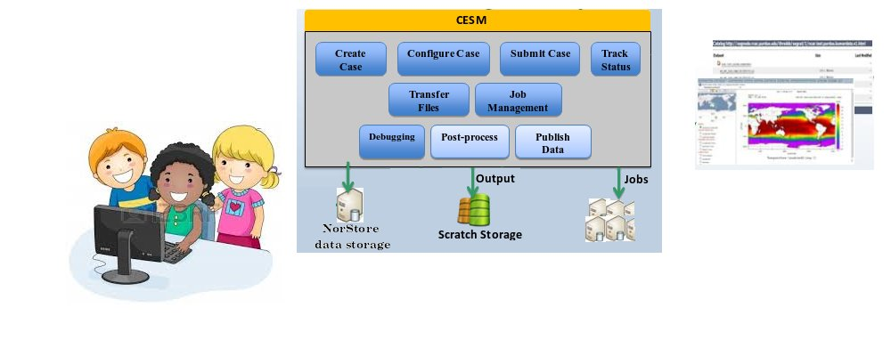

# Introduce model experiments

You will work **in pairs** for this practical and you will **analyze the model outputs in pairs**.  

First choose your teammate: you will have to work together to set-up and run your experiment so make sure one of you has access to Abel.  

## Experiments

The goal is to run the experiment of your choice (to cherry pick from the list below) for a duration of 14 months, starting on 1st of January until 1st of March the following year. For this you will take the same restart file you already used for the test experiment of the previous practicals.

Each of the 4 experiments is given an explicit name: 

1.  **EXPNAME = CO2**
              Doubling of CO2 (change CO2 value to 800 ppm > change the name list)
2.  **EXPNAME = rockies**
              Lowering of Rocky Mountains (set surface Geopotential to 0 from 30N to 50N and 235E to 260E > 
3.  **EXPNAME = sea_ice**
              Melt of Arctic sea ice (set sea ice fraction to zero North of 40N > change the input data set)
4.  **EXPNAME = SST**
              Super El Nino (add +6 K to tropical Central and East Pacific SST from 5S to 5N, 180W to 85W > change the input data set)
5.  **EXPNAME = himalaya**
              Lowering of Himalaya Mountains and Tibetan Plateau (set surface Geopotential to 0 from 30N to 50N and 70E to 100E > change the input data set)

Make sure you define an environment variable EXPNAME, **every time** you login on Abel:  

    # define an environment variable for your experiment (CO2, rockies, sea_ice, SST or himalaya)
    
    export EXPNAME=CO2

Here is the list of tasks to perform for the experiment of your choice:  

1.  [Create a new case for your experiment](#Create-a-new-case-for-your-experiment)
2.  [Setup experiment duration (1 month)](#Setup-your-new-experiment-duration)
3.  [Changing namelist or dataset](#Changing-namelist-or-dataset)
4.  [Long experiment (14 months)](#Long-experiment-(14-months))

### Create a new case for your experiment

Use an appropriate name for your new experiment depending on what you selected (doubling CO2, sea_ice, etc.). 

Suggested **EXPNAME** were given above.  

To create a new case always involve executing the command create_newcase.  

On Abel:

<pre>cd $HOME/cesm/cesm1_2_2/scripts

# Adjust EXPNAME depending on your experiment (CO2, rockies, sea_ice, SST, himalaya)

export EXPNAME=CO2
#
# Simulation 2: Long simulation
#
./create_newcase -case ~/cesm_case/f2000.T31T31.$EXPNAME -res T31_T31 -compset F_2000_CAM5 -mach abel
</pre>

Now you should have a new directory in $HOME/cesm_case/f2000.T31T31.$EXPNAME corresponding to your new case.  

On Abel:

<pre># Make sure EXPNAME is correctly defined!

cd ~/cesm_case/f2000.T31T31.$EXPNAME
</pre>

As before we start a hybrid run from the control experiment.

On Abel: 

<pre>./xmlchange RUN_TYPE=hybrid
./xmlchange RUN_REFCASE=f2000.T31T31.control
./xmlchange RUN_REFDATE=0009-01-01
</pre>

We also need to define the **START DATE** for your experiment (that will make it easier to compare the outputs of the experiment with those of the same month from the control run).

On Abel: 

<pre>./xmlchange RUN_STARTDATE=0009-01-01
</pre>

### Setup your new experiment duration

Before running the long simulation (14 months), it is sensible to check your new settings on a short experiment that will take only a few minutes to run, to make sure everything is done as you expected (and if not, to correct any mistake). 

You will run 1 month first, check the results and then restart the same experiment for several months.  

Make sure you set the duration of your experiments properly. 

On Abel: 

<pre>./xmlchange -file env_run.xml -id STOP_N -val 1
./xmlchange -file env_run.xml -id STOP_OPTION -val nmonths
</pre>

Now we are ready to set-up the model configuration and build the cesm executable.  

On Abel:  

<pre>./cesm_setup

# Make sure EXPNAME is set properly!

./f2000.T31T31.$EXPNAME.build
</pre>

The default history file from CAM is a monthly average but it is possible to change the output frequency with the namelist variable **nhtfrq**

*   If nhtfrq = 0, the file will be a monthly average
*   If nhtfrq > 0, frequency is input as number of timesteps
*   If nhtfrq < 0, frequency is input as number of hours.

For instance to change the history file from monthly average to daily average, we set the namelist variable nhtfrq = -24\. 

We also need to copy restart files in your running directory, etc.

On Abel:

<pre>cat >> user_nl_cice << EOF
grid_file = '/work/users/$USER/inputdata/share/domains/domain.ocn.48x96_gx3v7_100114.nc'
kmt_file = '/work/users/$USER/inputdata/share/domains/domain.ocn.48x96_gx3v7_100114.nc'
EOF

# Make sure EXPNAME is set properly!      

scp login.nird.sigma2.no:/projects/NS1000K/GEO4962/outputs/runs/f2000.T31T31.control/rest/0009-01-01-00000/f2000.T31T31.control.*.0009-01-01-00000.nc  /work/users/$USER/f2000.T31T31.$EXPNAME/run/.
scp login.nird.sigma2.no:/projects/NS1000K/GEO4962/outputs/runs/f2000.T31T31.control/rest/0009-01-01-00000/rpointer.* /work/users/$USER/f2000.T31T31.$EXPNAME/run/.
</pre>

Now depending on your experiment case, you would have either to change the namelist or to change the input dataset.

### Changing namelist or dataset 

*   [Doubling CO2](../09-CO2/index.html)
*   [Lowering Rocky mountains](../10-rocky/index.html)
*   [Melt of Artic sea ice](../11-sea-ice/index.html)
*   [Super El Nino](../12-sst/index.html)
*   [Lowering Himalaya mountains](../13-himalaya/index.html)



