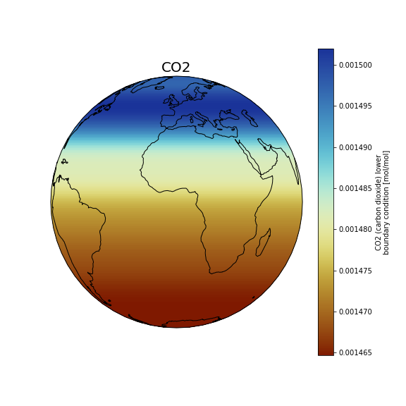

The goal is to quadruple CO2 (EXPNAME=CO2).

### **Quadrupling CO2**: how to update the input dataset?

Copy LBC file to your case directory:

On Saga:

~~~
export EXPNAME=CO2

cd $HOME/cases/F2000climo-f19_g17.$EXPNAME

cp /cluster/work/users/$USER/inputdata/atm/waccm/lb/LBC_2000climo_CMIP6_0p5degLat_c180227.nc .
~~~
{: .language-bash}

Use nco utilities to edit values on the file (http://nco.sourgeforce.net)

We will use a function called ncap2 – (netCDF Arithmetic Averager) single line command below

On Saga:

~~~
module load NCO/4.7.9-intel-2018b

ncap2 -O -s 'CO2_LBC=(CO2_LBC*4)' LBC_2000climo_CMIP6_0p5degLat_c180227.nc LBC_2000climo_CMIP6_0p5degLat_c180227_$EXPNAME.nc
~~~
{: .language-bash}

Apply this change and add it to user_nl_cam.

On Saga:

~~~
echo "flbc_file = './LBC_2000climo_CMIP6_0p5degLat_c180227_$EXPNAME.nc'" >> user_nl_cam 	

./preview_namelists

grep flbc /cluster/work/users/$USER/cesm/F2000climo-f19_g17.$EXPNAME/run/atm_in
~~~
{: .language-bash}

Copy the changed LBC data file into the run directory.

On Saga:

~~~
cp LBC_2000climo_CMIP6_0p5degLat_c180227_$EXPNAME.nc /cluster/work/users/$USER/cesm/F2000climo-f19_g17.$EXPNAME/run/.
~~~
{: .language-bash}



