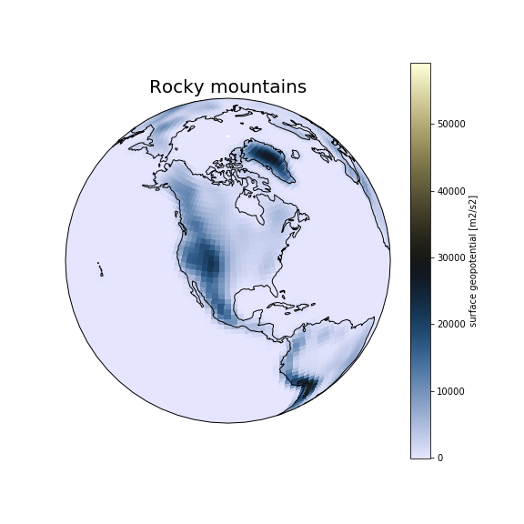

<h3 id="dataset"><b>Rocky Mountains</b>: how to update the input dataset?</h3>

Copy surface geopotential file to your case directory:

On Saga:

<pre>
export EXPNAME=rocky
cd ~/cesm_case/f2000.T31T31.$EXPNAME

cp /work/users/$USER/inputdata/atm/cam/topo/USGS-gtopo30_48x96_c050520.nc .
</pre>

Use nco utilities to edit values on the file (http://nco.sourgeforce.net)

We will use a function called ncap2 – (netCDF Arithmetic Averager) single line command below

On Saga:

<pre>module load nco

ncap2 -O -s 'lat2d[lat,lon]=lat ; lon2d[lat,lon]=lon' -s 'omask=(lat2d >= 30.0 && lat2d <= 50.0) && (lon2d >=235.0 && lon2d <= 260.0)' -s 'PHIS=(PHIS*(1-omask))' USGS-gtopo30_48x96_c050520.nc  USGS-gtopo30_48x96_c050520_$EXPNAME.nc
</pre>

Apply this change and add it to user_nl_cam.

On Saga:

<pre>echo "bnd_topo = './USGS-gtopo30_48x96_c050520_$EXPNAME.nc'" >> user_nl_cam 	

./preview_namelists

grep topo /work/users/$USER/f2000.T31T31.$EXPNAME/run/atm_in
</pre>

Copy the changed surface geopotential data file into the run directory.

On Saga:

<pre>cp USGS-gtopo30_48x96_c050520_$EXPNAME.nc /work/users/$USER/f2000.T31T31.$EXPNAME/run/.
</pre>



