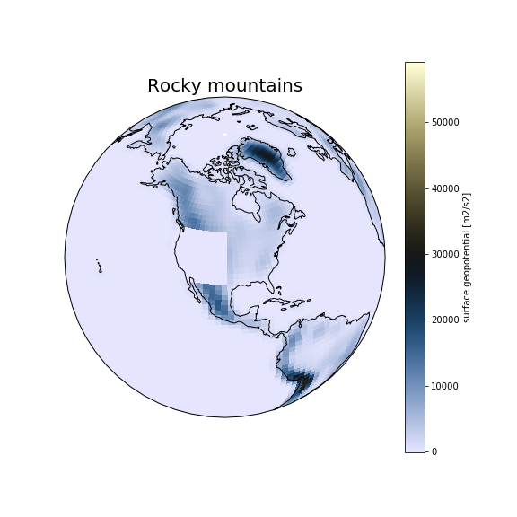

<h3 id="dataset"><b>Rocky Mountains</b>: how to update the input dataset?</h3>

Copy surface geopotential file to your case directory:

On Saga:

~~~
export EXPNAME=rocky

cd $HOME/cases/F2000climo-f19_g17.$EXPNAME

cp /cluster/projects/nn1000k/cesm/inputdata/./atm/cam/topo/fv_1.9x2.5_nc3000_Nsw084_Nrs016_Co120_Fi001_ZR_061116.nc .
~~~
{: .language-bash}

Use nco utilities to edit values on the file (http://nco.sourgeforce.net)

We will use a function called ncap2 – (netCDF Arithmetic Averager) single line command below

On Saga:

~~~
module load NCO/4.7.9-intel-2018b

ncap2 -O -s 'lat2d[lat,lon]=lat ; lon2d[lat,lon]=lon' -s 'omask=(lat2d >= 30.0 && lat2d <= 50.0) && (lon2d >=235.0 && lon2d <= 260.0)' -s 'PHIS=(PHIS*(1-omask))' fv_1.9x2.5_nc3000_Nsw084_Nrs016_Co120_Fi001_ZR_061116.nc fv_1.9x2.5_nc3000_Nsw084_Nrs016_Co120_Fi001_ZR_061116_$EXPNAME.nc
~~~
{: .language-bash}

Apply this change and add it to user_nl_cam.

On Saga:

~~~
echo "bnd_topo = './fv_1.9x2.5_nc3000_Nsw084_Nrs016_Co120_Fi001_ZR_061116_$EXPNAME.nc'" >> user_nl_cam 	

./preview_namelists

grep topo /cluster/work/users/$USER/cesm/F2000climo-f19_g17.$EXPNAME/run/atm_in
~~~
{: .language-bash}

Copy the changed surface geopotential data file into the run directory.

On Saga:

~~~
cp fv_1.9x2.5_nc3000_Nsw084_Nrs016_Co120_Fi001_ZR_061116_$EXPNAME.nc /cluster/work/users/$USER/cesm/F2000climo-f19_g17.$EXPNAME/run/.
~~~
{: .language-bash}



