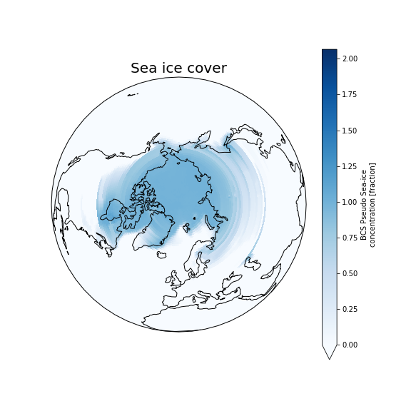

<h3 id="dataset"><b>Sea-ice</b>: how to update the input dataset?</h3>

The ice fraction data (used for prescribed CICE) is found in the same data file that provide SST data to the data ocean model since SST and ice fraction data are derived from the same observational data sets and are consistent with each other.

You first need to copy the original SST file to your case directory.

On Saga:

~~~
export EXPNAME=sea_ice
cd $HOME/cases/F2000climo-f19_g17.$EXPNAME

cp /cluster/projects/nn1000k/cesm/inputdata/./atm/cam/sst/sst_HadOIBl_bc_1x1_2000climo_c180511.nc .
~~~
{: .language-bash}

To change sea-ice fraction surface boundary data, use <a href="http://nco.sourgeforce.net">nco</a> utilities to modify the values in the file.

We will use a function called <a href="http://nco.sourceforge.net/nco.html#ncap2-netCDF-Arithmetic-Processor">ncap2</a> – (netCDF Arithmetic Averager) single line command below:

On Saga:

~~~
module load NCO/4.7.9-intel-2018b

ncap2 -O -s 'lat2d[lat,lon]=lat' -s 'omask=(lat2d >= 40.)' -s 'ice_cov=(ice_cov*(1-omask))' sst_HadOIBl_bc_1x1_2000climo_c180511.nc sst_HadOIBl_bc_1x1_2000climo_c180511_$EXPNAME.nc
~~~
{: .language-bash}

Apply this change:

We have to figure out which namelist variable to change.

On Saga:

~~~
grep sst_ *.xml
~~~
{: .language-bash}

then change the relevant variable in env_run.xml.

On Saga:

~~~
./xmlchange SSTICE_DATA_FILENAME=./sst_HadOIBl_bc_1x1_2000climo_c180511.nc
~~~
{: .language-bash}

and to make the namelist changes effective (i.e., create namelist files).

On Saga:

~~~
./preview_namelists
~~~
{: .language-bash}

Finally, we can copy the changed SST data file to the run directory.

On Saga:

~~~
cp sst_HadOIBl_bc_1x1_2000climo_c180511_$EXPNAME.nc /cluster/work/users/$USER/F2000climo-f19_g17.$EXPNAME/run/.
~~~
{: .language-bash}



