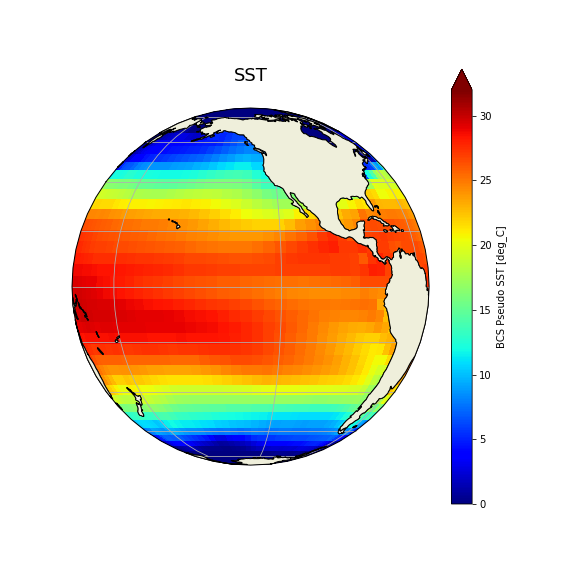

### **SST**: how to update the input dataset?

Copy the original SST file into your case directory.

On Saga:

<pre>export EXPNAME=SST
cd ~/cesm_case/f2000.T31T31.$EXPNAME

cp /work/users/$USER/inputdata/atm/cam/sst/sst_HadOIBl_bc_48x96_clim_c050526.nc .
</pre>

To change SST (+6K), use [nco](http://nco.sourgeforce.net) utilities to edit values from the original file.  

We will use a function called [ncap2](http://nco.sourceforge.net/nco.html#ncap2-netCDF-Arithmetic-Processor) – (netCDF Arithmetic Averager) single line command below.

On Saga:

<pre>module load nco

ncap2 -O -s 'lat2d[lat,lon]=lat ; lon2d[lat,lon]=lon' -s 'omask=(lat2d >= -5.0 && lat2d <= 5.0) && (lon2d >=180.0 && lon2d <= 275.0)' -s 'SST_cpl=(SST_cpl + 6.0*omask)' sst_HadOIBl_bc_48x96_clim_c050526.nc sst_HadOIBl_bc_48x96_clim_$EXPNAME.nc
</pre>

*   Figure out which namelist variable to change

    <pre>grep sst_ *.xml
    </pre>

*   Change it in env_run.xml

    <pre>./xmlchange -file env_run.xml -i SSTICE_DATA_FILENAME -val ./sst_HadOIBl_bc_48x96_clim_$EXPNAME.nc
    </pre>

Process env_run.xml to make namelist changes effective (create namelist files).

On Saga:

<pre>./preview_namelists
</pre>

Copy the modified SST data file into the run directory.

On Saga:

<pre>cp sst_HadOIBl_bc_48x96_clim_SST.nc /work/users/$USER/f2000.T31T31.$EXPNAME/run/.
</pre>



