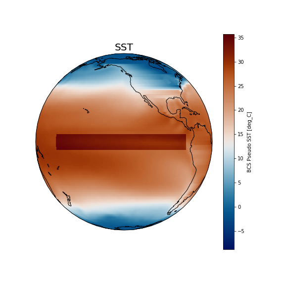

### **SST**: how to update the input dataset?

Copy the original SST file into your case directory.

On Saga:

~~~
export EXPNAME=SST
cd ~/cases/F2000climo-f19_g17.$EXPNAME

cp /cluster/projects/nn1000k/cesm/inputdata/./atm/cam/sst/sst_HadOIBl_bc_1x1_2000climo_c180511.nc .
~~~
{: .language-bash}

To change SST (+6K), use [nco](http://nco.sourgeforce.net) utilities to edit values from the original file.  

We will use a function called [ncap2](http://nco.sourceforge.net/nco.html#ncap2-netCDF-Arithmetic-Processor) – (netCDF Arithmetic Averager) single line command below.

On Saga:

~~~
module load NCO/4.7.9-intel-2018b

ncap2 -O -s 'lat2d[lat,lon]=lat ; lon2d[lat,lon]=lon' -s 'omask=(lat2d >= -5.0 && lat2d <= 5.0) && (lon2d >=180.0 && lon2d <= 275.0)' -s 'SST_cpl=(SST_cpl + 6.0*omask)' sst_HadOIBl_bc_1x1_2000climo_c180511.nc sst_HadOIBl_bc_1x1_2000climo_c180511_$EXPNAME.nc
~~~
{: .language-bash}

*   Figure out which namelist variable to change

~~~
grep sst_ *.xml
~~~
{: .language-bash}

*   Change it in env_run.xml

~~~
./xmlchange SSTICE_DATA_FILENAME=./sst_HadOIBl_bc_1x1_2000climo_c180511_$EXPNAME.nc
~~~
{: .language-bash}

Process env_run.xml to make namelist changes effective (create namelist files).

On Saga:

<pre>./preview_namelists
</pre>

Copy the modified SST data file into the run directory.

On Saga:

~~~
cp sst_HadOIBl_bc_1x1_2000climo_c180511_$EXPNAME.nc /cluster/work/users/$USER/F2000climo-f19_g17.$EXPNAME/run/.
~~~
{: .language-bash}



