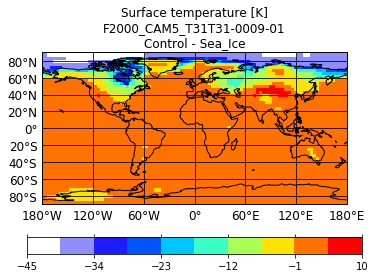
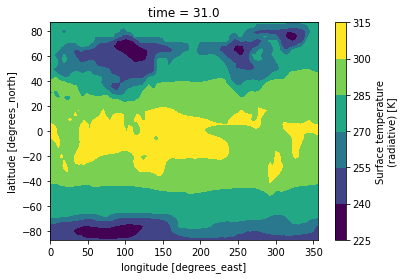
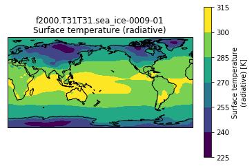
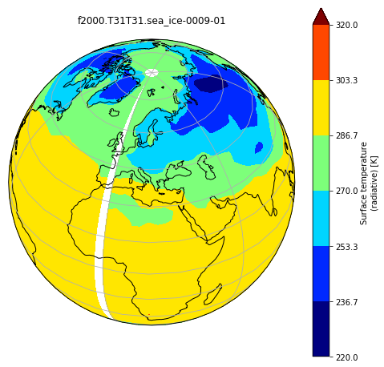
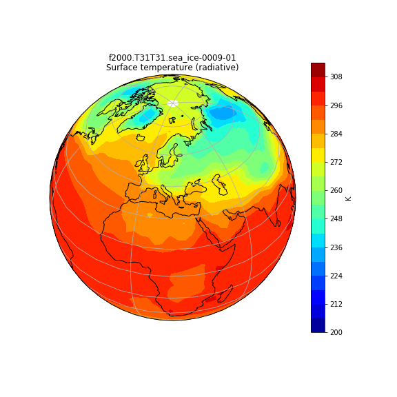
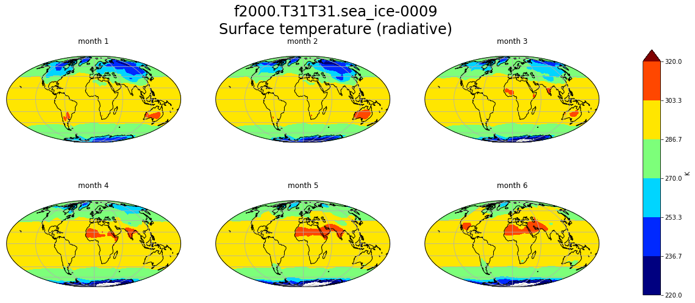
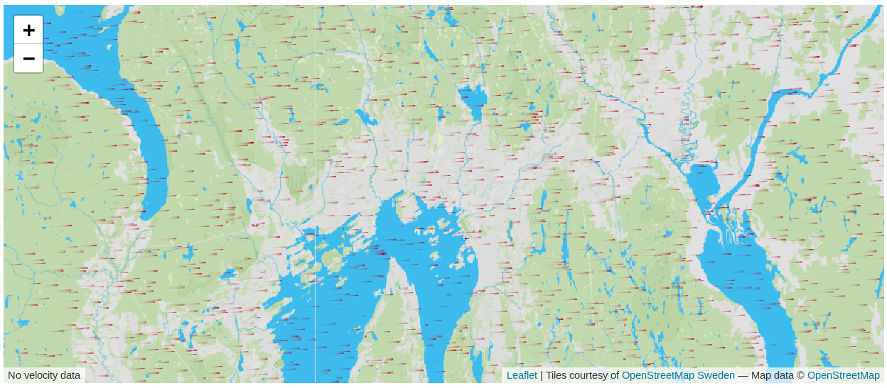

### Running your experiment

Now you are ready to submit your simulation on Abel.

On Abel:

~~~
cd ~/cesm_case/f2000.T31T31.$EXPNAME

./f2000.T31T31.$EXPNAME.submit

squeue -u $USER
~~~
{: .language-bash}

If your simulation is **unsuccessful** you have to understand what happened!

There are in particular log files in the run directory (/work/users/$USER/f2000.T31T31.$EXPNAME/run/) which can provide some clues, although the error messages are not always explicit...

Open the latest log file with your favorit text editor (vi, emacs, etc.) and try to search for keywords like "ERROR" or "Error" or "error" (remember that the search is case sensitive).

Then correct any identified bug.

If your short simulation has **finished without crashing**, check the outputs: were your changes taken into account? Do you get significant results?

### Model timing data

A summary timing output file is produced after every CESM run. On Abel and in our case this file is placed in /work/users/$USER/archive/f2000.T31T31.$EXPNAME/cpl/logs and is nammed cpl.log.$date.gz (where $date is a datestamp set by CESM at runtime).

This file contains information which is useful for *load balancing a case* (i.e., to optimize the processor layout for a given model configuration, compset, grid, etc. such that the cost and throughput will be optimal).

For this lesson we will concentrate on the last few lines in the file and in particular the number of simulated years per computational day, which will help us evaluate the wallclock time required for long runs.

On Abel:

~~~
vi cpl.log.190205-144355.gz

.......................
(seq_mct_drv): ===============       SUCCESSFUL TERMINATION OF CPL7-CCSM ===============
(seq_mct_drv): ===============        at YMD,TOD =    90201       0      ===============
(seq_mct_drv): ===============  # simulated days (this run) =    31.000  ===============
(seq_mct_drv): ===============  compute time (hrs)          =     0.347  ===============
(seq_mct_drv): ===============  # simulated years / cmp-day =     5.873  ===============
(seq_mct_drv): ===============  pes min memory highwater  (MB)   50.429  ===============
(seq_mct_drv): ===============  pes max memory highwater  (MB)  517.162  ===============
(seq_mct_drv): ===============  pes min memory last usage (MB)   -0.001  ===============
(seq_mct_drv): ===============  pes max memory last usage (MB)   -0.001  ===============
~~~
{: .language-bash}

_Here the throughput was 5.873 simulated years / cmp-day and it took 0.347 * 60 ~ 21 minutes to run the first month. Assuming that the other months will take approximately the same time, that represents about 3 months per hour and a bit more than 4 hours for 12 months._

### Long experiment (14 months)

As for the previous exercice, you will work **in pairs** for this practical and you will **analyze the model outputs in pairs**.  
You will be using your previous experiment ~/cesm_case/f2000.T31T31.$EXPNAME (EXPNAME should be set depending on your experiment!) and run 14 months.  

#### Set a new duration for your experiment

Make sure you set the duration of your experiment properly. Here we wish to run 14 months from the control restart experiment but as it is a long run, we would rather continue to split it into chuncks of 1 month. 

*Note that splitting an experiment into small chunks is good practice: this way if something happens and the experiment crashes (disk quota exceeded, hardware issue, etc.) everything will not be lost and it will be possible to resume the run from the latest set of restart files.*

On Abel:

~~~
# Set EXPNAME properly

cd ~/cesm_case/f2000.T31T31.$EXPNAME
~~~
{: .language-bash}

Since we have already the first month done, we are going to continue the experiment instead of starting from scratch.

On Abel:

~~~
./xmlchange CONTINUE_RUN=TRUE
~~~
{: .language-bash}

To perform a 14 months experiment, we would need to repeat this one month experiment 13 times. 

For this purpose there is a CESM option called RESUBMIT.

On Abel:

~~~
./xmlchange -file env_run.xml -id RESUBMIT -val 13
~~~
{: .language-bash}

By setting this option, CAM5 will be running one month of simulation (once submitted) and automatically resubmit the next 12 months.  

On Abel:

~~~
cd ~/cesm_case/f2000.T31T31.$EXPNAME

./f2000.T31T31.$EXPNAME.submit
~~~
{: .language-bash}

Regularly check your experiment (and any generated output files) and once it is fully done, [store your model outputs on norStore](norstore.html).

# Store model outputs on norStore

First make sure that your run was successful and check all the necessary output files were generated.  

To post-process and visualize your model outputs, it is VERY IMPORTANT you move them from Abel to norStore. Remember that all model outputs are generated in a semi-temporary directory and all your files will be removed after a few weeks!  

If you haven't set-up your [SSH keys](http://www.mn.uio.no/geo/english/services/it/help/using-linux/ssh-tips-and-tricks.html), the next commands (ssh and [rsync](http://www.tecmint.com/rsync-local-remote-file-synchronization-commands/)) will require you to enter your Unix password.  

Make sure you define EXPNAME properly (it depends on your experiment).

On Abel:

~~~
# If you are running CO2 experiment (otherwise adjust: sea_ice, SST, rocky)
export EXPNAME=CO2
~~~
{: .language-bash}

Then copy the archived files from abel to the norStore project area.

*It is sometimes sensible to also copy the run files and even the case directory, but that should not be necessary for this lesson.*

On Abel:

~~~
ssh login.nird.sigma2.no 'mkdir -p /projects/NS1000K/GEO4962/outputs/$USER/archive'

rsync -avz /work/users/$USER/archive/f2000.T31T31.$EXPNAME $USER@login.nird.sigma2.no:/projects/NS1000K/GEO4962/outputs/$USER/archive/.
~~~
{: .language-bash}

Once the previous commands are successful, you are ready to [post-process and visualize](../../results.html) your data on login.nird.sigma2.no  

However, as your simulation is stored on the norStore project area, you can now [archive your experiment](archive.html) on the norStore archive (long-term archive i.e. several years).

# Post processing and visualization

You can always compare the results of your experiments to the control run, at any time (i.e., this applies for both the short and long runs).

An easy way to do this is to calculate the difference between for example the surface temperature field issued from the control run and that from your new experiment.

# Copy your output files from Abel to your virtual machine

Start a new **Terminal** on your JupyterHub and transfer your data. Do not forget to replace *YOUR_USER_NAME* by your actual user name and *YOUR_EXPERIMENT* by your actual experiment name (you have to do this because the Virtual machine and Abel are different systems, therefore all the environment variables that were defined on Abel are not known here).

On the JupyterHub terminal:

~~~
rsync -avzu --progress YOUR_USER_NAME@abel.uio.no:/work/users/YOUR_USER_NAME/archive/f2000.T31T31.YOUR_EXPERIMENT/ /opt/uio/GEO4962/$USER/f2000.T31T31.YOUR_EXPERIMENT/
~~~
{: .language-bash}

# Visualization with psyplot

Start a new **python3** notebook on your JupyterHub and type the following commands (in this example the *USER* is jeani and we have the first month of data from the sea ice experiment).

On jupyter:

~~~
import psyplot.project as psy

month = '0009-01'

path = '/opt/uio/GEO4962/outputs/runs/f2000.T31T31.control/atm/hist/'
filename = path + 'f2000.T31T31.control.cam.h0.' + month + '.nc'
dsc = xr.open_dataset(filename, decode_cf=False)
Sc = dsc['TS'][0,:,:]

path = '/opt/uio/GEO4962/jupyter-jeani/f2000.T31T31.sea_ice/atm/hist/'
filename = path + 'f2000.T31T31.sea_ice.cam.h0.' + month + '.nc'
dssi = xr.open_dataset(filename, decode_cf=False)
TSsi = dssi['TS'][0,:,:]

diff = TSc - TSsi

diff.psy.plot.mapplot(title="Surface temperature [K]\nF2000_CAM5_T31T31-0009-01\nControl-Sea_Ice")
~~~
{: .language-python}

Psyplot is a high level tool which offers a convenient means to easily and quickly create plots directly from the netCDF file. However for customized graphs and more advanced analyse one usually uses lower level python packages.

## Making bespoke graphs with python

Let's make a basic contour plot with python.

Start a new **python3** notebook on your JupyterHub.

On jupyter:

~~~
import xarray as xr

%matplotlib inline

month = '0009-01'
path = '/opt/uio/GEO4962/jupyter-jeani/f2000.T31T31.sea_ice/atm/hist/'
experiment = 'f2000.T31T31.sea_ice'
filename = path + experiment + '.cam.h0.' + month + '.nc'

dset = xr.open_dataset(filename, decode_cf=False)
TSsi = dset['TS'][0,:,:]
dset.close()
~~~
{: .language-python}

So far that is similar to what we did before to define the path and filename for the data and read the surface 
temperature values.

Now we can make a contour plot with a single command.

On jupyter:

~~~
TSsi.plot.contourf()
~~~
{: .language-python}

to obtain this:

This figure is not very useful: we do not know which projection was used, there is no coastline, we would rather have a proper title, etc.

To do that we need to add bit more information.

On jupyter:

~~~
import matplotlib.pyplot as plt
import cartopy.crs as ccrs
ax = plt.axes(projection=ccrs.PlateCarree(central_longitude=180))
TSsi.plot.contourf(ax=ax,
                   transform=ccrs.PlateCarree())
ax.set_title(experiment + '-' + month + '\n' + TSsi.long_name)
ax.coastlines()
ax.gridlines()
~~~
{: .language-python}

This is a slightly better plot, we are getting closer to what we had with psyplot...

### Change the default projection

It is very often convenient to visualize using a different projection than the original data:

On jupyter:

~~~
import xarray as xr
import numpy as np
import cartopy.crs as ccrs
from cartopy.util import add_cyclic_point
import matplotlib.pyplot as plt

%matplotlib inline

path = '/opt/uio/GEO4962/jupyter-jeani/f2000.T31T31.sea_ice/atm/hist/'
experiment = 'f2000.T31T31.sea_ice'
month = '0009-01'

filename = path + experiment + '.cam.h0.' + month + '.nc'

dset = xr.open_dataset(filename, decode_cf=False)
TSsi = dset['TS'][0,:,:]
dset.close()

TSmin = 220
TSmax = 320

fig = plt.figure(figsize=[8, 8])
ax = fig.add_subplot(1, 1, 1, projection=ccrs.Orthographic(central_longitude=20, central_latitude=40))  # specify (nrows, ncols, axnum)

TSsi.plot.contourf(ax=ax,
                      transform=ccrs.PlateCarree(), 
                      extend='max',
                      cmap='jet', vmin=TSmin, vmax = TSmax)

ax.set_title(experiment + '-' + month + '\n')
ax.coastlines()
ax.gridlines()
~~~
{: .language-python}

> ## wrap around longitudes
> 
> 
> On jupyter:
>
> ~~~
> 
> # get longitude min and max
> print(TSsi.lon.min(), TSsi.lon.max())
> ~~~
> {: .language-python}
>
> To fill the gap, we can wrap around longitudes i.e. add a new longitude band at 360. equals to 0.
>
> ~~~
> import xarray as xr
> import numpy as np
> import cartopy.crs as ccrs
> from cartopy.util import add_cyclic_point
> import matplotlib.pyplot as plt
> 
> %matplotlib inline
> 
> path = '/opt/uio/GEO4962/jupyter-jeani/f2000.T31T31.sea_ice/atm/hist/'
> experiment = 'f2000.T31T31.sea_ice'
> month = '0009-01'
> 
> filename = path + experiment + '.cam.h0.' + month + '.nc'
> 
> dset = xr.open_dataset(filename, decode_cf=False)
> TSsi = dset['TS'][0,:,:]
> dset.close()
> 
> TSmin = 220
> TSmax = 320
> 
> # max longitude is 356.25 so we add another longitude 360. (= 0.)  
> TS_cyclic_si, lon_cyclic = add_cyclic_point(TSsi.values, coord=TSsi.lon)
> # Create a new xarray with the new arrays
> TSsi_cy = xr.DataArray(TS_cyclic_si, coords={'lat':TSsi.lat, 'lon':lon_cyclic}, dims=('lat','lon'), 
>                        attrs = TSsi.attrs )
> 
> fig = plt.figure(figsize=[8, 8])
> ax = fig.add_subplot(1, 1, 1, projection=ccrs.Orthographic(central_longitude=20, central_latitude=40))  # specify (nrows, ncols, axnum)
> 
> TSsi_cy.plot.contourf(ax=ax,
>                       transform=ccrs.PlateCarree(), 
>                       extend='max',
>                       cmap='jet', vmin=TSmin, vmax = TSmax)
> 
> ax.set_title(experiment + '-' + month + '\n')
> ax.coastlines()
> ax.gridlines()
> 
> ~~~
> {: .language-python}
>
> 
> 
{: .callout}

You can now use the command [savefig](https://matplotlib.org/api/_as_gen/matplotlib.pyplot.savefig.html) to save the current figure into a file.

On jupyter:

~~~
fig.savefig(experiment + '-' + month + '.png')
~~~
{: .language-python}

### contourf versus pcolormesh

So far, we used *contourf* to visualize our data but we can also use *pcolormesh*.

> ## Change *contourf* by *pcolormesh* 
>
> Change *contourf* by *pcolormesh* in the previous plot.
> 
> What do you observe?
> 
> > ## Solution
> > ~~~
> > import xarray as xr
> > import numpy as np
> > import cartopy.crs as ccrs
> > from cartopy.util import add_cyclic_point
> > import matplotlib.pyplot as plt
> > 
> > %matplotlib inline
> > 
> > path = '/opt/uio/GEO4962/jupyter-jeani/f2000.T31T31.sea_ice/atm/hist/'
> > experiment = 'f2000.T31T31.sea_ice'
> > month = '0009-01'
> > 
> > filename = path + experiment + '.cam.h0.' + month + '.nc'
> > 
> > dset = xr.open_dataset(filename, decode_cf=False)
> > TSsi = dset['TS'][0,:,:]
> > dset.close()
> > 
> > TSmin = 220
> > TSmax = 320
> > 
> > # max longitude is 356.25 so we add another longitude 360. (= 0.)  
> > TS_cyclic_si, lon_cyclic = add_cyclic_point(TSsi.values, coord=TSsi.lon)
> > # Create a new xarray with the new arrays
> > TSsi_cy = xr.DataArray(TS_cyclic_si, coords={'lat':TSsi.lat, 'lon':lon_cyclic}, dims=('lat','lon'), 
> >                        attrs = TSsi.attrs )
> > 
> > fig = plt.figure(figsize=[8, 8])
> > ax = fig.add_subplot(1, 1, 1, projection=ccrs.Orthographic(central_longitude=20, central_latitude=40))  # specify (nrows, ncols, axnum)
> > 
> > TSsi_cy.plot.pcolormesh(ax=ax,
> >                       transform=ccrs.PlateCarree(), 
> >                       extend='max',
> >                       cmap='jet', vmin=TSmin, vmax = TSmax)
> > 
> > ax.set_title(experiment + '-' + month + '\n')
> > ax.coastlines()
> > ax.gridlines()
> > ~~~
> > {: .language-python}
> >
> > 
> > 
> >
> {: .solution}
{: .challenge}

### Create multiple plots in the same figure

On jupyter:

~~~
import xarray as xr
import numpy as np
import cartopy.crs as ccrs
from cartopy.util import add_cyclic_point
import matplotlib.pyplot as plt

%matplotlib inline

path = '/opt/uio/GEO4962/jupyter-jeani/f2000.T31T31.sea_ice/atm/hist/'
experiment = 'f2000.T31T31.sea_ice'

fig = plt.figure(figsize=[20, 8])
TSmin = 220
TSmax = 320

for month in range(1,7):
    filename = path + experiment + '.cam.h0.0009-0' + str(month) + '.nc'

    dset = xr.open_dataset(filename, decode_cf=False)
    TSsi = dset['TS'][0,:,:]
    lat = dset['lat'][:]
    lon = dset['lon'][:]
    dset.close()

    TS_cyclic_si, lon_cyclic = add_cyclic_point(TSsi.values, coord=TSsi.lon)
    TSsi_cy = xr.DataArray(TS_cyclic_si, coords={'lat':TSsi.lat, 'lon':lon_cyclic}, dims=('lat','lon'), 
                            attrs = TSsi.attrs )

    ax = fig.add_subplot(2, 3, month, projection=ccrs.Mollweide())  # specify (nrows, ncols, axnum)

    cs = TSsi_cy.plot.contourf(ax=ax,
                      transform=ccrs.PlateCarree(), 
                      extend='max',
                      cmap='jet', vmin=TSmin, vmax = TSmax, add_colorbar=False)

    ax.set_title( 'month ' + str(month) + '\n')
    ax.coastlines()
    ax.gridlines()
    

fig.suptitle(experiment + '-0009'+'\n' + TSsi.long_name, fontsize=24)
    
# adjust subplots so we keep a bit of space on the right for the colorbar    
fig.subplots_adjust(right=0.8)
# Specify where to place the colorbar
cbar_ax = fig.add_axes([0.85, 0.15, 0.02, 0.7])
# Add a unique colorbar to the figure
fig.colorbar(cs, cax=cbar_ax, label=TSsi.units)
~~~
{: .language-python}

### Create interactive plots with ipyleaflet

Instead of plotting the horizontal wind components (U and V) as contours there are ways to create more dynamic plots. The ipyleaflet project is one example that offers a custom interactive map control that allows a user to display and manipulate geographic data within a Jupyter Notebook.

On jupyter:

~~~
from ipyleaflet import Map, Velocity, TileLayer, basemaps, basemap_to_tiles
import xarray as xr
import os
import glob
from ipywidgets import IntSlider
from ipywidgets.embed import embed_minimal_html

pattern = '/opt/uio/GEO4962/jupyter-jeani/f2000.T31T31.sea_ice/atm/hist/f2000.T31T31.sea_ice.cam.h0.*-*.nc'
filenames=glob.glob(pattern)
filenames.sort()
dset = xr.open_mfdataset(filenames, decode_cf=False)

# Center on Oslo
m = Map(center=(59+55/60, 10+44/60), zoom=10, 
        interpolation='nearest', basemap=basemaps.Hydda.Base)
display_options = {
    'velocityType': 'Global Wind',
    'displayPosition': 'bottomleft',
    'displayEmptyString': 'No wind data'}
    
month=1
# Level 4 roughly corresponds to 25mb
wind = Velocity(data=dset[['U','V']].isel(lev=4, time=month-1),
                zonal_speed='U',
                meridional_speed='V',
                latitude_dimension='lat',
                longitude_dimension='lon',
                velocity_scale=0.00,
                max_velocity=2,
                display_options=display_options)
m += wind
m    
~~~
{: .language-python}

And here is an example of what you should get on your screen, with the widget giving you more options than with a static plot (to zoom in / out and see a different region):

<iframe width="600" height="400" src="../files/widget.html" frameborder="0" allowfullscreen></iframe>



