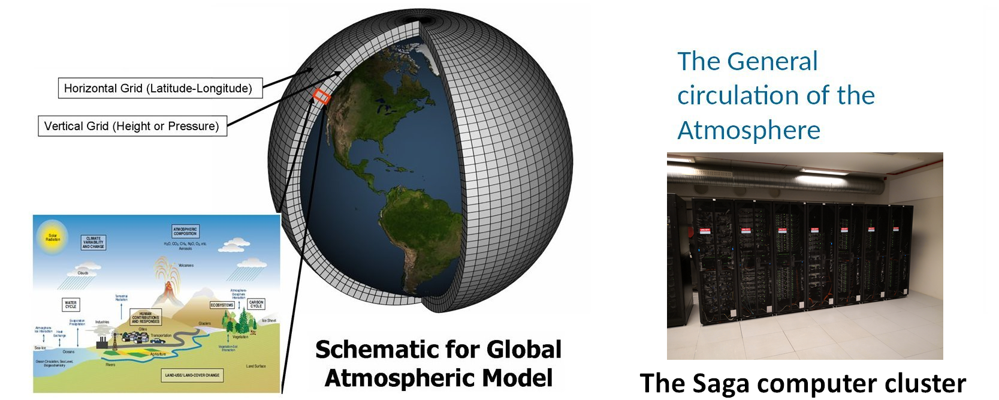

The course gives a broad overview about the general circulation of the atmosphere, including the tropospheric and stratospheric circulations. The lecture will cover the transport of climate and ozone relevant gases, which are important for the chemical composition and for the radiative budget of the atmosphere. Future climate and ozone changes affecting the general circulation of the atmosphere will be highlighted.

**Learning outcome**

After finishing this course, students should understand:

- Tropospheric Circulation,
- Brewer Dobson Circulation,
- Stratospheric Ozone distribution,
- Dynamics and chemistry of key trace gases,
- Climate change and the Ozone Hole.

<!-- this is an html comment -->

 This is a comment in Liquid 

> ## Prerequisites
>
> This course corresponds to practical parts of the GEO4962 "The General 
> Circulation of the Atmosphere" given at the University of Oslo and assumes 
> students have a basic knowledge of the Climate System.
>
{: .prereq}


